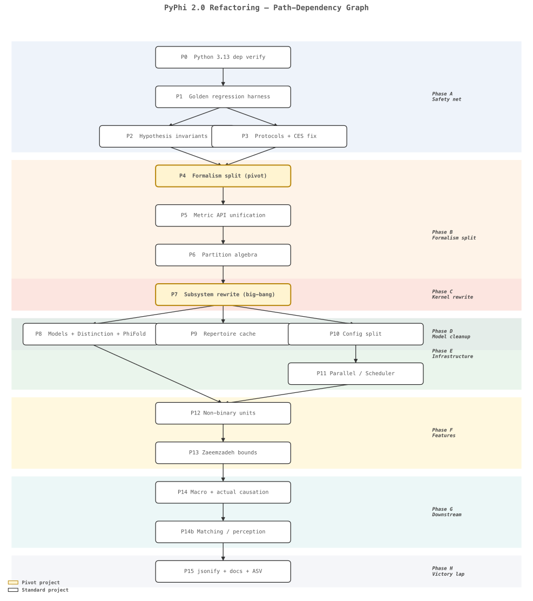

# PyPhi Strategic Refactoring Roadmap

> **⚠️ This document has ONE source of truth for status: the [Status Dashboard](#status-dashboard) below.**
> When an item lands or changes status, update its dashboard row **in the same change**. The detailed
> prose under [Design rationale & history (archive)](#design-rationale--history-archive) is historical
> context, not a status record — it has drifted before (items implemented but left described as
> upcoming), so **trust the dashboard, and verify against the code, `changelog.d/`, and git history —
> not the archive prose.** Last full audit: **2026-06-13** (every item verified against the code).

## Status Dashboard

**Legend:** ✅ landed · 🟡 partial (some sub-parts open) · ⬜ open (in 2.0) · ⛔ deferred — out of 2.0 (genuine blocker) · ✖️ dropped / moot.

### ✅ Landed (verified 2026-06-13)

P0 · P1 · P2 · P3 · P4 · P5 · P6 · P6a · P7 · **P8** (incl. `PhiFold`) · P9 · P10 · P10b · P10c · **P11 core** (Scheduler Protocol + Process/Thread schedulers + cost-sampling chunking + config-snapshot propagation) · P11.5 · P11.6 · P11.7 · **P11.8 Tier 1** · P11.9 · P11.85 · P11.86 · P11.87 · P11.88 · P11.95a · P11.95b · P11.95d · P11.95e · **P12** (factored TPM + multivalued units, incl. AC k-ary) · P14 · **P14b core** (sub-projects 1–4) · P14d (sub-projects B + A-1..A-4) · **Macro / Marshall-2024 intrinsic units** (SP1 + SP2 + SP3 + search parallelization) · **N2** (parallel≡sequential invariant) · **P11 loky-flake** (root-caused to the P9 cache-registry leak; confirmed resolved, N2 guards it) · **B1** (runtime bound-certificate assertions; `validate_phi_bounds`, on suite-wide) · **P13 SP2** (bite-rate study: bounds don't prune in the certified domain → no pruning built, SP1 is the deliverable) · **Eq-23 cap MIP-selection fix** (cap no longer shifts the system MIP; 2026 φ ≤ 2023 φ restored — found via B5) · **B9** (decimal precision oracle: GID/information-density primitives well-conditioned to ≤1 ULP — no catastrophic cancellation, no guard needed) · **B4** (Eq-23 cap differential oracle; cap-biting network = `logistic3_k8`, asserted to strictly bind — the network N1/P17 need) · **B5** (cross-formalism differential testing — all four invariants: `2026≤2023`, 3.0/4.0-reducibility refutation, `b3aaa3e5` 4.0 non-regression oracle, AC/IIT sign agreement) · **CES-completeness search** (brute force settles P11.95c case (b)'s open theory: the CES is **not** a complete substrate invariant in general — non-isomorphic substrates share an identical CES, down to repertoires/relations, whenever a unit is left unconstrained — but it **is** complete on *complexes*: 0 counterexamples among irreducible systems, n=2 exhaustive + n=3 sampled; `test/test_ces_completeness.py`) · **P11.95c (a)+(c)** (substrate canonicalization — `pyphi/automorphism.py` with `substrate_automorphisms` / `substrate_canonical_form` / `are_substrates_isomorphic` / `canonical_state`, by exact behavior-aware node-permutation enumeration; **pynauty rejected** — it canonicalizes wiring not behavior, and Φ caps n below where n! matters. The per-direction φ asymmetry was confirmed a **reducible-system-only tie-break determinism issue** (the per-pair φ table is permutation-symmetric; the system MIP is non-unique when φ_s=0), fixed via a `canonical_state` Determinism tie-break in the IIT 4.0 SIA fallback; un-xfails `test_sia_per_direction_phi_multiset_symmetric`; `test/test_automorphism.py`) · **B16** (first-class `Complex` marker type: `complexes()` → `tuple[Complex, ...]`, null-object `maximal_complex()`, exclusion postulate as `validate.non_overlapping()`; advances ship-criterion #1)

### ⬜🟡 Remaining 2.0 work — *the schedule lives in [Remaining 2.0 Work](#remaining-20-work)*

| Item | Status | Wave | One-line |
|---|---|---|---|
| p53-Mdm2 golden | ✅ landed | 1 | Multi-valued p53-Mdm2 (ternary p53 + binary Mdm2; `examples.gomez_p53_mdm2_substrate`) reproduces Gómez 2020 Fig 3A — `Φ(001)=0.44` over 3 mechanisms — under the paper's exact config (`AID` + wedge tripartition + `SUM_SMALL_PHI`). **First k>2 golden under IIT 3.0** (`gomez_p53_mdm2_iit3_aid`) + an N1 paper-reproduction test. (Paper used `MEASURE='AID'`, **not** EMD — EMD is unavailable for non-binary; this needed only the IIT_3_0 AID/ID measure-name fix, not k-ary EMD. k-ary EMD also landed separately — EMD now works on multi-valued substrates; see below.) |
| N1 paper-reproduction suite | 🟡 partial | 1 | Acceptance suite scaffolded (`test/test_paper_reproduction.py`); **IIT 4.0 (2023) Figs 1/2/4 + 6C, IIT 3.0 (2014) Fig 12, and AC 2019 Fig 6 landed** (4.0 Fig 1A logistic substrate: φ_s of a/aB/aBC + φ_c/φ_e of aB, φ_d of the 3 distinctions, φ_r({a,aB}); 4.0 Fig 6C copy-ring: φ_s=1.7467 and Φ=7.65 via analytical relations; 3.0 Fig 12 fig4 net A=OR/B=AND/C=XOR @ (1,0,0): Φ=23/12≈1.92 + the 6-concept constellation {0.5,0.33,0.25,0.25,0.17,0.17}, corroborated by Mayner 2018's 1.917; AC 2019 Fig 6 OR-AND account: 4×α=log₂(4/3)=0.415 bits + joint α=log₂(9/8)=0.170 bits; Gómez 2020 Fig 3A multi-valued p53-Mdm2: Φ(001)=0.44 over 3 mechanisms, the first k>2 reproduction). All tractable N1 reproductions landed. **Blocked (genuine upstream blocker — revisit when unblocked): Fig 6 A/B/D/E + Fig 7** — weights graphical-only; external search exhausted 2026-06-14, defs not publicly deposited (paper data-availability → this repo's `feature/iit-4.0`, which carries only the `network_generator/weights.py` building blocks + the Fig 1/2/4 demo; absent from S1–S4, Albantakis GitHub, iit.wiki/Colab) → needs authors' exact defs (email) |
| B5 cross-formalism diff testing | ✅ landed | 1 | All invariants landed: `2026≤2023` (caught+fixed an Eq-23 cap MIP-selection bug); "3.0/4.0 agree on reducibility" **refuted** (witness pinned); `b3aaa3e5` 4.0 non-regression oracle (4.0 `signed_phi` reproduces pre-refactor raw φ to machine epsilon, clamped φ = `max(0,raw)`); **AC/IIT sign agreement** (AC α and IIT GID share sign — both `log2(p/q)` of the same repertoire primitive, GID = selectivity·α with selectivity ≥ 0) |
| cause/effect rename | ✅ landed | 2 | `cause_tpm`/`effect_tpm` → `cause_marginal`/`effect_marginal` (+ `proper_*` variants, module funcs, internal helpers); they are causal marginals (Eq. 3/4), not TPMs. No value change |
| N8 provenance stamp | ⬜ open | 2 | Provenance record on every result (version, git sha, seed, wall-time) extending the P10 config snapshot |
| P14b env-generation | ⬜ open | 2 | Built-in world/stimulus generators so matching works out of the box |
| P14b analytical projection | 🟡 open | 2 | Closed-form differentiation projection (φ-max derivable; perception-max stays research) |
| P14d `to_pandas` consolidation | ✅ landed | 2 | One labeled-export convention: scalar-record→Series, `Distinctions`→mechanism-indexed DataFrame, state specs→tidy long-format, `TriggeredTPM`→wide matrix (reconciled byte-identical); units-as-labels (k-ary aware); `json_normalize` heuristic removed |
| P14d A-5 | ⬜ open | 2 | Higher-degree (≥4) relation visualization |
| P11.95c (a)+(c) | ✅ landed | 2 | Substrate canonicalization (`pyphi/automorphism.py`, exact behavior-aware enumeration — pynauty rejected); canonical-state tie-break un-xfails the strict permutation invariant |
| P6b | ⬜ open | 2 | graphillion → OxiDD (bus-factor, no-GIL relations, install ergonomics) |
| B7 unified PartitionAlgebra | ✅ landed | 2 | Total `removed_edges()`/`num_connections_cut()` on every partition type (efficient structural overrides validated vs `cut_matrix`), `refines()`/`coarsens()` refinement partial order + `lex_key` total-ordering dunders; replaced the `except AttributeError: return None` φ-norm hack with explicit None handling. No value change |
| B13 config validator | 🟡 partial | 2 | Eager rejection landed (`pyphi/conf/constraints.py`): measure↔version combos rejected on `override`/`load_yaml` with a two-field error + fix; `validate_config` opt-out; failed apply restores state. Confirmed `2023+II` is *valid* (cap follows the measure, not the version) — so no `II⟹2026` rule. Scheme-combo constraints deferred pending confirmation experiments |
| B16 `Complex` marker type | ✅ landed | 2 | First-class `Complex` (exclusion as a checkable invariant); advances ship-criterion #1 |
| B19 CM/TPM consistency check | ✅ landed | 2 | Default-on `validate_connectivity` rejects an under-specified CM (omits a TPM-implied edge → silent φ under-count); over-specification stays legal. New k-ary-correct `FactoredTPM.infer_cm`/`infer_edge` (per-factor, precision-aware, `rtol=0`); the legacy `JointTPM.infer_cm` was **not** reused — it is binary-only and unsound for k-ary. `validate.connectivity` wired into `validate.substrate`; sibling to B13 |
| B20 substrate graph bridge | ⬜ open | 2 | `Substrate.to_networkx()`/`from_networkx()` + GraphML/adjacency export; thin labeled DiGraph over the CM (state/weights); topology helpers. Pairs with P11.95c (pynauty) + P14d export; excludes BN/CPD semantics (→ N11). *(Added 2026-06-15.)* |
| B21 unified display model | ✅ landed | 2 | Unified `_describe()` model in `pyphi.display` + pluggable ASCII (boxed-card) and styled-HTML backends; every result type migrated (full `_repr_html_` coverage); `repr_verbosity` read in one place; dead `fmt.py` composers removed (1168→530 lines). Vertical cards, full readable labels, decimal-consistent numbers, collections→tables, leaf rendering for embedded values; `rich` deferred behind the backend seam. Coverage invariant + SIA golden in `test/test_display.py`. Foundational for B8/B15. |
| B8 `result.explain()` | ✅ landed | 2 | `.explain()` on every top-level result (4.0/3.0 SIA, RIA/MICE/Distinction, AcSIA/AcRIA/CausalLink/Account) returns a typed, `Displayable`, `to_pandas`-able `Explanation` of why a Φ/φ/α came out as it did (fired null reasons, winning + runner-up partition + φ-gap, binding cause/effect direction). Unified the two divergent `ShortCircuitConditions` enums into one flat `NullResultReason` (+ `.level`); a confirmation experiment split out `NO_WEAK_CONNECTIVITY` for AC (its `is_weak` is strictly weaker than IIT's `is_strong`). Runner-up retained at the IIT MIP-selection sites (AC reduces with a streaming min, so no AC α-gap); no φ/α value change. `pyphi/models/explanation.py`; `test/test_explanation.py` (coverage invariant over every result type) |
| B15 `result.diff()` | ⬜ open | 2 | Structured delta of two analyses with config-diff attribution (pairs with B8) |
| P11.8 Tier 2 | ⬜ open | 3 | Rewrite benchmark suite + ASV-in-CI (regression gate *before* the perf work) |
| P9.5 | ⬜ open | 4 | Math-fingerprint cache keys (cross-label cache reuse) |
| P6a no-GIL CI | 🟡 open | 4 | no-GIL CI lane (xfail relations until P6b, then full) + `lru_cache` counter-race cleanup |
| P11 cluster backends | ⬜ open | 4 | Fill HTCondor / full Dask behind the stable Scheduler Protocol (additive) |
| B18 adaptive chunking | ⬜ open | 4 | Cost-model bin-packing for parallel granularity (activates the dormant `size_func`; guarded by N2) |
| P15 | ⬜ open | 5 | jsonify→msgspec, test reorg, docstring sweep, pandas extend (display → B21), import cleanup, PR triage, changelog condense |
| B17 drop dead deps | ⬜ open | 5 | Remove unused `tblib`; `ordered-set`→`dict.fromkeys`; audit `toolz`→stdlib (with the P15 import cleanup) |
| EMD backend → POT | ✅ landed | 5 | Swapped deprecated `pyemd` for POT (`ot.emd2`) behind `OptionalEMD`; `pyphi[emd]` extra now installs `pot`. Backends agree to machine epsilon (binary + k-ary, 3600 cases); the IIT 3.0 CES-distance EMD was reformulated to proper non-negative OT (the negative-null-mass / signed-φ case), which **reproduces the existing goldens exactly** — no regen needed. |
| P17 | ⬜ open | 6 | Cross-formalism perf characterization (post-freeze, internal-only) |
| P18 (+B6) | ⬜ open | 6 | Sparse / treewidth-dispatched exact inference — junction-tree marginals both directions (B6 generalizes the cause-only sparse inversion) |

### ⛔ Deferred — out of 2.0 (genuine blocker)

| Item | Blocker |
|---|---|
| P14c | Second AC formalism (4.0-style α) — unsettled theory **and** awaiting a collaborator's notes; no reference implementation |
| P11.95c case (b) (impl) | Theory **resolved** (Wave-1 CES-completeness search): CES is incomplete in general but complete on *complexes*; every counterexample is a reducible system, so the opt-in `intrinsic_equivalence` API addresses only a degenerate regime → low-value research, post-2.0 |
| P16 | Approximation framework — research direction; its one near slice (Zaeemzadeh bounded-exact) is gated on P13 SP2 |
| AC default-flip | `noise_background` default — breaking change + unsettled AC background-condition semantics |

### ✖️ Dropped / moot

| Item | Why |
|---|---|
| P12c (xarray coord labels) | Verified cosmetic — the xarray backend hands plain `.values` to all math, so labels never reach a computation; near-zero value (revisit only if xarray becomes the default backend) |
| "Retire `precision` when 3.0 is dropped" (note) | Premise is counterfactual — IIT 3.0 is **kept**; moot |

---

## Remaining 2.0 Work

> There is no release deadline; the only valid reason to defer is a genuine blocker (unsettled theory,
> missing upstream input, or a hard dependency on unlanded work). Everything below has no such blocker.
> Waves are ordered by dependency; items **within** a wave are independent and can run in parallel. Full
> design detail for each item is in the [archive](#design-rationale--history-archive) under its P-number.

### Wave 1 — Confirmation experiments & correctness *(cheap, parallel; several are "don't defer confirmation experiments")*

- **p53-Mdm2 golden — landed (2026-06-14).** The Gómez et al. **2020** ("multi-valued elements") p53-Mdm2 network is reconstructed from **Table 3** (the paper's "Table 1" reference is to the *data-class* table; the evolution function is Table 3), shipped as `pyphi.examples.gomez_p53_mdm2_substrate`, and reproduces **Fig 3A: `Φ(001)=0.44` over 3 mechanisms** ({P},{Mc},{Mn}; PyPhi computes 0.4387). State order **P (ternary), Mc, Mn (binary)**; per-node deterministic functions `P'=2·(1−Mn)` (P←Mn), `Mc'=[P==2]` (Mc←P), `Mn'=Mc ∨ (P==0)` (Mn←P,Mc); all 12 transitions verified, (0,0,1) is the fixed point. Landed both as an **N1 paper-reproduction test** (`test_gomez_2020_p53_mdm2_phi`) and the **first k>2 golden under IIT 3.0** (`gomez_p53_mdm2_iit3_aid` in `test/golden/zoo.py`). **Config is the paper's exact methods block:** `MEASURE='AID'` (absolute intrinsic difference), `PARTITION_TYPE='TRI'` (→ `WEDGE_TRIPARTITION`), `USE_SMALL_PHI_DIFFERENCE_FOR_CES_DISTANCE=True` (→ `ces_measure='SUM_SMALL_PHI'`). **Key correction:** the paper used `AID`, **not** EMD — it explicitly states EMD is *unavailable* for non-binary systems. So no k-ary EMD was needed; the only blocker was a genuine bug — `IIT_3_0.compatible_measures` listed the intrinsic-difference measures under long names (`ABSOLUTE_INTRINSIC_DIFFERENCE`/`INTRINSIC_DIFFERENCE`) the registry doesn't have (it uses `AID`/`ID`), making AID/ID *unselectable* under IIT 3.0 by any spelling. Fixed (one-line rename in `formalism/iit3/formalism.py`). Non-binary IIT 3.0 otherwise already worked end-to-end (P12 pipeline + alphabet-generic measures). *(The p53 reproduction uses AID, not EMD; k-ary EMD landed separately — see below.)*
- **k-ary EMD — landed (2026-06-14).** EMD was the last IIT-3.0 measure still binary-only (`measures/distribution.py` registered it `supports_alphabet=_binary_only`, with `2^N`-Hamming kernels and the `# TODO extend to nonbinary nodes`). Generalized both directions to arbitrary/heterogeneous alphabets: the cause-direction ground metric (`_ground_metric`/`_kary_hamming_matrix`) now counts differing node states over the substrate's actual product state space (states enumerated via `all_states` in `flatten`'s little-endian order), and the effect-direction analytic shortcut (`effect_emd`) generalizes to per-node total variation between k-ary marginals. The binary path is byte-identical (delegates to the cached `_hamming_matrix`; full golden suite passes unchanged). EMD is now `_any_alphabet` and computes a system φ as the IIT-3.0 mechanism measure on the multi-valued p53 net (φ=0.5 under EMD vs 0.44 under the paper's AID). Validated by `test/test_kary_emd.py` — known hand-computed values, metric properties, the analytic effect-EMD matching the full Wasserstein distance to machine epsilon on random k-ary product distributions, and a `multivalued_k3_tiny_iit3_emd` golden. Removed the now-dead `_binary_only` predicate and updated the alphabet-support tests that had enforced the limitation.
- **CES-completeness search — landed (2026-06-13, `test/test_ces_completeness.py`).** Brute force on small binary substrates settled the open theory question gating P11.95c case (b). **Finding:** the CES is **not** a complete invariant of the substrate *in general* — non-isomorphic substrates can share an identical CES (down to repertoires and relations, under node relabeling) whenever a unit is left unconstrained by the structure (a causally inert unit, or a unit specifying no distinction at the evaluated state); concrete n=2 counterexamples are pinned. **But** restricted to *irreducible* systems — the complexes a CES is properly the structure of — **no counterexample is found** (n=2 exhaustive: 132 complexes, all distinct CES fingerprints; n=3 sampled: 250 complexes, 250 distinct). So case (b) is formally non-empty (the "open theory" blocker is removed), yet its only witnesses are reducible (Φ_s = 0) systems; on complexes, substrate canonicalization (a)+(c) suffices and the opt-in `intrinsic_equivalence` API is low-value. The fingerprint matches the roadmap's case-(b) CES-as-labeled-structure definition and uses specified-state *tie sets* so tie-resolution labelling cannot manufacture spurious differences.
- **N1 — paper-reproduction acceptance suite (CI gate) — *partial (scaffolded 2026-06-13, `test/test_paper_reproduction.py`)*.** Systematically reproduce every published worked example (IIT 4.0 Figs 1/2/4/6/7, Marshall 2024, AC 2019 Fig. 11, Gómez p53) with pinned expected values, wired in as a CI gate. Subsumes the p53-Mdm2 golden above and *yields the network that exercises the 2026 ii-cap with non-zero φ* that P17 (Wave 6) needs. *(Promoted from the wishlist.)* **Landed so far — IIT 4.0 (2023) Figs 1, 2, 4 & 6C.** The Fig 1A logistic substrate (3 units; sigmoid activation Eq 60, k=4; weights read from the causal-model diagram: A↔B=+0.7, A→C=+0.2, C→B=−0.8, A/B self=−0.2, C self=+0.2) is reconstructed and its Fig 1E system-φ values reproduce the paper to two decimals — `φ_s(a)=0.04`, `φ_s(aB)=0.17`, `φ_s(aBC)=0.13`, plus aB's cause/effect split `φ_c=0.24`/`φ_e=0.17` (Fig 1D) — five published values matching to 2 dp, with aB confirmed a complex (maximal φ_s among overlapping systems). The matching values double as a checksum on the weight reading. **Cross-validated against paper-era PyPhi 1.2.0 (commit `75d0c411`):** both versions agree the single unit {C} has the highest φ_s here (~0.21–0.29), so aB is *a* complex, not the global max (the paper's exact claim); and current PyPhi's `DIRECTED_SET_PARTITION` is the paper-faithful scheme — it reproduces `φ_s(a)=0.04` where the old `SET_UNI/BI` scheme gives 0.068. **Fig 2** (distinctions of aB) and **Fig 4** (relations) extend the same complex: the three distinctions reproduce `φ_d(a)=0.33`, `φ_d(B)=0.32`, `φ_d(aB)=0.07` with their cause/effect purviews, and the relation `r({a,aB})` reproduces 9 faces and `φ_r=0.0357` (= `φ_d(aB)/2`; the paper's 0.035 is the same quantity from the rounded `φ_d(aB)=0.07`). The Fig 2/4 φ_d/φ_r values live only in the figure images and were read out by rendering the PDF figure graphics at high resolution. **Fig 6C** (one of five 6-unit nets) is the only Fig 6 panel whose weights are given *exactly in the text* ("a directed cycle… unidirectionally connected with weight w = 1.0 and k = 4. Each unit copies the state of the unit before it"): the copy-ring reproduces `φ_s = 1.7467` (paper's 1.74 is a 2-dp truncation) and `Φ = 7.65`, where Σφ_r is computed with `pyphi.relations.AnalyticalRelations(...).sum_phi()` (Albantakis 2023 S3) — sidestepping concrete-relation enumeration (the recipe for the heavy panels, e.g. 6D's ~1.5M relations / Φ≈11452). The 6-unit `sia()` takes ~27 s, so the test is `@pytest.mark.slow`. *(Method note: the 4.0 paper's worked examples are logistic networks with weights given only graphically — the existing `fig*` examples are from the 2014 3.0 paper, not 4.0 — so each figure must be reconstructed from its diagram and validated by its published φ; networks are built with `pyphi.substrate_generator.ising.probability` at `temperature=1/k`, equivalent to the Fig 1 sigmoid; this is now a working recipe.)* **Blocked — needs authors' exact network definitions (genuine upstream blocker; revisit when unblocked):** Fig 6 panels A/B/D/E and Fig 7 give weights only as figure diagrams; a confirmation experiment over 7 plausible readings of the degenerate panel 6A all overshot the published φ_s by ~10×, so diagram pixel-reading is not reliable for the 6-unit topologies (these aren't in `pyphi.examples`, the EXAMPLES registry, the demo/JSON notebooks, or the S1–S4 supplements — only the 3-unit Fig 1/2/4 net is, in `docs/examples/IIT_4.0_demo.ipynb` cell 59). **External search exhausted (2026-06-14):** the published defs are not deposited anywhere reachable — the paper's Data-Availability statement points to *this repo's* `feature/iit-4.0` branch, whose `pyphi/network_generator/weights.py` carries only generic building blocks (`copy_loop(size)` is exactly the 6C ring `W[i,i+1]=W[-1,0]=1`, confirming that reconstruction, but there are no named 6A/6B/6D/6E/Fig 7 generators), and the full repo history holds no figure-generating notebook; the Albantakis GitHub account has no IIT-4.0 repo, and iit.wiki only links PyPhi + the (sign-in-gated, Fig 1/2/4) Colab tutorial. Unblock path: email the authors for the exact weight matrices, or obtain a future supplementary deposit. Until then this sub-part is out of 2.0. **IIT 3.0 (2014) Fig 12 — landed (2026-06-14).** The 2014 paper's *worked* example (Figs 4/6/8–12/14) is the 3-unit logic-gate net A=OR/B=AND/C=XOR (fully connected; `pyphi.examples.fig4_substrate`) in state (1,0,0) — note the roadmap's earlier "Fig 1" label was loose: the 2014 Fig 1 is the conceptual *Existence* axiom, not a Φ example, and `fig4_system` fixes the *different* state (1,0,1). Under the `iit3` preset PyPhi reproduces Fig 12's `Φ^MIP = 1.92` exactly (computes 23/12 = 1.9167) and its six-concept constellation with φ^Max {0.5, 0.33, 0.25, 0.25, 0.17, 0.17} (per-mechanism A=B=1/6, C=AB=1/4, BC=1/3, ABC=1/2; mechanism AC specifies nothing). Two independent published sources agree — the 2014 Fig 12 figure value and the Mayner et al. 2018 "Calculating φ" practical guide's `Φ = 1.917`. (The published value is figure-only in body text, as with the 4.0 figures, so it was read from the rendered Fig 12 and confirmed against both the computation and the 2018 guide.) **Actual Causation (2019) Fig 6 — landed (2026-06-14).** The canonical 2-unit OR-AND example (`pyphi.examples.actual_causation_substrate`); under the `iit3`/PMI preset PyPhi reproduces Fig 6's full causal account of the transition {OR,AND}=10→10 — four first-order links (OR & AND, each as cause and effect) at α = log₂(4/3) = 0.415 bits and one second-order joint *cause* link at α = log₂(9/8) = 0.170 bits (no irreducible joint effect). As with "Fig 1" above, the roadmap's "Fig 11" label was loose: 2019 Fig 11 is the 7-unit "voting" net (weights graphical-only, not in `pyphi.examples`); Fig 6 is the canonical example the library ships. **Gómez 2020 Fig 3A (multi-valued p53-Mdm2) — landed (2026-06-14):** `Φ(001)=0.44` over 3 mechanisms via the paper's `AID`/wedge-tripartition/`SUM_SMALL_PHI` config (see the p53-Mdm2 golden item above), the suite's first k>2 reproduction. **All tractable N1 reproductions are now landed**; the only outstanding N1 items are the genuinely-blocked IIT 4.0 Fig 6 A/B/D/E + Fig 7 panels (authors' defs not deposited). **P11.95e fallout (2026-06-13):** the IIT 3.0 `rule110`/`grid3` `sia.phi` goldens depend on the `PURVIEW_SIZE` purview tie-break (the audit proved it load-bearing for system φ) yet lack an independent reference — only `basic`/`basic_tri` carry canonical values. Reproducing them against a correctly-invoked PyPhi 1.x 3.0 SIA belongs here.
- **B5 — cross-formalism / pre-refactor differential testing (landed in full).** *Landed (2026-06-13, `test/test_cross_formalism_invariants.py`):* the `φ_2026 ≤ φ_2023` Hypothesis invariant — which **caught a real Eq-23 cap MIP-selection bug** (the cap was applied per-partition inside the system-MIP search, shifting the MIP so 2026 φ could exceed 2023 φ; now fixed, MIP selected on uncapped φ and capped once) — plus the **refutation** of the hypothesized "3.0/4.0 agree on reducibility" invariant (they disagree on ~70% of random reachable small substrates; a reachable witness is pinned). *Landed (2026-06-14):* the 4.0-only non-regression oracle against the `b3aaa3e5` pre-refactor commit (`TestPreRefactorByteMatch`; reproducer `scripts/gen_iit4_2023_byte_match_oracle.py`, data `test/data/iit4_2023_byte_match_oracle.json`). A 48-state corpus (20 nonzero, spanning positive complexes and negative "preventative cause" systems) is recomputed and matched under the **`DIRECTED_BIPARTITION`** scheme (the oracle's `DIRECTED_BI`, *preserved* across the refactor — **not** the era's default `SET_UNI/BI`, which was intentionally replaced by `DIRECTED_SET_PARTITION`). Two findings made a *literal* `float.hex()` match infeasible, neither a regression: **(1)** the pre-refactor `phi` was the **raw, un-clamped** integration, so it matches HEAD's `signed_phi`, while HEAD's clamped `phi` = `max(0, raw)` (the Eqs. 19-20 `|·|+` correction the refactor added); **(2)** sub-ULP floating-point reassociation (max abs diff **3.3e-16** over the corpus), so the test asserts machine-epsilon equivalence (`atol=1e-12`). Net: the 4.0 directed-bipartition hot path is confirmed numerically non-regressing across the 2.0 refactor. *Landed (2026-06-14):* the **AC/IIT sign-agreement invariant** (`TestAcIitSignAgreement`). The "unsettled" relation resolves cleanly at the primitive level: actual causation's α and IIT's integration are both `log2(p/q)` of the *same* repertoire value at the actual purview state — AC's α (PMI) reads `p = transition.probability(...)` / `q = partitioned_probability(...)`, and `transition.probability` delegates to the very `system.repertoire` IIT's GID uses, where `GID_at_state = selectivity_at_state · log2(forward/partitioned)` with the selectivity repertoire ≥ 0. So the structural identity `GID = selectivity·α` holds *exactly* (verified to 1e-9 across 324 mechanism/purview/partition combos on the OR-gate transition + a Hypothesis property over random small substrates), and the sign-agreement corollary follows: the two formalisms never disagree on the *direction* (excitatory vs "preventative") of a fixed mechanism/purview/partition. **B5 complete.** *(Note: a 3.0 byte-match is **not** viable from `b3aaa3e5` — its `compute.phi` is not a valid IIT 3.0 SIA, `basic` → 0 — so it would need a genuine PyPhi 1.x oracle.)*

### Wave 2 — Pre-freeze surface-affecting *(must land before the P15 freeze)*

- **`cause_tpm` / `effect_tpm` rename — landed (2026-06-14).** The misnamed public properties (`cause_tpm` returned a posterior over past states — the Bayesian inversion of IIT 4.0 Eq. 4 — not a TPM) are renamed to `cause_marginal` / `effect_marginal` (causal marginals per Eq. 3/4), with the `proper_*` variants (`proper_cause_marginal` / `proper_effect_marginal`), the `core/tpm/marginalization.py` module functions, and the internal `_*_factored` helpers following the same scheme. Mechanically renamed through `system.py`, `protocols.py` (the public-surface registry), `core/tpm/marginalization.py`, `core/repertoire_algebra.py`, `core/tpm/joint_distribution.py`, `node.py`, `validate.py`, `actual.py`, `macro/system.py`, and 9 test files (205 occurrences across 18 source/test files; `docs/superpowers/` history and changelog fragments describing prior work left as records, except the public-name references in three fragments that render into the 2.0 changelog). `TransitionSystem` inherits the rename via its System-surface delegation. No computed value changes. Done pre-freeze (a clean break — 2.0 is breaking, so no deprecation alias).
- **N8 — provenance stamp on results.** Extend the P10 per-result config snapshot to a full provenance record (pyphi version, git sha, RNG seed, wall-time, host) on every top-level result object. It adds a public field, so it lands before the freeze; supports reproducible re-runs and pairs with N4 (the disk-backed result cache). *(Promoted from the wishlist.)*
- **P14b tail — environment generation + analytical projection.** *Env-gen:* port the matching-repo world/stimulus generators (`stationary_distribution`, Metropolis Ising sampler, segment/point + temporal stimulus sequences) so `MatchingAnalysis` works without a hand-supplied world distribution. *Analytical projection:* land the closed-form differentiation (φ-maximized) projection (derivation in the archive; `2^K−1` calls to `sum_of_minimum`), cross-validated against the concrete oracle. The perception-maximized projection for matching M stays open research.
- **P14d — `to_pandas` consolidation — landed (2026-06-15); A-5 viz remains.** The per-class `ToPandasMixin` is unified into one convention (`pyphi/models/pandas.py`): a thin `to_pandas()` delegates to a per-class `_to_pandas()`, with pure helpers (`record_to_series`, `records_to_frame`, `state_multiindex`, `distribution_rows`) owning all pandas construction over the existing `NodeLabels` utilities. Shapes are category-determined — scalar-record (RIA/MICE/`Distinction`)→`Series`; `Distinctions`→`DataFrame` indexed by labeled mechanism; `StateSpecification`/`SystemStateSpecification`→tidy long-format (`direction, kind, purview, state, probability`, the pair = `concat`); `TriggeredTPM`→wide labeled matrix rebuilt on the shared `state_multiindex` helper (output byte-identical, guarded by a test). Units render as labels (k-ary aware via `all_states`/`flatten`; integer fallback where state specs carry no `node_labels`); the `json_normalize` heuristic and `Series`-vs-`DataFrame` guessing are removed. `test/test_to_pandas.py`. *(Also fixed a latent pre-commit gap: pyright lacked `pandas`, so it resolved `import pandas` in `pyphi/models/` to the sibling `models/pandas.py`.)* A-5 (faithful viz of relation faces of degree ≥4, star/incidence-expansion default) is lower priority and remains open.
- **P11.95c (a)+(c) — substrate canonicalization — landed (2026-06-15).** `pyphi/automorphism.py` ships `substrate_automorphisms`, `substrate_canonical_form`, `are_substrates_isomorphic`, and `canonical_state`, computed by **exact behavior-aware node-permutation enumeration** (preserving connectivity, TPM, and alphabet sizes). **pynauty was rejected** during planning: it canonicalizes a *colored graph* by wiring and cannot see the TPM (so AND/XOR nodes with identical wiring would be wrongly identified), and its only advantage is on graphs far larger than n! enumeration handles — a regime Φ never reaches (Φ is O(2ⁿ), so n ≲ 8 where n! ≤ 40320). **The open principle is resolved:** the per-direction asymmetry is *not* a bug in φ but a **reducible-system-only tie-break determinism issue** — the per-`(cause,effect)`-pair φ table is provably permutation-symmetric, and when every pair ties at φ_s = 0 the system MIP is non-unique, so the state-tie cascade's enumeration-order fallback was label-dependent. Fixed with a `canonical_state` Determinism tie-break at the IIT 4.0 SIA fallback (fires only on the residual φ_s=0 tie; irreducible-system values are unchanged, and no golden drifted). Un-xfails `test_sia_per_direction_phi_multiset_symmetric`; `test/test_automorphism.py`. Case (b) stays out — the Wave-1 CES-completeness search settled it: CES is complete on complexes, so (a)+(c) suffice for the regime that matters; the residual incompleteness is reducible-system-only.
- **P6b — graphillion → OxiDD.** Reimplement the `setset` family algebra (`powerset_family`, `set_size_family`, …) behind a `ZDDFamily` Protocol with OxiDD as default and graphillion retained as a one-release fallback. Removes the bus-factor-1 dependency, closes the last no-GIL gap (the relations path — unblocking P6a's full no-GIL CI lane and P11's thread scheduler for relations), and drops the macOS `libomp` source-build. Pin the reimplemented `set_size_family(k)` with Hypothesis tests on partition counts. *Accepted risk: OxiDD is younger; the fallback caps the downside.*
- **B7 — unified `PartitionAlgebra` — landed (2026-06-15).** P6 had already done the structural consolidation (every type under `_PartitionBase` with a universal `cut_matrix(n)`), so the remaining surface was narrow (and display was already thin functions in `fmt.py`). Added total `removed_edges()` (efficient per-type structural overrides, validated exhaustively against `cut_matrix` nonzeros) and derived `num_connections_cut()` on the base (deleting `JointPartition`'s Eq. 24 override — the derived `len(removed_edges())` reproduces it). Added the refinement **partial** order as named methods `refines()`/`coarsens()` (superset of severed edges) and a deterministic **total** order via `functools.total_ordering` keyed on the existing `lex_key` — kept distinct by design so a partial order never masquerades as `<`. Replaced the `except AttributeError: return None` fragility in distinction-φ normalization with explicit `None`-partition handling: the broad except was masking three cases (no-method — now impossible; `None` partition for null analyses — preserved; a sloppy `()` test placeholder — fixed), and real AttributeErrors are no longer swallowed. No computed value changes. Plan: `docs/superpowers/plans/2026-06-15-b7-unified-partition-edge-set.md`. *(Brainstorm B7.)*
- **B13 — eager config-combination validator — landed (2026-06-14, framework + measure↔version constraints).** A declarative `ConfigConstraint` registry (`pyphi/conf/constraints.py`) evaluated eagerly on `override`/`load_yaml` (gated by the new `infrastructure.validate_config` flag, default on), raising `ConfigurationError` naming the two conflicting fields + a concrete fix. The shipped constraint makes the existing reactive `check_measure_compatible` boundary eager: `mechanism_phi_measure` (all versions) and `system_phi_measure` (4.0 family) must be in the active formalism's `compatible_measures` — catching the headline `IIT_3_0 + INTRINSIC_INFORMATION` and `IIT_4_0 + EMD` cases. An enumeration test classifies every (version × compatible measure) pair. A rejected apply restores prior state (no half-applied config). Ships permissive/overridable (`validate_config=False`). **Two roadmap assumptions corrected by confirmation experiment:** (1) the `INTRINSIC_INFORMATION` cap is **not** inert in 2023 — it is keyed on the measure (`applies_ii_cap`), not the version, so `IIT_4_0_2023 + INTRINSIC_INFORMATION` correctly applies the cap (== 2026, verified) and is a valid config → **no** `II⟹2026` constraint; (2) the `EMD needs precision ≤ 6` and partition-scheme↔version constraints are **deferred** pending confirmation experiments (the preset comment itself hedges on EMD precision; encoding unverified constraints risks false rejections — exactly the hazard CLAUDE.md warns against). *(Brainstorm B13.)*
- **B16 — first-class `Complex` marker type — landed (2026-06-15).** `pyphi/models/complex.py` adds `Complex` (wraps a SIA + `is_maximal`, the selecting substrate, and `excluded`) and the lightweight `ExcludedCandidate` record `(node_indices, phi)`. `complexes()` returns `tuple[Complex, ...]` and `maximal_complex()` returns a `Complex` — a falsy null-object (`bool(...) is False`, `node_indices == ()`) when no system is irreducible, preserving the `.node_indices`/`.phi` reads `actual.py`'s `major_complex` path depends on. The exclusion postulate is now the named, always-on `validate.non_overlapping(...)` postcondition rather than an emergent property of the condensation loop. The condensation cascades are untouched: exclusion records are computed in an `_exclusion_records` post-pass over the already-materialized `sorted_sias` (each accepted complex records every overlapping non-accepted irreducible candidate; lightweight records avoid retaining the heavy SIA graphs). `Complex` exposes a curated surface (`.sia` escape hatch + delegated `.node_indices`/`.phi`, `OrderableByPhi`) and round-trips through `jsonify`. Advances ship-criterion #1 (every Greek letter a named type). Macro `complexes()` (its own `ComplexesResult`) is out of scope. *(Brainstorm B16.)*
- **B8 — `result.explain()`.** Unify the two divergent `ShortCircuitConditions` enums and add `.explain()` returning a typed tree of findings (which short-circuit fired and the offending quantity; for φ>0 the winning/runner-up partition, the φ-gap, the binding min direction, the driving mechanism/purview). The data is already computed and discarded; doubles as a stable test handle for asserting *why*, not just the value. Co-design with B15 + P14d `to_pandas`. *(Brainstorm B8.)*
- **B15 — `result.diff(a, b)`.** A frozen `ResultDiff` (Δφ, MIP-changed + partition lex-key delta, distinctions/relations gained-lost keyed by mechanism, per-shared Δφ) composing the landed `ConfigSnapshot.diff` to attribute which config differences could explain the change, with `_repr_html_` and `to_pandas()`. Comparison is the core epistemic operation in IIT research; pairs with B8. Use `lex_key` + `EQUALITY_TOLERANCE` so a tie-reshuffle isn't mistaken for a real MIP change. *(Brainstorm B15.)*
- **B19 — CM/TPM connectivity-consistency validator (default-on) — landed (2026-06-15).** A directional, k-ary-correct check at substrate construction: `FactoredTPM.infer_cm()` (built on `infer_edge()`) infers the true edge set **per factor** — an edge `a→b` exists iff factor `b` is non-constant along input axis `a` — without materializing the joint, and `validate.connectivity()` rejects an **under-specified** CM (one omitting a real edge, which would be silently marginalized out in `get_inputs_from_cm` / `irreducible_purviews`, under-counting φ), naming the offending edge(s). **Over-specification stays legal.** Added `validate_connectivity: bool = True` to `conf/infrastructure.py` (joining the `validate_*` family), wired into `validate.substrate()`; default-on is a breaking-ish change, `validate_connectivity=False` opts out. **Key correction to the plan:** the legacy `JointTPM.infer_edge`/`infer_cm` (`joint_distribution.py:467-509`) were **not** reused — they compare only source state 0 vs 1 (binary-only) and use exact `!=`, so they are **unsound for k-ary** substrates (the landed Gómez p53 net is ternary); B19's per-factor inference uses an absolute (`rtol=0`) precision tolerance so a small-but-real dependence is not swallowed. Cost `O(N²·factor_size)`, negligible vs φ. **Fallout — latent inconsistencies the tightened contract surfaced:** the `multivalued_k3k3_k4_sparse` golden fixture declared a 3-cycle CM but built dense random factors (self-inconsistent), so it was rebuilt with genuinely sparse factors honoring the cycle and its golden regenerated. The shipped `residue` example carries self-copying TPM columns on its input units C/D/E while its CM (matching the published diagram) omits those self-loops, marginalizing them to uniform effect repertoires — the intended input-unit behavior; a confirmation experiment showed removing the self-copy changes 896/2048 repertoires (the value depends on it), so the example is preserved exactly via a `@config.override(validate_connectivity=False)` decorator rather than altered. The reference/shape tests that deliberately pair dense factors with reduced/inconsistent CMs (`test_repertoire_reference.py`, `test_repertoire_kary_properties.py`, `test_actual.py::test_state_probability_strict_system`) opt out the same way. `substrate_generator` output stays consistent (its `cm = (weights != 0)` is always a superset of the functional edges). Self-loops are validated like any other edge (the input-unit idiom must opt out). Sibling to B13; advances "make illegal states unrepresentable." *(Brainstorm B19.)*
- **B20 — substrate ↔ networkx graph bridge.** *(Added 2026-06-15.)* `Substrate.to_networkx()` returns a labeled `DiGraph` from the CM (reusing the `nx.from_numpy_array` pattern already in `visualize/connectivity.py`), carrying node labels / state and edge weights when available; `from_networkx()` constructor (topology only — TPM supplied separately or full-connectivity default); GraphML / adjacency export. Topology accessors (degree, SCCs, cycles, DAG-check) as thin networkx wrappers — hand users the `DiGraph` rather than reinventing graph algorithms. Pre-freeze (public surface); sibling to P11.95c (pynauty automorphism) and P14d (labeled export). **Explicitly excludes** Bayesian-network / CPD semantics — that is N11.
- **B21 — unified object display — landed (2026-06-15).** Shipped the `pyphi.display` package: a per-type `_describe()` returning a declarative description (`Description`/`Section`/`Row`/`Table`/`Inline`/`Nested`), rendered by pluggable ASCII (boxed-card) and styled-HTML backends, with a `Displayable` mixin owning `__repr__`/`__str__`/`_repr_html_`/`_repr_mimebundle_` and the single `repr_verbosity` read site. Every user-facing result type was migrated and `fmt.py` shrank 1168→530 lines (dead composers removed; value-formatters kept). The look — vertical cards, full readable labels, decimal-consistent numbers (6 sig figs, floats keep a decimal), collections as tables, and leaf rendering for embedded values like partitions — was settled with the user at a look-lock checkpoint; the HTML backend is genuinely HTML-native (header, key/value grids, real tables) and the `rich` backend is deferred behind the backend seam. The partition-display change required decoupling the golden harness's `canonical_partition` from `str()` (now the structural `cut_matrix`); no φ values changed. Tests in `test/test_display.py` (incl. a `Displayable`-coverage invariant + an SIA ASCII golden); plan `docs/superpowers/plans/2026-06-15-b21-unified-display.md`. **Post-landing polish (2026-06-15):** configurable collection-table truncation (`repr_max_table_rows`, default 50; `… N more` indicator + scrollable HTML); RIA/MICE label consistency (φ symbol, clean specified-state, probabilities as rows); rich partition cards (a `removed_edges()`-based severed-connections cut grid, concise shorthand retained for embedding via `concise_partition`); and cause/effect color-coding in HTML (`#D55C00`/`#009E73`) across SIAs, distinctions, state specs, RIA/MICE, AC, and directed partitions (ASCII unchanged). **Further polish (2026-06-16):** table tones now apply as inline `color` styles (the class-based tone lost to the more-specific `table.pyphi-table th` rule and to some notebook front-ends' table CSS, so purview-column headers rendered gray) and the account-link table colors its direction cells per-row; and `FactoredTPM`/`JointTPM` gained a rich state-by-node matrix-grid card (scrolling/overflow for large state spaces; binary → one `P(on)` column per unit, k-ary → one column per `(unit, next-state)` pair with the full conditional, columns labeled with node names when the TPM comes from a `Substrate`) plus an optional, lazily-imported `to_xarray()` (a `Dataset` of per-unit conditionals for the factored form, a `DataArray` for the joint) — the matrix display itself pulls in no xarray. `Substrate` and `System` were promoted from one-line leaves to rich cards (Substrate: connectivity grid + embedded TPM grid; System: per-unit state, units, background, applied cut, connectivity grid, and the background-conditioned cause/effect effective TPMs over the system's units — toned cause/effect, genuinely distinct from the substrate TPM for subset systems), the `CauseEffectStructure`/`PhiFold` cards embed a relations table, the SIA cards now embed the MIP as a cut-matrix grid, and the HTML backend renders symbol subscripts (`φ_s`, `φ_d`, `Σφ_r`) as real `<sub>` (ASCII unchanged); the ASCII renderer was fixed to widen a card for section labels longer than its body. **Original plan:** Object formatting has accumulated into spaghetti: one 1169-line `pyphi/models/fmt.py` (~50 flat `fmt_*` helpers, Unicode box-drawing, the `align_columns` workhorse), text-only, with `_repr_html_` on just 4 classes (the SIAs, `CauseEffectStructure`, `AcSIA`) via a bare unstyled `html_columns` table — every other result type has no notebook rendering. Delegation is inconsistent (`Relation`/`RelationFace`/`AcSIA` hand-roll their own boxed reprs bypassing `fmt`; some `__str__` return `repr(self)`; some define no `__str__`), and `repr_verbosity` is read in scattered places. Replace this with a **structured-description → multi-backend-renderer** pipeline: (1) each result type implements one `_describe()` hook returning a declarative description from a small layout vocabulary (sections, key-value rows — the generalized P11.87 `fmt_*_columns` pattern — side-by-side panels, tables, nested sub-descriptions), the single source of truth for *what* to show; (2) a renderer with pluggable backends turns it into output — **ASCII/Unicode** (always available; today's `fmt.py` primitives `box`/`header`/`align_columns`/`side_by_side`/`indent` survive as renderer internals), **styled HTML** for notebooks (replacing the bare table), and an **optional, lazy `rich`** backend (a `DeferredRich` mirroring `pyphi/deferred/deferred_import.py`'s `DeferredPlotly`) that renders `rich.Table`/`Panel`/`Tree` for styled terminal *and* notebook HTML in one path, degrading to ASCII/HTML when absent — no mandatory dependency; (3) a shared `Displayable` mixin supplies `__repr__`/`__str__`/`_repr_html_`/`_repr_mimebundle_` dispatching to `_describe()` + the active backend, removing per-class duplication and the `__str__`→`repr(self)` circularity; (4) `repr_verbosity` read in exactly one place. **Coverage:** every user-facing result type (3.0/4.0 SIAs, `CauseEffectStructure`/`PhiFold`, `Distinction`/`Distinctions`, `RIA`, `MICE`, `Relation`/`RelationFace`/`Relations`, partitions & cuts, `Complex`/`ExcludedCandidate`, `System`/`Substrate`/`Node`, `AcRIA`/`AcSIA`/`Account`, repertoires, state specs); the ad-hoc reprs and `DirectedBipartition` special-casing all route through the model. **Out of scope:** `pyphi/visualize/` (matplotlib/plotly *figures*) — a separate heavy-optional-dep concern, not inline object display. **Coordinated with P14d** (`to_pandas` consolidation) — the description model and the pandas export share one labeled-field extraction, though P14d owns the pandas surface. **Foundational for B8** (`result.explain()`) **and B15** (`result.diff()`) — both want `_repr_html_`/display and should plug into B21 rather than grow their own renderers. **Pre-freeze** (Wave 2): it defines the public repr/HTML surface P15 freezes. **Load-bearing risk:** many doctests across `pyphi/` and `docs/` plus `test/test_result_protocols.py` assert on repr/HTML content — the ASCII backend must reproduce current text output, or affected doctests/goldens are updated deliberately and reviewed as intended surface changes, not silently. Verify with `uv run pytest` (no path argument, so the `pyphi/` doctest sweep runs). *(Brainstorm B21.)*

### Wave 3 — Regression gate

- **P11.8 Tier 2 — benchmark rewrite + ASV-in-CI.** The `benchmarks/` suite predates 2.0 and no longer imports (`pyphi.Subsystem`, `pyphi.compute`, `BenchmarkConstellation`). Rebuild it in the 2.0 vocabulary on the 2.0 hot paths, point `asv.conf.json` at `2.0`, add a nightly ASV workflow with regression alerts. *Moved ahead of P13 SP2 / P17 / P18* — it is the regression gate those hot-path items need (the class of gate that would have caught the 60–300× YAML-write slowdown).

### Wave 4 — Internal cheap wins *(anytime after their deps)*

- **P9.5 — math-fingerprint cache keys.** Add `System._math_fingerprint` (content hash of factor bytes + cm + state-as-indices + partition hash, omitting labels); key `_memoize` on it so label-distinct-but-identical systems share cached results. Hypothesis-verify `equivalent_substrates → equal_fingerprint`. Independent; prereq (P9) landed.
- **P6a — no-GIL CI lane.** Add the `PYTHON_GIL=0` matrix entry (xfail relations until P6b, then full) and the deferred `lru_cache` counter-race cleanup.
- **P11 — cluster backends.** Fill HTCondor / full Dask behind the already-stable `Scheduler` Protocol; additive, sequence on demand.
- **B18 — adaptive parallel granularity.** Activate the dormant `ChunkingPolicy.size_func` with an analytic per-item cost signal (mechanism: `|potential_purviews| × alphabet-product`; partition: severed-edge count; relation: overlap-size × degree) and bin-pack into equal-predicted-cost chunks instead of uniform timed-sample extrapolation. Eliminates the straggler where one worker draws all the expensive items; chunking can't change results (guarded by N2), so low-risk. *(Brainstorm B18.)*

### Wave 5 — Surface freeze (P15, last surface-affecting work)

jsonify → msgspec serialization; mirror `pyphi/` structure in `test/` + split mixed test files; **docstring sweep** (rewrite to final-state voice; remove planning-artifact leaks like `pre-P11.9` and project-stage markers); extend `to_pandas` (object-display unification is **B21**, scheduled pre-freeze in Wave 2); retire the `_import_submodules` eager walk + PEP-562 `__getattr__` (with the registry audit as the load-bearing risk); open-PR triage (#114/#116/#130/#134/#117); **(B17)** drop dead/micro dependencies — remove the declared-but-unused `tblib`, replace `ordered-set` with a `dict.fromkeys` wrapper, audit `toolz` sites onto stdlib/`more_itertools`; condense changelog fragments to first-encounter voice.

**EMD backend → POT — landed (2026-06-14, ahead of the freeze).** Swapped the deprecated in-house `pyemd` for [POT](https://pythonot.github.io) (`ot.emd2`) behind `OptionalEMD`; the `pyphi[emd]` extra now installs `pot`. The exact-EMD cost is the unique optimal-transport optimum, so the backends agree to **machine epsilon** (≤2e-15 across 3600 random binary + k-ary cases; far inside the 1e-13 golden tolerance) — no golden regeneration or tolerance bump needed. Two divergences surfaced and were resolved: (i) POT returns NaN (divide-by-zero) on the empty/zero-mass case where `pyemd` returned 0 — guarded in `OptionalEMD.compute`; and (ii) the IIT 3.0 CES-distance EMD (`ces_measure="EMD"`) put a *negative* mass on the null concept when a partitioned constellation carried more φ than the whole (the signed-φ / "preventative cause" case), which `pyemd` tolerated out-of-spec but a correct OT solver cannot. Reformulated that construction to assign each side's φ deficit to its *own* null concept (both signatures non-negative, distance symmetric, identical to the old formula when `sum(d1) ≥ sum(d2)`); it **reproduces the prior golden value exactly** (`grid3` SIA φ = 0.020341). (scipy is not an option — its Wasserstein helpers don't take a general ground-cost matrix.) *Pre-existing, unrelated:* `test_invariants.py::test_cache_clearing_option` fails under one multi-file batch ordering on `main` too (global-cache test pollution) — not introduced here.

### Wave 6 — Post-freeze internal optimization *(internal-only; do not reopen the frozen surface)*

- **P17 — perf characterization.** Extend the cross-temporal benchmark beyond 5 nodes, find the interactive/batch size thresholds, characterize the mechanism behind the IIT 4.0 speedup (the archive records 19–43× at 4–5 nodes), and synthesize a network that exercises the 2026 ii-cap with non-zero φ. Needs the frozen surface + the P11.8-T2 ASV harness.
- **P18 (+B6) — sparse / treewidth-dispatched exact inference.** `_cause_tpm_factored` materializes the full `aⁿ` substrate joint; for sparse connectivity it factorizes. Confirm the bottleneck binds (record a negative result if not), then design the inference. **B6 generalizes the original cause-only sparse inversion:** compile the per-node factors into a junction tree and compute repertoire marginals in `O(2^treewidth)` via belief propagation — covering the *effect* repertoires and unconstrained-forward averages too (min-fill treewidth-driven dispatch), not just the cause inversion; treewidth, not node count, is the true exponent, and sparse biological substrates (p53-Mdm2, Gómez) have treewidth far below `n`. Gate behind byte-identical exact parity against the dense oracle. *(This is the sole "P18"; the cluster-backend deferral that once shared the label is folded into Wave 4 / P11.)*

### Ship criterion for 2.0

The release is gated on completing the roadmap, not a partial ship — every ⬜/🟡 dashboard item lands, with one remaining contingent resolution: P14b's perception-maximized projection may remain open research. (P13 SP2's bite-rate study has run — the certified bounds do not prune in their valid domain — so no search-integration pruning ships; the bounds module + B1 assertions are the P13 deliverable.) Concretely:

1. Every Greek letter in Albantakis et al. 2023 (+ the 2026 ii-cap) maps to a named runtime type (the "mathematician's acceptance test").
2. Goldens (fast + slow) green; Hypothesis suite green at default seed and on the 1000-run nightly; `test_actual.py` **and** `test_macro_system.py` unskipped; perf budget green; **no parallel-only golden left silently skipped** (the loky intermittent resolved or made a loud xfail).
3. Public surface frozen: jsonify retired for msgspec; layered YAML auto-load (legacy flat YAML rejected with a rename map); `_conf_legacy` gone; `cause_tpm`/`effect_tpm` renamed; no `TODO(4.0)` / `TODO(nonbinary)` and **no project-stage markers** (`P`-numbers, "Phase A") surviving in `pyphi/`.
4. `import pyphi; pyphi.examples.basic_system().ces()` runs clean (no internal `DeprecationWarning`); version namespaces are `pyphi.iit4_2023` / `pyphi.iit4_2026` (no bare `pyphi.iit4`).
5. Sphinx site rebuilt; `docs/migration-2.0.md` ships.

**Out of 2.0** (genuine blockers): P14c, P16, the AC default-flip, and P11.95c case (b) implementation — see the dashboard.

---

## Wishlist / candidate new directions

New ideas surfaced by the 2026-06-13 audit (the roadmap "started as an engineering overhaul and wishlist", so formalism-level and algorithmic ideas are in scope). **N1, N2, and N8 are now promoted into the schedule (Waves 1–2).** The rest are candidates for 2.x or for folding into the waves above.

*Correctness & rigor:* **(N1)** a comprehensive **paper-reproduction acceptance suite** as a CI gate — every worked example (IIT 4.0 Figs 1/2/4/6/7, Marshall 2024, AC 2019 Fig 11, Gómez p53) with pinned values, *including a network that exercises the 2026 ii-cap with non-zero φ*. **(N2)** a standing **`parallel ≡ sequential` Hypothesis invariant** in CI (the loky bug shows results can silently diverge/crash). **(N3)** recurring **mutation testing** as a scheduled gate so the golden+property net is proven to bite.

*Performance / algorithmic:* **(N4)** a **disk-backed result cache** keyed on the P9.5 math-fingerprint, so notebook re-runs and paper reproductions skip recomputation. **(N5)** elevate the "**Rust/PyO3 kernel**" aside to a concrete, P17-gated item for the partition-enumeration + repertoire inner loops — the one lever that touches the O(2ⁿ) floor caching can't. **(N6)** a **lazy / top-K relations mode** (relations are the n≥6 bottleneck that OxiDD + analytical folds only partly address).

*API ergonomics / usability:* **(N7)** one high-level **`pyphi.analyze(substrate, state, formalism=…)`** entry point. **(N8)** a full **provenance stamp** on every result (pyphi version, git sha, seed, wall-time) extending the P10 config snapshot. **(N9)** the unified labeled-export (`to_pandas`/xarray) story — already a P14d follow-on, elevated because it interlocks with the freeze. **(N11)** *(added 2026-06-15)* **Bayesian-network / dynamic-BN interop** — render a substrate as a **2-timeslice DBN** (nodes_t → nodes_{t+1}) where the TPM becomes CPDs, enabling pgmpy / d-separation / Markov-blanket workflows. The static-BN view is **unfaithful** — substrates are cyclic by construction (feedback/self-loops); the 2-TBN unrolling is the correct acyclic target. Open-ended ecosystem-research + representation-design task; **2.x**, gated on a concrete user need. Builds on B20's topology bridge.

*Maintainability:* **(N10)** this restructuring + the AGENTS.md/ROADMAP maintenance protocol — the meta-fix that prevents the drift this audit cleaned up.

### 2026-06-13 brainstorm sweep — ranked candidates (B1–B18)

> Generated by a six-lens idea sweep (formalism / algorithm / dependency / performance / API /
> correctness) + a synthesis pass that deduped against every P-item and N1–N10 (14 near-duplicates
> dropped, each mapped to the roadmap item it overlaps). Ranked by value × leverage × novelty,
> weighted toward formalism/algorithm depth. **Scheduled into the waves (2026-06-13):** B1/B4/B5/B9 → Wave 1; B7/B8/B13/B15/B16 → Wave 2;
> B18 → Wave 4; B17 → Wave 5; B6 folded into P18 (Wave 6). The remaining B-items stay 2.x / research
> candidates (B2/B3/B10 are P17-gated — build only the lever P17's profiling says will pay). Disposition tags: `2.0` (fold-into-2.0 candidate) · `2.x` · `research` · `quick-win`.

**Key insight:** `pyphi/formalism/iit4/bounds.py` (the landed Zaeemzadeh module) is the most
under-exploited asset in the codebase — the roadmap only uses it to *prune* (P13). It can also be a
runtime correctness oracle (B1), a B&B search driver (B2), and a magnitude bracket complementing
precision analysis (B9). Other themes: differential/paired verification across the 5+ formalisms as
the dominant correctness strategy (B1/B4/B5/B9/B14); the 2026 ii-cap as the central un-falsifiable
blind spot (B4); exact algorithmic attacks on the combinatorial floor that caching can't touch
(B2/B3/B6/B10/B11); cut-aware structural reuse keyed on what a cut actually changes (B3/B7/B18);
making implicit theory objects named, checkable runtime types (B7/B8/B16).

- **B1** — Runtime bound-certificate assertions. *`2.0`.* Wire the certified bounds (`|M||Z|`, `N(θ)`, `n(n-1)`, Σφ) as live assertions at the ~4 result-construction sites behind a debug/CI flag; any over-large φ is a proof of a formalism bug (zero false positives in the certified domain). Distinct from P13 (compute/prune) and N1 (pins values).
- **B2** — Branch-and-bound MIP search. *`research`.* Replace the exhaustive min-over-partitions reduction with an incumbent-driven B&B (order by ascending `num_connections_cut`, prune by certified bound), gated by byte-identical shadow-equality. Finer-grained than P13 SP2's candidate-skipping.
- **B3** — Cut-decomposed repertoire reuse. *`research`.* Re-key the kernel cache on `(substrate, base_state, severed-edges-touching-purview, mechanism, purview)` so a repertoire unchanged by a cut is computed once per SIA, not once per partition. Orthogonal to P9.5/N4 (surfaced in 3 lenses).
- **B4** — 2026 ii(s)-cap oracle + cap-biting generator. *`2.0`.* From-scratch differential reimplementation of `min(φ_uncapped, i_diff, i_spec)` + a search constructing the small TPM where the cap strictly binds with non-zero φ (golden asserts 2026 < 2023). Closes the cap's un-falsifiable blind spot; yields P17/N1's cap-biting network.
- **B5** — Cross-formalism / pre-refactor differential testing. *`2.0`.* Paired tests asserting cross-formalism invariants (`2026 ≤ 2023`; 3.0/4.0 agree on reducibility) + a byte-match against the `b3aaa3e5` pre-refactor oracle; elevates the cross-temporal benchmark from perf to a correctness gate.
- **B6** — Junction-tree / treewidth-dispatched exact inference. *`research`.* Compile per-node factors into a junction tree; compute repertoire marginals in `O(2^treewidth)` via belief propagation, covering effect repertoires + unconstrained-forward averages. Generalizes P18 (cause-inversion only) — candidate to merge with it.
- **B7** — Unified `PartitionAlgebra` (directed edge-set `Cut`). *`2.0`.* Canonicalize every scheme's output as a directed bipartite edge-set with total `removed_edges()` / `num_connections_cut()`; kills the `except AttributeError: return None` φ-normalization fragility. Realizes the "unified partitioning" debt; highest refactor surface (pre-freeze).
- **B8** — `result.explain()`. *`2.x`.* Unify the two divergent `ShortCircuitConditions` enums and return a typed tree of findings (which short-circuit fired; for φ>0 the winning/runner-up partition, the φ-gap, the binding min direction, the driving mechanism/purview). The data is already computed and discarded.
- **B9** — High-precision (mpmath/Fraction) cancellation oracle + condition-number guard. *`2.x`.* Sidecar exact recompute of `information_density`/GID/`intrinsic_information` + a `condition_number(p,q)` estimator + a Hypothesis battery on `p≈q` / 0–1-boundary pairs; opt-in warn when a φ's input is too ill-conditioned to trust `precision` digits.
- **B10** — Automorphism orbit-pruning of enumeration. *`research`.* Use the substrate's automorphism group (fixing `cm` AND the TPM up to relabeling) to iterate one representative per orbit in mechanism/purview/partition enumeration, expanding φ by the group action. Reduces the *count* of φ computations on symmetric nets; shares the pynauty dep with P11.95c but is a deeper application.
- **B11** — Batched (state-axis) repertoire kernel (+ optional JAX). *`2.x`.* Carry a leading batch axis (candidate states, or a purview/partition cohort) through the pure-tensor algebra so N tiny dispatches become one broadcasted einsum; expose `phi_over_states` / `analyze_states` + a `jax/vmap` backend. Attacks per-call dispatch overhead in the interactive n≤5 regime.
- **B12** — `pyphi.Sweep` cartesian batch driver. *`2.x`.* Lazy `Sweep(substrate).over_states().over_subsets().over_formalisms([...]).compute()` → one tidy MultiIndexed DataFrame (φ, n_distinctions, Σφ_r, version) with raw results in `.results` and a `ConfigSnapshot`/seed per row. Co-design the row schema with P14d `to_pandas`.
- **B13** — Eager config-combination validator. *`2.0`.* A declarative registry of `ConfigConstraints` (EMD needs `precision≤6`; the cap is inert outside 4.0_2026; 3.0 + a 4.0-only system measure) evaluated on override/load + at compute entry, raising `ConfigurationError` with the two conflicting fields + a fix; an enumeration test forces every combo to be classified. Pre-freeze.
- **B14** — Matching analytic oracle + Monte-Carlo convergence/selection-bias cert. *`2.x`.* `matching_exact()` enumerating the finite M expectation for small alphabets; a paired test that the seeded MC estimate converges to it; `MatchingResult.standard_error` + a `subsequence_max` selection-bias flag; a 0/0 guard on `triggering_coefficient`. Hardens the repo's weakest-validated research code.
- **B15** — `result.diff(a, b)`. *`2.x`.* A structured `ResultDiff` (Δφ, MIP-changed + partition lex-key delta, distinctions/relations gained-lost keyed by mechanism, per-shared Δφ) that composes `ConfigSnapshot.diff` to attribute which config differences could explain the change; `_repr_html_` + `to_pandas()`. Composes with Sweep + explain().
- **B16** — First-class `Complex` marker type. *`2.0`.* `models/complex.py` wrapping a SIA + `is_maximal`, its exclusion set, and the selecting substrate; `complexes()` returns `tuple[Complex, ...]` and the exclusion postulate becomes `validate.non_overlapping(...)`. Advances ship-criterion #1 (every Greek letter a named type); pre-freeze (return-contract change).
- **B17** — Drop dead/micro dependencies. *`quick-win`.* Remove the declared-but-unreferenced `tblib`; replace `ordered-set` with a `dict.fromkeys` wrapper; audit the ~8 `toolz` sites onto stdlib/`more_itertools` (already a dep). Shrinks the install closure; fits the P15 import-cleanup wave.
- **B18** — Adaptive parallel granularity (analytic cost model). *`2.x`.* Activate the dormant `ChunkingPolicy.size_func` with an analytic per-item cost signal and bin-pack into equal-predicted-cost chunks instead of uniform timed-sample extrapolation; eliminates the straggler where one worker draws all the expensive items. Chunking doesn't affect results (guarded by N2).

*Dropped as duplicates (14):* log-space repertoire algebra, low-rank TPM backend, SCC/modularity factorization, analytic/marginal-polytope specified-state search, four relation-face compaction variants, relation-hypergraph isomorphism, checkpoint/resume ledger, half-precision storage, pyemd→POT swap, numba JIT, `to_xarray()` cube, `config.profile()`, notebook gallery, partition φ-spectrum attribute — each folded under the existing P-item or N-item it overlaps (full mapping in the audit record).

## Context

PyPhi is a scientific library implementing Integrated Information Theory (IIT). It has
drifted twice without a corresponding engineering rewrite: **(a)** IIT 3.0 → IIT 4.0,
which changed the formalism in deep ways (state-centric `ii(s,s̄)` replacing distribution
distances, directional partitions `Θ(S)` with `δ ∈ {←,→,↔}`, disintegrating partitions
`Θ(M,Z)` for distinctions with product probabilities `π_c`, normalized MIP per Eq. 23,
relations, Φ-structures); and **(b)** the aspirational move toward multi-valued units
(Gómez et al. 2020 — PyPhi once had a `nonbinary` github branch), which never fully
landed and now manifests as ~12 `# TODO extend to nonbinary nodes` breadcrumbs scattered
across `network.py`, `node.py`, `subsystem.py`, `tpm.py`, `metrics/distribution.py`,
and `repertoire.py`.

The result is a codebase where:

- `subsystem.py` is a 1422-line god-object holding conditioned TPMs, four repertoire
  caches, MIP search, φ computation, and both IIT versions behind a `config.IIT_VERSION`
  branch at `subsystem.py:983-1018`, layered over implicit metric-dispatch via
  `config.REPERTOIRE_DISTANCE` (`subsystem.py:1090-1142`). The author's own
  `TODO(4.0) refactor for consistent API across metrics` at line 1089 and
  `TODO(4.0): compute arraywise once, then find max; requires refactoring state kwarg
  to metrics` at line 1144 name the problem exactly.
- Distance metrics have incompatible signatures: IIT 3.0 is `f(rep, rep) → float`,
  IIT 4.0 is `f(forward, partitioned, selectivity, state=None) → Rep|float`. No type
  enforcement; dispatch is by string name in `metrics/distribution.py`.
- Illegal config combinations (`IIT_VERSION=3` + `REPERTOIRE_DISTANCE=INTRINSIC_INFORMATION`)
  are silently accepted and will run to nonsense.
- `models/subsystem.py:187` vs `:283` — `CauseEffectStructure.purviews(direction)` is a
  method but `FlatCauseEffectStructure.purviews` is a property. Liskov violation silenced
  with `# type: ignore[override]`.
- `partition.py:643`: `TODO(4.0) consolidate Cut and SystemPartition logic` — directional
  system partitions, mechanism bipartitions, k-partitions, and the disintegrating
  partitions that distinction computation actually requires are all loosely coexisting
  under one module. The codebase may in fact use the wrong partition family for distinctions
  (needs verification during Project 6).
- `Concept.subsystem` back-reference (`compute/subsystem.py:89,113`) prevents distinctions
  from being clean value types.
- `_backward_tpm()` in `Subsystem.__init__` is PyPhi's implementation of IIT 4.0
  causal marginalization (Eq. 3, 4) but is called unconditionally and documented nowhere
  as such.
- Parallelization uses `joblib + loky` (PROJECTS.md docs calling out "Ray" are stale);
  `parallel/` has a clean `MapReduce` abstraction but only a local backend, and parallel
  tests are excluded from CI.
- `macro.py` (1094 lines) and `actual.py` (953 lines) are flagged "out of date" and import
  from the unstable core.

The ~50+ `TODO(4.0)` and `TODO(nonbinary)` comments in the code constitute the
author's own backlog — this plan absorbs that backlog and orders it against an
architectural north star.

**Intended outcome:** A PyPhi where (i) every Greek letter in Albantakis et al. 2023
maps to a named, typed runtime object; (ii) IIT 3.0 is preserved as a first-class
`PhiFormalism` strategy rather than a contaminant in the hot path; (iii) multi-valued
units become a parameterization, not an aspiration; (iv) the mathematical objects are
immutable value types flowing through stateless algorithm layers; (v) the golden
numerical results are locked in, so every refactor is provably non-regressing.

There is also significant **prior art in open PRs** that should be absorbed:
- **PR #138 (substrate modeler)** (+3577/-452): Adds a `substrate_modeler/` subpackage
  making substrates stateless, unit states as ints, and removing BaseUnit. Directly
  aligned with P7's layered rewrite — review its `unit.py` (364 lines) and
  `substrate.py` (294 lines) as inputs to `core/unit.py` and `core/substrate.py`.
- **PR #105 (implicit TPMs)** (+1918/-620, 100 commits): Adds `ImplicitTPM` as a
  factored per-node TPM representation, with `state_space.py` for per-node state
  tracking. Explicitly supports non-binary ("last dimension must contain entries for
  all states"). **Caution:** This branch diverged ~2019 and predates the entire IIT 4.0
  implementation. It should be treated as **design reference**, not ready-to-merge code.
  The ~6 years of divergence means significant reconciliation work is needed.

**Long-term goal:** PyPhi should also become the reference library for *tractable
approximations* to Φ (φ\*, φ_G, geometric integrated information, etc.). This affects
the Protocol design: `PhiFormalism` must be broad enough for both exact and approximate
methods.

**Language:** Python remains the right choice. Users are researchers in
Python/Jupyter/pandas workflows; the bottleneck is algorithmic (O(2^n) partition
enumeration), not linguistic; NumPy/xarray/dask have no equivalent elsewhere; and
rewriting 15k+ lines of mathematical code in another language carries unacceptable
correctness risk. Consider Rust extensions (pyo3) for specific hot loops only after
profiling the refactored codebase, and only if the Zaeemzadeh bounds (P13) don't
already make the bottleneck irrelevant.

**Python version: target 3.13+** (not 3.12+). Key features:
`copy.replace()` for frozen-dataclass functional updates, experimental free-threaded
mode (no GIL — potentially transformative for parallelization), `match/case` (3.10+)
for partition/formalism dispatch, PEP 695 generic syntax `class Foo[T]:`, `@override`
decorator, `itertools.batched()`, `slots=True` on dataclasses. The 2.0 release won't
ship before late 2026, when 3.13 will be well-established.

This plan ignores time and effort costs (per the task brief) and orders by leverage,
path dependence, and correctness risk.

---

## Guiding Principles

1. **Formalism is the source of truth.** Every first-class runtime object corresponds
   to a named mathematical object from the 4.0 paper: `Unit`, `Substrate`,
   `CausalModel`, `CauseTPM`/`EffectTPM`, `Repertoire`, `IntrinsicInformation`,
   `Distinction`, `Relation`, `PhiStructure`, `Complex`. If it isn't in the paper
   and isn't infrastructure, it's a code smell.

2. **State is part of identity.** IIT 4.0 evaluates `ii(s,s̄)` at a single state.
   Every abstraction above `numpy` should accept or carry a state; the array form
   should be an intermediate, not a primitive.

3. **Separate state from computation.** Today `Subsystem` is simultaneously a
   conditioned TPM, a cache, a repertoire algebra, a MIP searcher, a config
   dispatcher, and a formalism selector. The target is frozen value types flowing
   through stateless algorithm modules, with caches as explicit decorators at known
   memoization boundaries.

4. **Make illegal states unrepresentable.** Replace `config.IIT_VERSION` +
   `config.REPERTOIRE_DISTANCE` double-dispatch with a single `PhiFormalism` object
   that bundles its own compatible metrics, partition schemes, and evaluators.
   Protocol-based dispatch catches wrong-shape calls at type-check time.

5. **Correctness safety before architectural purity.** Before touching any numerical
   code, lock in a golden regression oracle that survives every downstream refactor.
   Without this, every later step carries unacceptable silent-wrongness risk.

6. **Correctness risk scales with call-graph reach.** `subsystem.py` touches almost
   everything. Sequence the high-blast-radius refactors while the test net is freshest
   and defer low-blast-radius work (`macro.py`, `actual.py`, docs, Jupyter display).

---

## Target Architecture

> **Target — partially realized (~40–50% as of 2026-06-13).** This is the intended end-state, not
> the current tree. Notable deltas: `System`/`Substrate` are top-level `pyphi/system.py` /
> `pyphi/substrate.py` (not under `core/`); there is no `CausalModel`/`CandidateSystem` type;
> `metric/` shipped as `pyphi/measures/`; `combinatorics` and `partition` stayed single modules
> (not packages); config is the `pyphi/conf/` package (no `io/`); `approx/` and the OxiDD/`ZDDFamily`
> backend are not built (P16 post-2.0; P6b in Wave 2). What did land: the
> `formalism/{iit3,iit4,actual_causation}` split, `iit4/bounds.py`, frozen-value-type `models/`,
> the `parallel/` refresh, and the keep-IIT-3.0 decision.

```
pyphi/
  core/                          # typed kernel — no formalism logic
    unit.py                      # Unit(index, state, alphabet_size)
    substrate.py                 # immutable set of Units + connectivity
    causal_model.py              # CausalModel(substrate, TPM) — the zeroth postulate
    tpm/
      base.py                    # TPM Protocol: effect_marginal(), cause_marginal() (Eq. 3, 4)
      explicit.py                # xarray-backed ExplicitTPM; alphabet_size per axis
      implicit.py                # factored per-node TPM (from PR #105); non-binary native
      marginalization.py         # causal_marginalization() — named, documented against Eq. 3/4
    repertoire.py                # Repertoire = labeled tensor + state selector
    candidate_system.py          # (CausalModel, state, node_subset, cut) — frozen
    protocols.py                 # Metric, PartitionScheme, Formalism, Scheduler

  partition/
    algebra.py                   # Partition sum type
    system.py                    # Θ(S) directional — Eq. 14-18
    disintegrating.py            # Θ(M,Z) — Eq. 29 (currently missing as a type)
    mechanism.py                 # legacy bipartitions (IIT 3.0)

  metric/
    base.py                      # Metric Protocol: (repertoire, state|None) → DistanceResult
    intrinsic_information.py     # Eq. 5, 7
    gid.py                       # generalized intrinsic difference
    specification.py
    legacy/                      # IIT 3.0 distribution distances

  combinatorics/                   # refactored from single combinatorics.py + parts of utils.py
    sets.py                      # powerset, pairs, subset operations, only_nonsubsets
    states.py                    # state enumeration, generalized for multi-valued units
    analytical.py                # closed-form Σφ_r formulas (S3 Text of 4.0 paper)
    zdd_family.py                # ZDDFamily Protocol (powerset_family, set_size_family)
    oxidd_family.py              # default ZDD backend (P6b)
    graphillion_family.py        # legacy fallback, removed in 2.1

  formalism/
    base.py                      # PhiFormalism Protocol
    iit3/                        # frozen legacy: bipartitions + distribution metrics
    iit4/
      distinction.py             # build_distinction() — uses Θ(M,Z) + π_c
      relation.py                # relations.py cleaned; uses graphillion + combinatorics
      phi_structure.py           # C = D ∪ R, Φ = Σφ_d + Σφ_r
      sia.py                     # Θ(S) + Eq. 23 normalization
      bounds.py                  # Zaeemzadeh 2024 upper bounds
    approx/                      # future: tractable approximation methods
      base.py                    # ApproximateFormalism(PhiFormalism) with error_bound()
      # phi_star.py, phi_g.py, geometric.py — added incrementally

  models/                        # frozen value types, no back-references
    distinction.py
    phi_structure.py
    sia.py
    ces.py                       # CES + FlatCES as siblings under AbstractCES

  parallel/                      # joblib+loky local, dask.distributed cluster
    backends/ local.py dask.py htcondor.py
    scheduler.py                 # Scheduler Protocol
    chunking.py                  # dynamic cost-sampled chunking

  io/
    config.py                    # split: FormalismConfig / InfrastructureConfig / NumericsConfig
    serialize.py                 # msgspec-based; no custom registry
    pandas.py

  compute/                       # thin orchestration — one-line API over formalism.evaluate_*
```

**Key dependency changes:**
- **Add `xarray`**: labels every repertoire axis with the unit index and state alphabet.
  Retires ~10 binary-assumption TODOs by construction. **Caveat (from review):**
  xarray has significant per-operation overhead on small arrays (16 floats for 4-node
  systems). Benchmark xarray vs raw ndarray on the actual hot path before committing.
  Consider xarray for external-facing API (construction, display, indexing) with
  raw ndarray for internal computation. If benchmarks show >2x overhead, use plain
  ndarrays with metadata carried separately and xarray only at I/O boundaries.
- **Add `msgspec`**: replaces `jsonify.py`'s custom `CLASS_KEY`/`VERSION_KEY`/`ID_KEY`
  scheme for serializable types.
- **Add `dask.distributed` + `dask-jobqueue`** (optional group): cluster backend for
  SLURM / PBS / LSF / SGE / HTCondor. These are the environments scientific users
  actually have access to.
- **Keep `joblib + loky`** for local. The PROJECTS.md entry claiming PyPhi uses Ray
  is stale; it already uses loky.
- **Consider `attrs`** for the value type migration (replacing hand-rolled
  `__eq__`/`__hash__`/`__repr__`); plain frozen `dataclass` is also sufficient.
- **Do NOT add** pydantic, polars, pgmpy, jax, torch. Each is either premature
  (tensor networks, vectorized phi) or scope creep (polars vs pandas).
- **Drop `graphillion`, add `oxidd`** (P6b). graphillion is bus-factor-1, has no
  PyPI wheels for Python 3.13+, and its `_graphillion` C extension does not declare
  GIL safety (blocks free-threaded mode). OxiDD is multi-contributor, ships wheels
  for cp39-cp314 including cp314t (free-threaded), and provides ZBDD primitives
  with cleaner manager-based state management. PyPhi's high-level `setset` family
  algebra (`powerset_family`, `set_size_family`) is reimplemented behind a
  `ZDDFamily` Protocol with both backends shipping in 2.0 (graphillion as fallback
  for one release, removed in 2.1).

**Decision on IIT 3.0: keep it, behind the `PhiFormalism` Protocol.** Reasons:
(a) 3.0 is in the published literature; reproducing 3.0 results is a scientific
requirement; (b) once 3.0 is behind the Protocol, its marginal maintenance cost is
near zero because it stops contaminating the 4.0 hot path; (c) dropping it
forecloses comparative research; (d) the unification work to clean up 4.0 must happen
anyway, so keeping 3.0 is not extra work. The version that's wrong is
"keep 3.0 in the same file as 4.0 with a config branch"; the version that's right is
"keep 3.0 behind a Protocol that 4.0 also implements."

---

## Design rationale & history (archive)

> **Everything from here down is historical design rationale and per-item detail**, kept for context
> and commit history. It is **not** the status record — the [Status Dashboard](#status-dashboard) is.
> Landed items are described here in their original (often future-tense / pre-rename) planning voice,
> so **do not infer current status from this prose**; class and path names in landed-item entries may
> predate later renames (e.g. `subsystem.py`, `metrics/`, `Cut`/`SystemPartition`, `CandidateSystem`
> are gone). The [Remaining 2.0 Work](#remaining-20-work) schedule above supersedes the "Updated 2.0
> ordering" section further down.

The original **Ordered Project List** (Phase A–H) follows, then the **Updated 2.0 ordering**, kept for
design rationale and commit history.

### Phase 0 — Prerequisites

**P0. Python 3.13 dependency verification — DONE (2026-04-12)**

Verified that ALL C-extension dependencies compile and pass tests on Python 3.13
(both standard and free-threaded builds). Findings:

**Standard Python 3.13.13:**
- ✓ `graphillion 2.1` installs from source (no wheels published, but compiles cleanly)
- ✓ `numpy 2.4.4`, `scipy 1.17.1`, `joblib 1.5.3` all install
- ✓ pyphi imports and runs
- ✓ Test suite: **874 passed, 27 skipped, 2 xfailed** (vs 850/52/2 on Py 3.12 — the
  delta is mostly EMD tests that were skipped on Py 3.12 due to numpy-2-incompatible
  pyemd; pyemd 2.0 is numpy-2 compatible and pulls in correctly on 3.13)
- ✗ One previously-masked bug surfaces: `PyPhiFloat.__eq__` returns `False` instead
  of `NotImplemented` for non-numeric types, which breaks Python's reflective
  comparison and prevents `pytest.approx` from matching `PyPhiFloat`. Source location:
  `pyphi/data_structures/pyphi_float.py:54-58`. Trivial fix, deferred to **P5**
  (metric API unification).

**Free-threaded Python 3.13.11 (no-GIL, PEP 703):**
- ✓ All deps install
- ⚠️ `graphillion`'s `_graphillion` C extension does **not** declare no-GIL safety
  via `PyMod_GIL_NOT_USED` / `Py_mod_gil`. Python automatically re-enables the GIL
  when `_graphillion` loads, with a `RuntimeWarning`.
- ✓ With GIL fallback, **850 passed, 52 skipped, 2 xfailed** — functionally
  equivalent to standard mode.
- **Conclusion:** Free-threaded mode is currently a no-op for PyPhi until
  `graphillion` ships GIL safety or we migrate the ZDD layer.

**ZDD library survey (also done 2026-04-12):**
The graphillion bus-factor-1 risk is real. Survey findings:

| Library | Last commit | 3.13 wheels | Free-threaded | ZDD primitives | `setset` algebra |
|---------|-------------|-------------|---------------|---|---|
| `graphillion` | 2026-01 | source-only | no | yes | **yes** (unique) |
| `OxiDD` | active (multi-contributor) | yes | **yes (cp314t)** | yes | no (primitives only) |
| `dd` (tulip-control) | 2025-12 | source-only | no | yes (via CUDD) | no |
| `pyeda` | abandoned | n/a | n/a | no (BDD only) | n/a |

Graphillion is unique in providing a high-level `setset` family algebra
(`powerset_family()`, `set_size(k)` filter, `.join()`); replacements would require
~200 lines reimplementing these against ZDD primitives. The math is identical
(Minato's family algebra); the API is one layer below.

**Recommendation:** Stay on graphillion now. Hide it behind a `ZDDFamily` interface
in **P6/P15** (`combinatorics/graphillion_utils.py` already named in the target
architecture). Trigger for migration to OxiDD: graphillion blocks on (a) Python
3.14+ build, (b) free-threaded enablement, or (c) goes >12 months without a release.

**Decisions reflected in code:**
- `pyproject.toml`: `requires-python = ">=3.13"`, `target-version = "py313"`,
  `pythonVersion = "3.13"`. Classifier for 3.12 dropped.
- CI matrix in `.github/workflows/test.yml`: Python 3.13 + 3.14
  (was 3.12 + 3.13). Coverage upload moved to 3.13.
- `lint.yml`, `build.yml`: 3.12 → 3.13.
- P11's free-threaded-mode promise is **conditional** on graphillion or migration.

- *Files:* `pyproject.toml`, `.github/workflows/{test,lint,build}.yml`.
- *Status:* Complete.

### Phase A — Safety net (must be green before any numerical refactor)

**P1. Golden regression harness — landed (`23ecdde8`)**

> **Status (audited 2026-06-02):** Landed. Fixtures live under
> `test/data/golden/v1/` (not bare `golden/`); changelog
> `golden-regression-harness.feature.md`.

Freeze 15–25 (network × subsystem × config) fixtures covering IIT 3.0 and 4.0 with
every metric/partition scheme combination in use. For each, serialize the **raw
numerical outputs** to `.npz` or minimal JSON independent of `pyphi/jsonify.py`:
repertoires for every (mechanism, purview) pair; every RIA's phi, partition, and
specified states; every Concept's cause/effect purviews and phi; the final SIA phi.
Store as numbers and tuples — never as pickled objects. The format must survive
Project P11 (jsonify retirement).

Generate the fixtures from a known-good commit (the current `develop` head, manually
validated against published IIT results from Albantakis et al. 2023 Fig. 1-7 and
Barbosa et al. 2020 worked examples). Pin the commit hash in a header comment.

- *Why first:* Every later project is either safe because of this, or unsafe without it.
- *Files:* New `test/data/golden/*.npz`, new `test/test_golden_regression.py`. Modifies
  `test/conftest.py` to register fixtures. Uses existing `test/example_networks.py`.
- *Leverage:* Unblocks P4–P10 (anything that touches math).
- *Style:* Incremental — start with 3 networks × 2 versions × 3 metrics, grow.

**P2. Property-based invariant tests with Hypothesis — landed (`c6a0b0d4`)**

> **Status (audited 2026-06-02):** Landed
> (`test/test_invariants_hypothesis.py`, `test/hypothesis_utils.py`). Stale
> path below: `metrics/distribution.py` is now `pyphi/measures/distribution.py`.

Encode every invariant stated in the 4.0 paper as a Hypothesis test:
- Repertoires sum to 1; `phi ≥ 0`; MIP phi ≤ unpartitioned phi.
- Causal marginalization idempotent (Eq. 3 applied twice == once).
- `Direction.CAUSE` and `Direction.EFFECT` dual under `ii` (Eq. 5 vs 7).
- Partition counts match theoretical formulas for |S|, |M|, |Z|.
- `|π_c(z|m)|` = 1 across all sums.
- The invariants listed in the current `repertoire.py:27-31` comment.

Property tests catch bugs that golden tests don't — they explore random edge cases
(empty mechanisms, disconnected networks, deterministic TPMs, unreachable states).
Hypothesis is already a dev dependency but underused.

- *Files:* Expand `test/hypothesis_utils.py`; add `test/test_invariants_hypothesis.py`.
- *Leverage:* Catches regressions in P4–P10.
- *Acceptance criterion for Phase A complete:* a deliberate sign-flip in
  `metrics/distribution.py` must fail at least three golden fixtures AND at least one
  property test.

**P3. Protocol-based type hardening** *(can overlap with P2 — independent of Hypothesis)* — landed

> **Status (audited 2026-06-02):** Landed (`pyphi/protocols.py`). Naming drift
> vs the plan below: `SubsystemInterface` shipped as `SystemPublicInterface`;
> the partition protocols are `MechanismPartitionScheme` /
> `SystemPartitionScheme`; the CES/FlatCES Liskov issue was resolved by
> removing `FlatCES` entirely (`eliminate-flatces.change.md`), not by an
> `AbstractCES` sibling.

Convert `pyphi/types.py` from a pile of `type` aliases into a set of runtime-checkable
`Protocol` classes: `DistanceMetric`, `PhiFormalism`, `RepertoireComputer`,
`PartitionScheme`, `Scheduler`. Concrete `TypeAlias` remains only for pure
array/tuple types. Enable pyright `strict` mode for `pyphi/types.py`,
`pyphi/metrics/`, `pyphi/partition.py`, `pyphi/direction.py`.

This is pure typing work with zero runtime change, but it builds the vocabulary that
every later project expresses itself in. Writing P4's formalism split as
"Protocol-backed" instead of "duck-typed" is the difference between a clean cutover
and a maintenance disaster.

**Critically:** P3 must define a `SubsystemInterface` Protocol capturing
Subsystem's **full** public surface. The surface is larger than it appears:
- 58 public methods + 10 properties on `Subsystem` itself
- 26+ distinct attribute accesses from `new_big_phi/__init__.py` alone
- `MacroSubsystem` subclasses `Subsystem` and overrides 6 methods, and
  `SystemAttrs.apply()` (macro.py:151-158) directly mutates 7 attributes
  post-construction — incompatible with frozen value types
- 20+ import sites across the codebase (verified by grep)

**Generate this surface programmatically** (AST analysis of all Subsystem attribute
accesses across the codebase), do not hand-count. This Protocol becomes the interface
contract that P7's rewrite must satisfy.

**Also in P3:** Fix the CES/FlatCES Liskov violation — making them siblings under an
`AbstractCES` Protocol is purely a model-layer type change, independent of P7.
This was originally in P8 but has no dependency on the subsystem rewrite.

- *Files:* `pyphi/types.py`, `pyphi/metrics/distribution.py` (top), `pyphi/partition.py`
  (top), `pyphi/models/subsystem.py` (CES/FlatCES fix), new `pyphi/protocols.py`,
  `pyproject.toml` pyright config.
- *Leverage:* High — Projects P4–P9 all express themselves in these Protocols.

### Phase B — Formalism split (the architectural pivot)

**P4. Extract `PhiFormalism` and separate IIT 3.0 / IIT 4.0 into parallel packages — landed (`4ed7b73a`)**

> **Status (audited 2026-06-02):** Landed — `pyphi/formalism/` package with
> `base.py` (`PhiFormalism`), `iit3/`, `iit4/`, `actual_causation/`. Stale
> references below: `pyphi/subsystem.py` and `pyphi/compute/subsystem.py` are
> deleted; `new_big_phi/` content moved to `pyphi/formalism/iit4/formalism.py`;
> the `config.IIT_VERSION` runtime switch is now `config.formalism.iit.version`.

Define:

```python
class PhiFormalism(Protocol):
    exact: bool                    # True for exact methods, False for approximations
    default_metric: DistanceMetric
    compatible_metrics: frozenset[type[DistanceMetric]]
    partition_scheme: PartitionScheme | None  # None for methods that bypass partitions (e.g. φ*)
    def evaluate_mechanism(self, cs, mechanism, purview) -> RIA: ...
    def evaluate_system(self, cs) -> SIA: ...
    def build_phi_structure(self, cs) -> PhiStructure: ...

class ExactFormalism(PhiFormalism, Protocol):
    """Formalism that computes exact values via exhaustive enumeration."""
    exact: Literal[True]
    partition_scheme: PartitionScheme

class ApproximateFormalism(PhiFormalism, Protocol):
    """Formalism that computes approximate values with error characterization."""
    exact: Literal[False]
    def error_characterization(self, cs) -> ErrorInfo: ...
    # ErrorInfo distinguishes: upper_bound, approximation_error, different_quantity
```

Design `PhiFormalism` broad enough for future approximation methods (φ\*, φ_G,
geometric integrated information). **Key insight from review:** different
approximation types have different error semantics — φ\* computes a *different
quantity* (no error bound), Zaeemzadeh gives *upper bounds*, heuristic CES computes
the *same quantity approximately*. Split the Protocol into `ExactFormalism` and
`ApproximateFormalism` with an `ErrorInfo` return type that distinguishes these cases.
`partition_scheme` is `Optional` because some methods (φ\*) bypass partitions entirely.
`formalism/approx/` is a placeholder for this future work.

Create `IIT3Formalism` and `IIT4Formalism` concrete classes under `pyphi/formalism/`.
Move `new_big_phi/` contents into `formalism/iit4/`. Move IIT 3.0-specific parts of
`subsystem.py` and the 3.0-specific distance metrics into `formalism/iit3/`. The
shared kernel stays in `core/`.

Remove `config.IIT_VERSION` as a runtime switch. Introduce `config.FORMALISM` holding
a `PhiFormalism` instance. Validate at construction that metric and partition scheme
are in `compatible_metrics`/`compatible_partitions` — incompatible combinations become
*impossible*, not silently wrong.

Eliminate the `subsystem.py:983-1018` branch. Dispatch `find_mip` through
`formalism.evaluate_mechanism`.

- *Why here:* Every later refactor has a different (simpler) shape once you don't have
  to preserve both formalisms in the same hot path. Path-dependence: the cost of doing
  this at step P4 is much less than the cost of doing it at step P7, because by step P7
  every intermediate refactor has picked up a new dependency on the conflated code path.
During P4, also sketch the `FormalismConfig` portion of the config split (from P10)
to avoid making config decisions that P10 later reverses.

- *Files:* `pyphi/subsystem.py:983-1018`, `pyphi/new_big_phi/__init__.py` (moved),
  `pyphi/compute/subsystem.py` (contains IIT 3.0 `big_phi` path — must move to
  `formalism/iit3/`), new `pyphi/formalism/` package, `pyphi/conf.py`.
- *Risk:* High — the largest behavioral refactor on the list. Mitigated entirely by P1+P2.
- *Leverage:* Massive. Unblocks P5–P10.
- *Style:* Big-bang at the commit level; optional env-var gate for one release.

**P5. Unify distance metric API — landed**

> **Status (audited 2026-06-02):** Substantially landed — the signed-phi
> redesign (`models/ria.py`, `phi = positive_part(signed_phi)`; grid3 goldens
> already pin `phi=0` / `signed_phi=-0.0729`) and the PyPhiFloat fixes shipped;
> `values_array` shipped. `pyphi/metrics/` is now `pyphi/measures/` and was
> **not** split into the four files described below. Symbols
> `MechanismRIA.preventative_magnitude` and
> `SIA.partition_strengthens_specification` were never built (drop them). All
> `subsystem.py` / `new_big_phi` line references below are dead.
>
> **`DistanceResult.__array__` removal: closed, no action (2026-06-02).** The
> plan below to deprecate/remove `__array__` rested on a numpy-semantics
> misunderstanding. Empirically, `__array__` is a no-op for `DistanceResult`:
> `np.array([results])` already returns a fast `float64` array because
> `DistanceResult` subclasses `float`, not because of `__array__` (verified
> against a plain `float` subclass that has no `__array__` — same result). The
> metadata drop in such a conversion is inherent to float-subclassing and is
> the expected outcome for named result objects. `__array__` is load-bearing
> only for the non-float TPM wrappers, and lives on the shared `ArrayLike`
> base, so there is nothing to remove here. Kept as-is; `values_array()` remains
> the explicit float-extraction path.

Promote the 4.0-style signature as the single `DistanceMetric.__call__` signature:

```python
def __call__(
    self,
    repertoire: Repertoire,
    state: State | None = None,
    *,
    partitioned: Repertoire | None = None,
    selectivity: Repertoire | None = None,
) -> DistanceResult: ...
```

When `state is None`, return a `DistanceResult`-valued array so the caller can argmax
once (the `subsystem.py:1144` TODO). IIT 3.0 metrics become a subclass that ignores
`state` and computes distribution distance; IIT 4.0 metrics use it. The branching
`if repertoire_distance in [...]` at `subsystem.py:1090-1142` is deleted; dispatch
is through the metric object.

Also **deprecate `DistanceResult.__array__`** with a warning, and provide a class
method `DistanceResult.values_array(results) -> np.ndarray` as the recommended
replacement. The current design silently drops metadata when coerced into numpy
arrays, defeating the class's purpose in batch workflows. After one release cycle
with the deprecation warning, remove `__array__`.
`__float__` is provided for convenience. `PyPhiFloat` remains for precision-aware
comparison.

**Three `PyPhiFloat` fixes that pair with this work** (surfaced during P0):
1. `__eq__`/`__ne__` return `False`/`True` for non-numeric types instead of
   `NotImplemented` (`pyphi/data_structures/pyphi_float.py:54-58`). This breaks
   Python's reflective comparison fallback and prevents `pytest.approx` from
   matching. Fix: return `NotImplemented` for unknown types.
2. `__hash__` reads `config.PRECISION` at hash time, which is module-global
   mutable state hostile to free-threaded mode and to dict invariants if precision
   ever changes during a session. Fix: snapshot precision into the instance at
   construction (or at first hash; document the choice).
3. The `DistanceResult.__array__` deprecation above.

These three fixes together make `PyPhiFloat` no-GIL safe and well-behaved with
external libraries (pytest, numpy).

**Signed-phi metadata refinement** (surfaced during P1, see grid3 fixture
TODO). PyPhi currently drops the |·|+ operator from Eqs. 19-20 of the IIT 4.0
paper to give users visibility into "preventative" causal structure (mechanism
that decreases probability of a specified state) and the analogous
system-level case. This creates a real internal inconsistency:

- The IIT 3.0 paper (Box 1 Glossary, p. 8) and IIT 4.0 paper (text after
  Eq. 19, Eq. 23) both unambiguously define φ as a *loss* of intrinsic
  information — non-negative by construction. The |·|+ is not optional;
  it's the formal expression of "we only count cases where the system
  raises the probability of the state relative to the partitioned probability".
- PyPhi's MIP selector at `new_big_phi/__init__.py:498` is
  `(normalized_phi, -phi)` → `argmin(signed)` picks the *most negative*
  partition, which is "the partition with the strongest preventative
  effect" — the *opposite* of MIP semantics ("the partition that makes
  the least difference"). For grid3 (1,0,0), this changes the selected
  partition: argmin(signed) picks `2 parts: {A,BC}` (norm = -0.0182);
  argmin(|·|+) would pick `3 parts: {A,B,C}` (smallest signed |·|).
- The 2026 cap (`min(phi, i_diff, i_spec)`) is degenerate when phi is
  signed: `min(positive_caps, negative_phi) = negative_phi`, so the cap
  never enforces anything when 2023 phi is preventative.

The fix:

```python
class SystemIrreducibilityAnalysis:
    # Metadata: raw signed values for visibility
    signed_phi: float
    signed_normalized_phi: float

    # Primary: paper-faithful, non-negative
    @property
    def phi(self) -> float:
        return max(0.0, self.signed_phi)

    @property
    def normalized_phi(self) -> float:
        return max(0.0, self.signed_normalized_phi)


def sia_minimization_key(sia):
    # Operate on |·|+ values: argmin selects smallest deviation
    # (paper-faithful MIP). Tie-break unchanged.
    return (sia.normalized_phi, -sia.phi)  # now non-negative
```

The 2026 cap correspondingly operates on `max(0, ·)` values, so the cap
becomes a meaningful upper bound (`min(non-neg, non-neg) ≥ 0`) rather
than a no-op when any term is negative.

**Distinguish mechanism-level vs system-level signed phi.** At the mechanism
level, negative φ_d means the mechanism is a *preventative cause* (lowers
probability of the purview state). At the system level, negative φ_s means
*the partition increases specification of the system state* (geometric
quirk of factored vs joint distributions). Different phenomena; should be
labeled differently in metadata: `MechanismRIA.preventative_magnitude`
vs `SIA.partition_strengthens_specification`. Both are signed metadata
but they mean philosophically different things.

**Impact on golden fixtures:** `grid3_iit4_2023` and `grid3_iit4_2026`
currently pin SIA phi = -0.0729. Under this redesign they pin SIA phi = 0
(grid3 in (1,0,0) is reducible per the paper-faithful reading) with the
metadata showing the strongest preventative magnitude. P5's
`--regenerate-golden` step will refresh those values. This is the textbook
case where the harness catches an intentional formula change.

- *Why here:* Metric signature inconsistency is the specific seam that forces
  `intrinsic_information()` to have two code paths. Once 3.0 is cordoned off (P4),
  4.0 metrics unify without worrying about 3.0 metric shape. The signed-phi
  refinement piggybacks naturally because it lives at the metric/distance
  result boundary.
- *Files:* `pyphi/metrics/distribution.py` (1041 lines → split into `base.py`,
  `iit3_metrics.py`, `iit4_metrics.py`, `distance_result.py`),
  `pyphi/data_structures/pyphi_float.py`, `pyphi/new_big_phi/__init__.py:498`
  (MIP selector), `pyphi/subsystem.py:800-1200`, `pyphi/repertoire.py`.
- *Risk:* Medium-high — changes user-facing phi values on at least one
  fixture (grid3) and any other state where preventative phi was being
  reported. Covered by P1 fixtures + Hypothesis invariant tests in P2
  (the invariant `phi >= 0` becomes enforced rather than aspirational).
- *Leverage:* High. Unblocks P7 (subsystem rewrite) by removing the biggest
  internal conditional. Also resolves the grid3 anomaly and makes the 2026
  cap mathematically meaningful.

**P6. Partition algebra consolidation with typed sum type — landed (`b312ba5d` + `d5b7573a`)**

> **Status (audited 2026-06-02):** Landed — `Cut` consolidated into
> `SystemPartition`; typed `Mechanism/SystemPartitionScheme` protocols.
> `pyphi/models/cuts.py` is now `pyphi/models/partitions.py`. The proposed
> `partition/algebra.py` extraction and `set_partitions()` move were not done
> (`set_partitions` stayed in `combinatorics.py`).

Unify `Cut`, `SystemPartition`, `GeneralKCut`, `KPartition`, `Bipartition`, and
disintegrating partitions under a single `Partition` algebraic datatype. Critically,
**distinguish `DisintegratingPartition` (Θ(M,Z), Eq. 29) from `SystemPartition`
(Θ(S), Eq. 14-18) in the type system** — they have different mathematical roles and
use different probability constructions (`π_c` product probabilities vs `p_c`).

Verify during implementation that the current 4.0 distinction path's partition
usage is mathematically correct against Eq. 29 of the 4.0 paper. The mechanism-level
bipartitions used by `find_mip()` via `mip_partitions()` appear correct for
distinction computation (mechanism-purview bipartitions are the right family here).
The "disintegrating partition" concept from the paper applies at the **system level**
(already handled via `system_partitions` in `new_big_phi/__init__.py:570-575`).
Earlier analysis may have conflated these two levels. Regardless, verifying partition
correctness against the paper is a mandatory part of P6, not optional.

Resolve the `partition.py:643` TODO by making `Cut` an alias for
`SystemPartition` with `δ = →`. Partition schemes become typed functions returning
`Iterable[Partition]`, registered against typed schemes not strings.

- *Why here:* Partitioning is the combinatorial heart of phi. Doing it after P4-P5 means
  the partition algebra can assume typed TPMs, typed repertoires, and a clean 4.0 boundary.
Move partition-specific generation (`set_partitions()` from `combinatorics.py`) into
`partition/algebra.py`. The broader `combinatorics.py` refactoring into a package
(splitting `sets.py`, `states.py`, `analytical.py`, `graphillion_utils.py`, absorbing
from `utils.py`) is **deferred to P15** to avoid scope creep — `combinatorics.py` is
only 317 lines and the split doesn't block any downstream project.

- *Files:* `pyphi/partition.py` (811 lines), `pyphi/models/cuts.py`,
  `pyphi/subsystem.py:780-930`.
- *Risk:* Medium-high combinatorial (latent bug possible). Property tests on partition
  counts are mandatory.
- *Leverage:* Unblocks P7 and the Zaeemzadeh bounds project (P13).
- **CHECKPOINT:** If P6 discovers the suspected partition-family bug, the golden
  fixtures from P1 canonicalize wrong intermediate values. After P6, **regenerate
  golden fixtures** from the corrected code, validated against Albantakis et al. 2023
  Fig. 2 distinction values. This is a mandatory regeneration checkpoint.

**P6a. Lazy graphillion import + module-level globals audit**

P0 verification confirmed that `graphillion`'s `_graphillion` C extension does not
declare `PyMod_GIL_NOT_USED`, so loading it under free-threaded Python re-enables
the GIL process-wide. Today `import pyphi` eagerly loads graphillion (via
`relations.py:15`), which means even workers that never compute relations pay the
GIL re-enablement cost. P6a addresses both this and the broader globals problem:

1. **Defer graphillion imports** to function bodies in `relations.py` and
   `combinatorics.py`. Workers that compute mechanism-level φ or unfolding without
   relations stay no-GIL safe.
2. **Audit module-level globals that block no-GIL safety:**
   - `pyphi.config` — global mutable singleton; multiple worker threads
     reading/writing different settings is the classic hazard. P10 fixes this
     properly; P6a establishes the audit and adds a test that `config` is not
     written across threads in any code path.
   - `PyPhiFloat.__hash__` reads `config.PRECISION` at hash time → snapshot
     precision into the instance at construction. (Pair with the `__eq__`
     `NotImplemented` fix from P5.)
   - `np.random` global state → audit for any uses; replace with
     `np.random.Generator` instances.
   - `pyphi.log.TqdmHandler` — verify thread safety.
   - Any `lru_cache` or `cache` decorators on module-level functions — verify the
     cache itself is thread-safe (it is, in CPython 3.13t).
3. **Add a no-GIL CI matrix entry** that runs the test suite on Python 3.13t
   (`PYTHON_GIL=0`). Mark known-failing tests `xfail(strict=True)` until P6b lands.

After P6a, `pyphi.iit4.phi_structure(subsystem)` on a small network without
relations enabled should run in a no-GIL Python with no GIL re-enablement
(verifiable via `sys._is_gil_enabled()` returning `False` after the call).

- *Why here:* Independent of P7's critical path; could land any time after P3.
  Placed after P6 so the combinatorics package structure exists.
- *Files:* `pyphi/relations.py`, `pyphi/combinatorics.py` (or the new package after
  P6 split), `pyphi/data_structures/pyphi_float.py`, `pyphi/log.py`,
  `.github/workflows/test.yml` (no-GIL matrix entry).
- *Risk:* Low. Defensive change.
- *Leverage:* Unblocks `LocalThreadScheduler` in P11 for the non-relations
  path (no-GIL workers for mechanism-level parallelism).

**Status (landed 2026-05-06, commit `51062319`):** Complete. Graphillion
import deferred to function bodies in `pyphi.relations` and
`pyphi.combinatorics`; `import pyphi` no longer loads graphillion eagerly.
Globals audit findings: `np.random` global state not used (existing code
uses `np.random.Generator` instances in `tpm.py`/`dynamics.py`);
`log.TqdmHandler` thread-safe via inherited `StreamHandler` lock and
`tqdm.write`'s documented thread safety; `PyPhiFloat.__hash__` already
snapshots `config.PRECISION` at construction (P5 commit 1). Cache decorator
nonlocal hits/misses counters race on 3.13t but only affect counter
accuracy, not correctness — deferred to a P11 cleanup. No-GIL CI matrix
entry deferred to P11 (parallelization redesign already plans a CI
overhaul). Test `test/test_lazy_imports.py` pins the deferred-import
contract.

**P6b. ZDD library migration to OxiDD**

Replace `graphillion`'s `setset` family algebra with `OxiDD`'s `zbdd` primitives.
This addresses three problems:

1. **graphillion bus factor.** Single maintainer, slow release cadence, no PyPI
   wheels for Python 3.13+. OxiDD is multi-contributor, ships wheels for cp39-cp314
   including cp314t (free-threaded), and has been actively developed (last release
   2026-03, recent commits weekly).
2. **Free-threaded compatibility.** Even with P6a's lazy import, workers that
   compute relations re-enable the GIL because graphillion uses module-global
   state (`setset.set_universe()`). OxiDD uses manager objects per-call — fully
   no-GIL safe.
3. **Install ergonomics.** graphillion requires source build on macOS with
   `brew install libomp` workaround. OxiDD ships universal binary wheels.

**Architecture:** Hide the ZDD layer behind a `ZDDFamily` Protocol in
`pyphi/combinatorics/zdd_family.py`. Implement two backends:
- `GraphillionFamily` — current behavior, retained for one release as fallback
- `OxiDDFamily` — new default

Reimplement the high-level operations against ZBDD primitives:
- `powerset_family(X, min_size, max_size, universe)` — recursive `subset0`/
  `subset1` decomposition
- `union_powerset_family(sets, ...)` — fold `union` over per-set powersets
- `set_size_family(family, k)` — size filter, ~30 lines of recursive ZBDD walk
  (no direct primitive in OxiDD; pin with Hypothesis tests on partition counts)

Update `pyphi/relations.py` to use the new abstraction. The `ConcreteRelations` /
`AnalyticalRelations` split stays.

**Migration path (one release of overlap):**
- Default backend selectable via `config.ZDD_BACKEND` (values: `"oxidd"` (default
  in 2.0), `"graphillion"` (legacy fallback))
- If `OxiDDFamily` raises on a workload, user can fall back to graphillion to
  unblock; we triage and fix
- Drop graphillion in 2.1 if no fallback usage reported

- *Why here:* P6 has already created the abstraction seam. P6a has audited and
  fixed module-level globals. P6b is the actual swap.
- *Files:* New `pyphi/combinatorics/zdd_family.py`, `oxidd_family.py`,
  `graphillion_family.py`. `pyphi/relations.py`, `pyphi/combinatorics.py` (now
  package). Tests under `test/test_zdd.py`. `pyproject.toml` (`oxidd` dep added,
  `graphillion` becomes an optional fallback).
- *Risk:* Medium-high. OxiDD is younger than graphillion (~6 months public PyPI
  history). Mitigations: (a) GraphillionFamily fallback retained; (b) Hypothesis
  tests on `set_size_family(k)` partition counts since this is the only
  reimplementation that could introduce mathematical bugs; (c) golden fixtures
  from P1 catch any numerical regressions.
- *Leverage:* High — removes the bus-factor-1 dependency, simplifies install,
  enables free-threaded mode for the relations path. Most other workflows are
  already free-threaded-safe after P6a.
- *Style:* Big-bang behind the abstraction seam.

**Status (deferred to post-roadmap, 2026-05-06):** Deferred until after the
main 2.0 roadmap (P7–P16) ships. Reasoning:

- P6a already cleared the urgent piece (no-GIL-safe `import pyphi`). The
  remaining payoff (no-GIL for relations workflows + macOS install
  ergonomics) is real but not blocking the 2.0 work.
- No downstream project in P7–P10, P12–P16 depends on P6b. P11
  (parallelization redesign) wants `LocalThreadScheduler` for relations
  paths, but P11 can ship without it — relations workflows fall back to
  process-based parallelism, a bounded limitation.
- The OxiDD design will be better-informed after P11 lands (we'll know
  exactly which threading patterns are actually wanted, instead of
  designing speculatively).
- graphillion is used in only 2 files (relations.py, combinatorics.py)
  and a handful of functions. Migration cost won't grow much during the
  rest of the roadmap.

After 2.0 ships, P6b becomes a post-2.0 item (the "P17" label it used to
carry now belongs to the performance-characterization project). graphillion
bus-factor risk is acknowledged: if graphillion goes unmaintained
mid-roadmap, P6b promotes back to in-scope.

### Phase C — Kernel rewrite

**P7. Big-bang layered rewrite of `subsystem.py` — landed (Option D split)**

> **Status (audited 2026-06-02):** Landed — `pyphi/subsystem.py` deleted; the
> stateless kernel lives in `pyphi/core/` (`repertoire_algebra.py`, `unit.py`,
> `tpm/`) with a `CandidateSystem` / `System` value type. Deviations from the
> plan below: formalism dispatch was hoisted to `pyphi.formalism` (Option D);
> `MacroSystem` was ported but retains `SystemAttrs` post-construction mutation
> rather than the proposed functor redesign.

Replace the 1422-line `Subsystem` god-object with a layered architecture:

- `CausalModel` — immutable: substrate + TPM. Zero computation.
- `CandidateSystem` — immutable: `(CausalModel, state, node_subset, cut)`. This is
  what `Subsystem.__init__` should have been. Exposes cheap derived properties only.
  `cut` is a constructor arg, not a hidden mode.
- `RepertoireAlgebra` — stateless functions taking `CandidateSystem` and computing
  repertoires. Caching is a decorator applied at this layer, **not** hidden state
  inside the system. This retires the `subsystem.py:99` 4-cache TODO by making caching
  one explicit memoization boundary keyed on
  `(CandidateSystem, mechanism, purview)`.
- `MechanismEvaluator` — parameterized by a `PhiFormalism`, implements
  `find_mip`, `phi`, `concept`. Stateless per call.
- `PhiStructureBuilder` — top-level driver, delegates to `formalism.evaluate_system`.

The `Concept.subsystem` back-reference (`compute/subsystem.py:89,113`,
`models/subsystem.py:198` TODOs) vanishes because evaluation takes an explicit
`CandidateSystem` argument.

`CausalModel.causal_marginalization(direction)` explicitly returns `CauseTPM` or
`EffectTPM` subtypes, labeled in the docstring against Eq. 3 and Eq. 4. The current
`_backward_tpm()` call in `Subsystem.__init__` is retired as an implicit side effect
and becomes a named, documented operation.

**Begin with a compatibility analysis of PR #138 and PR #105.** PR #138 (Feb 2026) is
recent and aligned; review its `unit.py` and `substrate.py` as candidates for
`core/unit.py` and `core/substrate.py`. PR #105 (diverged ~2019, predates IIT 4.0)
is a **design reference** for implicit TPMs and non-binary support, not ready code —
expect significant reconciliation work. Verify these PRs' abstractions are compatible
with each other and with the target architecture before committing to either.

P7 must also **port `MacroSubsystem`** as part of the rewrite. This is non-trivial:
`MacroSubsystem` (macro.py:161) subclasses `Subsystem` and its `__init__` calls
`super().__init__()` then **mutates** `self` via `SystemAttrs.apply()` (macro.py:238),
which directly assigns to 7 attributes (`cause_tpm`, `effect_tpm`, `cm`,
`node_indices`, `node_labels`, `nodes`, `state`) post-construction. This is
*fundamentally incompatible* with frozen value types. A "thin adapter" cannot bridge
this gap. The fix is to redesign `MacroSubsystem`'s constructor pipeline as a
`CausalModel → transform → CandidateSystem` chain (coarse-graining as a functor
from one model to another), which is architecturally correct but adds significant
scope to P7. Budget accordingly. Note also that `System.effect_tpm` is now a
`FactoredTPM` for all substrates (the binary state-by-node bridge is gone), so the
port must consume the factored form directly — the legacy `.tpm`/state-by-node
accesses in `macro.py` (e.g. `rebuild_system_tpm`, `SystemAttrs.apply`'s `effect_tpm`
handling) need migration as part of this work.

**This is the one project that must be big-bang, not incremental.** Incremental
extraction of a class with shared mutable cache state and conditional version
dispatch preserves the coupling it's trying to remove.

**Note:** Subsystem's real public surface is **not** narrow — there are 58 public
methods, 10 properties, 20+ import sites across the codebase, and MacroSubsystem
subclassing with mutation. However, the `SubsystemInterface` Protocol defined in
P3 serves as the explicit contract. The rewrite must satisfy that Protocol exactly;
everything not in the Protocol is free to change. This is why P3 is load-bearing.

- *Why here:* The center of gravity. Must follow P4–P6 because those remove the
  ambient coupling that would otherwise leak into the new layering.
- *Files:* `pyphi/subsystem.py` (deleted/replaced), new `pyphi/core/` package
  (`causal_model.py`, `candidate_system.py`, `repertoire_algebra.py`,
  `mechanism_evaluator.py`, `phi_structure_builder.py`), `pyphi/models/mechanism.py`
  (remove subsystem backreference), `pyphi/compute/subsystem.py`.
- *Risk:* Very high in absolute terms, but P1–P6 have been specifically sequenced to
  reduce it. Golden fixtures catch regression; Protocol types catch interface
  mistakes at type-check time; the formalism split has already excised the biggest
  conditional.
- *Leverage:* Enormous. Unblocks everything else.
- *Style:* Worktree-based big-bang. One PR, frozen old module until cutover.
  Optional `PYPHI_NEW_CORE=1` env flag for one release.

### Phase D — Model cleanup and consolidation

**P8. `models/mechanism.py` split + Distinction type + Φ-folds — landed (`db15baee`; `PhiFold` added later via P14b SP1, `95b8e5fe`)**

> **Status (audited 2026-06-02):** Split landed — `models/mechanism.py` →
> `ria.py` / `mice.py` / `distinction.py` / `distinctions.py` /
> `state_specification.py` (the plan's `state_spec.py`). **`PhiFold` has since landed
> in core** at `pyphi/models/ces.py` (`class PhiFold`, `CauseEffectStructure.fold()`,
> `big_phi_contribution`, analytical fold sums) — brought in by P14b sub-project 1
> (commit `95b8e5fe`, `phi-fold.feature.md`), as a type in `ces.py` rather than a
> separate `models/phi_fold.py`.

Split `models/mechanism.py` (1216 lines) into `ria.py`, `state_spec.py`, `mice.py`,
`distinction.py` (new, 4.0-native replacement for `Concept`). Replace hand-rolled
`__eq__`/`__hash__`/`__repr__` with frozen `dataclass` / `attrs` definitions. Now
that `Concept` holds no subsystem backreference (from P7), it is a genuine value type.

**Add `models/phi_fold.py`:** Φ-folds are a core IIT 4.0 concept (Albantakis et al.
2023 Section 2.2.3, Eq. 3-4) — a sub-structure of a Φ-structure consisting of a
single distinction and all relations involving it. Currently implemented only in the
matching research repo's `phi_fold.py` (111 lines), but they belong in
core PyPhi since they characterize how each distinction contributes to total Φ.
The `PhiFold` type is the natural unit for computing Φ_d(C(d(m))) — each
distinction's share of the overall Φ-structure. This is also foundational for the
matching/perception extension (P14b).

(The CES/FlatCES Liskov fix was moved to P3 since it's independent of P7.)

- *Files:* `pyphi/models/mechanism.py`, new `pyphi/models/distinction.py`,
  new `pyphi/models/phi_fold.py`.
- *Risk:* Low-medium. Golden fixtures cover this.
- *Leverage:* Medium. Unblocks P15 (Jupyter display), P14 (macro/actual rewrite),
  and P14b (matching/perception extension).

**P9. Unified cache observability + memory bound + dead-code removal**

**Status (landed 2026-05-08):** Done on `feature/p9-unified-cache`
(`f828d776..294a956f`, 10 commits; now merged to `2.0`).

Original plan was to replace the four `DictCache` instances with a single
memoization layer keyed on `(CandidateSystem, mechanism, purview)` plus a
`FrozenMap` canonical key type. After auditing the cache landscape (kernel
`_memoize`, module-level `@cache(...)` for combinatorics, instance-level
`DictCache`, `joblib_memory` for Hamming matrices) we agreed on a narrower
approach: each flavor solves a genuinely different problem, so unification
happens at the *observability/control* layer, not the *decorator* layer.

What landed:

- `CachePolicy` Protocol (`name`, `info()`, `clear()`) + process-local registry in
  `pyphi/cache/{policy,registry}.py`. Public surface
  `pyphi.cache.{info, clear_all, clear, register, unregister}` walks every
  registered cache uniformly.
- Kernel `_memoize` registers under `kernel.<fn>`; bounded by
  `MAXIMUM_CACHE_MEMORY_PERCENTAGE` via per-miss `cache_utils.memory_full()`
  check (closes the unbounded-growth hole in long notebook sessions).
- Module-level `@cache(...)` decorators in `partition.py` / `distribution.py` /
  `combinatorics.py` register under `<module>.<qualname>`.
- `Network.purview_cache` is anonymous (no registration). Originally
  registered under a per-instance name (`f"network.{id(network)}.purview_cache"`)
  for multi-Network visibility, but reversed when the registration was
  found to leak `PurviewCache` instances forever via the adapter's
  closure capture and to interact with `clear_all()` between tests in
  ways that crashed loky workers. Per-Network introspection is still
  available via `network.purview_cache.info()` (the `DictCache.info()`
  method) — `network` is the natural handle for that question.
  Transient `_ObjectCache` instances inside `jsonify.loads()` also stay
  anonymous.
- Threading assumption documented (single-threaded-per-process, Ray-isolated;
  no locks added).
- Dead code removed: `RedisCache` class (never instantiated in pyphi/, test/,
  docs/), `REDIS_CACHE` and `REDIS_CONFIG` config keys (zero live readers),
  conftest Redis fixture, `CACHING.rst` Redis section, benchmark Redis cache
  mode parameter, stale `|MICECache|` Sphinx alias. `joblib_memory` retained
  (live consumer in `metrics/distribution.py` for Hamming matrix disk cache).

What did *not* land (deferred):

- `(CandidateSystem, mechanism, purview)` content-hash key scheme. Kernel cache
  still keys on `id(cs)` per P7's design; works because `weakref.finalize`
  evicts on GC.
- `FrozenMap` as canonical key type in cache. Cosmetic; not load-bearing yet.
- Distributed / cross-process cache (the original `RedisCache` rebuild-on-config-change
  TODO at `cache/redis.py:37`). When this returns, it integrates with the
  `CachePolicy` Protocol established here. Likely surfaces during P11.
- **Mystery (largely resolved by Decision-7 reversal; partial deferral to P11):**
  During acceptance we found that `pyphi.cache.clear_all()` between every
  test + per-instance `Network.purview_cache` name registration caused
  `BrokenProcessPool: failed to un-serialize` worker crashes on
  `loky.get_reusable_executor`-based parallel cuts (golden `basic_iit3_emd`
  / `xor_iit3_emd`, IIT 3.0 + EMD). The registration triggers a closure
  (`lambda: (self.hits, self.misses)`) that keeps every PurviewCache alive
  forever in the registry; combined with `clear_all()` walking that
  growing list between every test, this produced the failure. We
  eliminated the leak by making Network purview caches anonymous (no
  registration). What we still don't fully understand is the mechanism
  by which the parent-side leak propagated to worker-side crashes —
  workers receive Networks via `cloudpickle` and never re-register on
  unpickle, so there's no obvious path from the parent's registry to
  worker state. Most plausible theory: timing/resource interaction
  between slow `clear_all` walks and loky's worker IPC. P11's
  parallelization redesign is the natural place to revisit if it
  surfaces again.

- *Files:* `pyphi/cache/{__init__,policy,registry}.py`,
  `pyphi/core/repertoire_algebra.py`, `pyphi/network.py`, `conftest.py`,
  `pyphi/conf.{py,pyi}`, `CACHING.rst`, `docs/conf.py`,
  `benchmarks/benchmarks/compute.py`. Tests:
  `test/test_cache_{policy,registry,integration}.py`.
- *Risk realized:* The `clear_all`-between-tests interaction described above.
  Worked around; deferred root-cause investigation.
- *Leverage:* `pyphi.cache.info()` enables observability for P13 benchmarking.
  `CachePolicy` Protocol is the integration target for any future distributed
  cache backend.

**P9.5. Math-fingerprint cache keys (cross-label cache reuse)**

The repertoire cache in `pyphi/core/repertoire_algebra._memoize` keys
on `(id(system), args)`. Two Systems whose substrates differ only by
labels (`state_space` or `node_labels`) produce mathematically identical
repertoires / SIA / CES, but currently get distinct cache entries —
wasted recomputation. Surfaced during P12b design discussion.

Cleanest fix: separate the cache key from object identity. Add a
`System._math_fingerprint` cached property (content-hash of factor bytes
+ cm + state-as-indices + partition content hash, deliberately omitting
labels). `_memoize` keys on the fingerprint instead of `id`. Dict
semantics on System / Substrate stay instance-based (preserves
user-facing label distinction); only the cache changes.

Same idea applies to other id-based caches in pyphi (`Network.purview_cache`
etc.) — needs an audit during this project. The deferred-from-P9 item
"`(CandidateSystem, mechanism, purview)` content-hash key scheme" is
this project's antecedent.

- *Why here:* Builds on P9's CachePolicy Protocol foundation. Independent
  of other in-flight projects.
- *Files:* `pyphi/core/repertoire_algebra.py`, `pyphi/system.py`, possibly
  `pyphi/network.py` (purview cache); test additions for fingerprint
  correctness and cross-label cache reuse.
- *Risk:* Low. Math-fingerprint correctness verified by Hypothesis tests
  asserting `equivalent_substrates → equal_fingerprint` and the converse
  for distinguishable substrates.
- *Leverage:* Eliminates redundant computation across label-distinct
  Systems. Particularly valuable when users explore the same substrate
  under different labelings (debugging, paper-reproduction, etc.).
- *Style:* ~1-2 days plus the audit. One focused PR.

### Phase E — Infrastructure refresh

**P10. Config split with result-object snapshotting — landed (2026-05-08)**

Three frozen dataclass layers (`FormalismConfig` 18 fields,
`InfrastructureConfig` 24 fields, `NumericsConfig` 1 field) wrapped in a
`ConfigSnapshot` value type, accessed through a `_GlobalConfig` facade
singleton. Hard break on flat uppercase access; layered reads
(`config.numerics.precision`), top-level writes routed via
`_FIELD_TO_LAYER` map (`config.precision = 6`), scoped writes via
`config.override(precision=6, parallel=True)` with build-time field-name
collision detection (zero collisions across all 43 options). Every
top-level result object (SIA for both IIT 3.0 and IIT 4.0, PhiStructure)
carries a `.config: ConfigSnapshot` set at construction time;
`result.config.as_kwargs()` round-trips through `config.override()`.
Layered YAML format supported via `pyphi.config.load_yaml` /
`pyphi.config.to_yaml`; old 1.x flat YAML raises with a rename-map
pointer.

**Deferred to follow-up:** `_GlobalConfig` is currently a thin facade
over the legacy `PyphiConfig` singleton (now `pyphi._conf_legacy`); a
future cleanup will replace it with a self-owning layered config and
delete the legacy module. The auto-load of `pyphi_config.yml` at import
time still uses the 1.x flat format; users opting into the nested format
invoke `pyphi.config.load_yaml(path)` explicitly.

**P10b. Finish the config cutover — drop ``_conf_legacy`` and the facade — landed (2026-05-09)**

Phase 1 (``__dir__`` for tab completion) landed at ``30a39700``; the
self-owning rewrite + module deletions landed across ``0236ea63`` and
``a4885a73``.

The three frozen dataclass layers (``FormalismConfig``,
``InfrastructureConfig``, ``NumericsConfig``) are now stored directly on
``_GlobalConfig`` and replaced via :func:`dataclasses.replace` on field
writes; there is no longer a wrapped legacy ``PyphiConfig`` instance
behind the facade. Validators move to per-layer ``__post_init__`` (the
generic ``Option`` descriptor's value-list / type checks are reproduced
where the suite exercises them); logging callback +
``distinction_phi_normalization`` warning move to
``pyphi/conf/_callbacks.py`` with an explicit ``mark_loaded`` flag that
suppresses warnings during default-state setup. ``fallback`` and
``parallel_kwargs`` move to ``pyphi/conf/_helpers.py``.

YAML auto-load of ``pyphi_config.yml`` at import time uses the layered
nested format; ``pyphi_config.yml`` is migrated. Legacy uppercase keys
raise :class:`ConfigurationError` with a pointer to the rename map.

Public surface: flat (``config.precision``), layered
(``config.numerics.precision``), and legacy uppercase
(``config.PRECISION``) reads/writes all work; the uppercase form is
syntax sugar via case-folding. Wholesale layer replacement
(``config.numerics = NumericsConfig(...)``) is now supported (was
intentionally blocked during the cutover phase). ``override``,
``snapshot``, and ``install_snapshot`` keep their semantics.

``pyphi/_conf_legacy.py`` and its stub deleted (~1100 lines);
``pyphi/conf/legacy_global.py`` renamed to ``pyphi/conf/_global.py``;
the descriptor-pattern tests in ``test/test_config.py`` and the
``Config`` / ``Option`` / ``PyphiConfig`` re-exports are dropped (no
public-surface users remained).

**Acceptance:** golden 17/17 unchanged, hypothesis 21 green, fast unit
lane 926 passed (down from 939 — descriptor-pattern tests deleted),
ruff clean, pyright at 2.0 baseline.

**Original P10 design** (kept for reference):

Split `pyphi/conf.py` (1121 lines) along the three layers that P4–P9 reveal:

- `FormalismConfig` (~15 options) — bundled into the `PhiFormalism` object.
- `InfrastructureConfig` (~20 options) — parallelization, caching, logging.
- `NumericsConfig` (~5 options) — precision, comparison tolerance.

The global singleton becomes a thin facade dispatching to these. **Every result
object gets a snapshot of the relevant config layer attached** (the PROJECTS.md
"attach config to SIA" item, generalized to all result objects). Use frozen
dataclasses; `pydantic` only for YAML loading if desired, not in the hot path.

- *Why here:* Needs to follow P4–P7 because only then do you know which config keys
  are formalism-scoped, which are infrastructure, and which are global.
- *Files:* `pyphi/conf.py` → `pyphi/conf/formalism.py`, `infrastructure.py`,
  `numerics.py`, `legacy_global.py`. `pyphi/conf.pyi`. All call sites using `config.*`.
- *Risk:* Medium. Touches user-facing API; keep `from pyphi import config` working.
- *Leverage:* High for reproducibility; unblocks P11 (parallelization config
  threading to workers).

**P11. Parallelization redesign with `Scheduler` Protocol**

Define `Scheduler` protocol: `map_reduce(fn, items, reducer) -> result`. Concrete
implementations:

- `LocalProcessScheduler` (`joblib + loky`; not Ray — the PROJECTS.md entry is
  stale). Default for GIL-enabled runtimes.
- **`LocalThreadScheduler`** (`concurrent.futures.ThreadPoolExecutor`). Default
  for free-threaded runtimes (Python 3.13t and later). **Requires P6a + P6b
  complete** (graphillion drop and globals audit). Big wins: shared cache
  across workers, no pickling cost for `Subsystem`/`CandidateSystem`/`Repertoire`,
  generators cross thread boundaries without materialization, cheap spawn for
  small tasks.
- `DaskScheduler` using `dask.distributed` + `dask-jobqueue` for SLURM/PBS/LSF/SGE.
- `HTCondorScheduler` via `htcondor-dask` or a direct `condor_submit` adapter.

**Runtime backend selection.** At scheduler construction:
```python
def default_local_scheduler() -> Scheduler:
    if not sys._is_gil_enabled():
        return LocalThreadScheduler()
    return LocalProcessScheduler()
```
Users can override via `config.PARALLEL_BACKEND`.

Clean separation between *algorithmic* tree-reduction (`parallel/tree.py`) and
*backend-specific* work dispatch. Propagate through all the `TODO(4.0) parallelize`
call sites in `compute/subsystem.py`, `new_big_phi/__init__.py:795,802,810`.

Implement generator-aware dynamic chunking — sample the first N tasks, estimate
per-task cost, then chunk the remainder by target batch wall time (~1s). This
addresses the `PROJECTS.md` heterogeneous-chunking concern: IIT iterates over
combinatorial sets whose elements range in size 1..(2^n − 1), so static chunking
is hostile. Generator composition is preserved throughout — dask and joblib both
support streaming. **Note:** chunking matters less for `LocalThreadScheduler`
(no pickling cost) but still matters for cache locality and progress reporting.

Re-enable parallel tests in CI (currently excluded). Until this project lands, mark
them `xfail` instead of `skip`. Add a no-GIL CI matrix entry that runs the
tests with `PYTHON_GIL=0` after P6b lands.

**Possibly investigate the P9 cache/loky mystery here.** P9 hit a
`BrokenProcessPool: failed to un-serialize` on
`loky.get_reusable_executor` parallel cuts (golden `basic_iit3_emd` /
`xor_iit3_emd`) when `pyphi.cache.clear_all()` ran between tests with
per-instance `Network.purview_cache` name registration enabled. We
removed the cause by making Network purview caches anonymous (eliminating
the registry leak), but the precise mechanism by which the parent-side
leak crashed workers was never confirmed — workers receive Networks via
`cloudpickle` and never re-register on unpickle, so there's no obvious
propagation path. If P11's loky/cloudpickle boundary audit doesn't
incidentally explain it, file as a curiosity rather than a P11 deliverable.
See ROADMAP P9 deferred items above for full detail.

- *Why here:* Mostly independent of P4–P9 because `parallel/` has its own clean
  abstraction, but needs P10's config snapshotting so workers receive an explicit
  config (or share one safely under no-GIL) instead of reading globals. Also
  depends on P6a + P6b for the `LocalThreadScheduler` to actually keep the GIL
  off; without those, `LocalThreadScheduler` would still work but graphillion
  imports would re-enable the GIL the moment relations are computed.
- *Files:* `pyphi/parallel/`, new `parallel/backends/{local_process,local_thread,dask,htcondor}.py`,
  `parallel/scheduler.py`.
- *Risk:* Medium for the process backend; high for the thread backend (concurrency
  bugs, race conditions on any remaining shared state). Mitigated by P2 property
  tests running in both modes and by the P6a globals audit.
- *Leverage:* Very high. Enables large-scale experiments; prerequisite for P13.
  No-GIL thread mode is potentially transformative for mechanism-level
  parallelism (small tasks, cache-friendly).

**Status (scope cut for 2.0, 2026-05-09):** P11 ships `LocalProcessScheduler`
+ `LocalThreadScheduler` fully implemented, plus a `DaskScheduler` skeleton
(import lazy, `map_reduce` raises `NotImplementedError`). The skeleton
exists to exercise the `Scheduler` Protocol against three call shapes
(loky pool, thread pool, dask client) so the abstraction is right; cluster
deployment fills it in later. **`HTCondorScheduler` and the full Dask
implementation are a follow-up** (now Wave 4 / "P11 cluster backends" in the
[schedule](#remaining-20-work) — *not* the sparse-inversion P18; the old shared
`P18` label is retired) — additive behind the stable Scheduler Protocol. The
Scheduler Protocol shape is the contract that unblocks them; nothing else
in the 2.0 roadmap depends on cluster backends.

**Status (done, 2026-05-09):** Landed on `feature/p11-parallelization-redesign`
across nine phase commits. Spec at
`docs/superpowers/specs/2026-05-09-p11-parallelization-design.md`; plan at
`docs/superpowers/plans/2026-05-09-p11-parallelization.md`. Notable
deliverables: `Scheduler` Protocol + three concrete schedulers (Process/Thread
implemented, Dask stub); per-call `ConfigSnapshot` propagation via closure
with worker-side dedup; `_GlobalConfig.install_snapshot()` for durable
snapshot application; cost-sampling chunking in `parallel/sampling.py`
replacing the dead-code `chunking.py`; frozen-formalism dataclass conversion
absorbing the deferred P10 Phase 4 follow-through; re-enabled parallel tests
in CI. **Deferred / open:** the P9 loky/cloudpickle `BrokenProcessPool`
intermittent (~50% rate) on `basic_iit3_emd` / `xor_iit3_emd` goldens —
test_golden_regression skips on detection rather than failing CI; root-cause
investigation queued as a separate post-2.0 item. No-GIL CI matrix (`PYTHON_GIL=0`)
still gated on P6b. No-GIL safety audit of `DictCache` likewise gated on P6b.

**P11.5. `pyphi.compute` relocation — done (2026-05-09)**

Folded `pyphi.compute.subsystem` into the IIT 3.0 formalism module
(`pyphi.formalism.iit3`) and `pyphi.compute.network` into substrate-level
helpers (`pyphi.substrate.systems`, `reachable_systems`, `possible_complexes`).
The legacy `pyphi.compute` namespace is gone.

**P11.6. Paper-aligned user-facing type rename — done (2026-05-09)**

Renamed `pyphi.Network → pyphi.Substrate` and `pyphi.Subsystem →
pyphi.System` to match IIT 4.0 paper terminology. The flat `Substrate`
holds TPM + connectivity matrix + node labels (no separate Topology
layer); `System` wraps a `Substrate` with state, node subset, and an
optional cut. Config keys `SUBSYSTEM_*` renamed to `SYSTEM_*`. The
package `pyphi.network_generator` became `pyphi.substrate_generator`.

**P11.7. Paper-aligned model-class rename: ``CauseEffectStructure`` /
``PhiStructure`` / ``Concept`` / ``Distinction`` — landed (2026-05-09, ``7c4bc012``)**

The IIT 4.0 paper's terminology and PyPhi's class names diverge in two
places. Both should be reconciled.

*Concept vs distinction.* IIT 3.0 uses *concept*; IIT 4.0 (Albantakis
et al. 2023) uses *distinction*. The user-facing canonical name in 2.0
is `distinction`. The IIT 3.0 native idiom (``concept(s, m, purviews=...)``)
remains accessible as `pyphi.formalism.iit3.concept` for IIT 3.0
callers; the top-level `pyphi.formalism.distinction` does not carry
the 3.0 ``purviews=`` kwargs. ``System.concept()`` is removed in
favor of ``System.distinction()``. *Status: landed (``7c4bc012``;
fragment ``concept-distinction-rename.change.md``).*

*Cause-effect structure vs Φ-structure (Albantakis 2023, p11).* The
paper distinguishes two terms that PyPhi conflates:

- *Cause-effect structure* — distinctions + relations of *any candidate
  system* (reducible or not).
- *Φ-structure* — the cause-effect structure of a *complex*
  (a maximally irreducible substrate).

Today PyPhi's ``CauseEffectStructure`` class holds *just distinctions*
(no relations) — misnamed for IIT 4.0 — and ``PhiStructure`` holds
distinctions + relations regardless of complex status — misnamed
because Φ-structure carries the complex invariant.

The rename:

- ``CauseEffectStructure`` (current; just distinctions) →
  ``Distinctions`` (or ``DistinctionSet``).
- ``PhiStructure`` (current; distinctions + relations) →
  ``CauseEffectStructure`` — paper-aligned for any candidate system.
- ``System.phi_structure()`` method →
  ``System.cause_effect_structure()``. Available on any system.
- The term *Φ-structure* becomes a semantic / docstring term used in
  SIA contexts to communicate the additional complex invariant
  ("the cause-effect structure of a complex"), not a separate type.
  Optionally: a thin ``PhiStructure(CauseEffectStructure)`` subclass
  that SIA results use as a marker — only if it ends up load-bearing.

*Status: landed* in ``7c4bc012`` (fragment
``p11.7-ces-phistructure-rename.change.md``): ``CauseEffectStructure`` →
``Distinctions`` and ``PhiStructure`` → ``CauseEffectStructure``, with the
method exposed as ``System.ces()`` rather than the
``System.cause_effect_structure()`` proposed above. It touched model
definitions, metrics, jsonify, golden fixtures, and the public surface.

**P11.8. Performance regression gate + benchmark suite rewrite**

*Motivation.* During the 2.0 work we shipped a 4-day-old structural
change to ``IIT4_2026Formalism`` (5 nested defensive ``config.override``
calls per partition) that interacted catastrophically with a 3-year-old
latent ``atomic_write_yaml`` callback to produce a 60-300x slowdown on
the 2026 hot path. Goldens caught nothing because they were correctness
gates, not performance gates; the suite wall-time crept from minutes to
13 minutes and that felt like *the cost of doing more work* until we
profiled. The 2026 issue is fixed (commit ``7c2e2cd2`` removes the YAML
write), but the lesson is: structural refactors in hot paths need a
perf gate, not just correctness gates. P12 (non-binary) and P13
(Zaeemzadeh pruning) both touch hot paths and are the next likely
sources of perf regressions; the gate should be in place before they
land.

*Why this is bigger than "wire ASV into CI".* The ``benchmarks/``
suite predates the 2.0 architecture by years — every import is broken
(``pyphi.Subsystem``, ``pyphi.compute``, ``examples.basic_subsystem``,
``subsys._repertoire_cache.clear()``). The class names use
"BenchmarkConstellation" — terminology that predates *concept*, let
alone *distinction*. The TODO at the top of
``benchmarks/benchmarks/subsystem.py`` notes that even
``@config.override`` couldn't be used "because it doesn't exist in the
entire project history". The suite is effectively a museum piece. We
have to design what to benchmark from scratch, in the 2.0 vocabulary,
on the 2.0 hot paths.

*Two-tier proposal.*

**Tier 1 — Immediate inline perf budget (small, ships first).** A
handful of ``pytest.mark.perf`` assertions in the fast golden lane:
``basic_iit4_2026 must complete in <5s``,
``basic_iit3_emd must complete in <3s``, etc. Wall-time-based, with
generous margins (~5x typical) so they catch *catastrophic* regressions
without being brittle on slow CI runners. Run on every PR. Cheap
insurance. ~30 lines of code. Catches the class of regression we just
hit (the 2026 path going from 0.3s to 84s wouldn't have survived a 5s
budget).

**Tier 2 — Rewrite the benchmark suite for the 2.0 architecture.**
Design questions worth taking seriously rather than mechanically
porting:

  - *What to benchmark, parameterized by what?* The 2.0 architecture
    has 3 formalisms × N substrates × {sequential, parallel} ×
    {warm cache, cold cache}. A naive cross product is too many
    combinations to track. Pick a small representative grid (e.g.
    {basic, xor} × {iit3_emd, iit4_2023, iit4_2026} × cold) and a
    smaller set of "edge" benchmarks for specific concerns
    (large substrate scaling, parallel speedup, cache hit-rate
    sensitivity).
  - *Which operations?* SIA dominates wall time; but smaller-grain
    operations (``find_mip``, ``find_mice``, single ``distinction``,
    repertoire computation) are useful for localizing regressions. A
    layered set rather than only end-to-end.
  - *Wall time vs counter-based.* Wall time is platform-sensitive
    (~2-3x variance across CI runners). Counter-based measurements
    (``cProfile`` call counts on hot frames, kernel cache hit/miss
    counts, partition evaluation counts) are more stable but require
    upfront design. ASV supports both; the question is which signal
    we trust to fail a build vs only post a warning.
  - *Threshold policy.* When does a 10% regression fail CI vs warn?
    20%? This is policy, not engineering — and the answer changes
    once we have a baseline.
  - *Where does ASV run.* Nightly on develop is the safe answer. PR
    integration is harder because ASV's "compare two commits" mode
    needs both checkouts available, which CI runners don't natively
    do.

*Sequencing.* Tier 1 lands as a small commit (couple hours of work)
*before* P12 starts. Tier 2 is its own multi-day project, scoped
between Tier 1 landing and P12 starting — or punted to P15 if
schedule pressure makes it impractical, but with the inline budget
tier in place to bridge the gap.

*Files.* ``benchmarks/`` (rewrite), ``benchmarks/asv.conf.json``
(point at ``2.0`` not ``develop``), new
``test/test_perf_budget.py`` (Tier 1), ``.github/workflows/`` (new
nightly), ``ROADMAP.md`` (mark P15's Layer D as superseded).

**P11.9. Congruence resolution: make tied-state semantics safe by construction — landed (2026-05-09)**

Implemented as **Option C** (type-level). ``Distinctions`` is now a
shared base class with two marker subtypes:
:class:`pyphi.models.distinctions.UnresolvedDistinctions` (raw
computation result; per-distinction tied states not disambiguated) and
:class:`pyphi.models.distinctions.ResolvedDistinctions` (post
``resolve_congruence``; required by
:func:`pyphi.relations.relations` and the ``distinctions`` field of
:class:`pyphi.models.ces.CauseEffectStructure`). The boolean
``_resolved_congruence`` flag and the runtime ``PyPhiWarning`` in
``relations()`` are deleted — passing an ``UnresolvedDistinctions``
where a ``ResolvedDistinctions`` is required is a static type error.

For degenerate substrates whose SIA is null (NO_STRONG_CONNECTIVITY
etc.), ``phi_structure`` resolves against
``system_intrinsic_information(system)`` instead of skipping
resolution. The fig5b paper-example fixture is regenerated from 2
unfiltered distinctions to 1 resolved distinction; all other phi_structure
fixtures are unchanged.

Landed at commit ``065e7228``.

**Original design discussion** (kept for reference):

In IIT 4.0, a distinction can have multiple *tied* specified states for
its cause and effect MICs. The "true" specified state of each
distinction is determined only after the system-level SIA produces a
``system_state`` direction; ``Distinctions.resolve_congruence(system_state)``
then filters and selects per-distinction states to match that direction.
Until resolution happens, downstream code that operates on the
distinctions (relations, plots, fold counting, ces_distance) can
silently produce wrong results — different distinctions may pick
different unresolved-tied states, relations between them may include
"phantom" overlaps that wouldn't exist after resolution, and the
output looks plausible.

Today's handling is brittle:

- ``Distinctions.__init__`` sets ``_resolved_congruence=False`` by
  default. ``Distinctions.resolve_congruence(system_state)`` returns a
  new ``Distinctions`` with the flag set to ``True``.
- ``pyphi.relations.relations()`` checks the flag and emits a
  ``PyPhiWarning`` (not an error) if it's ``False``. The warning is
  easy to miss, easy to silence, and arrives after the wrong relations
  have already been computed and possibly stored.
- The official ``pyphi.formalism.iit4.phi_structure()`` pipeline calls
  ``distinctions.resolve_congruence(sia.system_state)`` correctly. But
  any caller obtaining distinctions another way (``System.all_distinctions()``,
  loading from JSON, regenerating after a config change, manually
  constructing) gets unresolved distinctions and no enforcement.
- There is no type-level distinction between ``UnresolvedDistinctions``
  and ``ResolvedDistinctions``; the same Python class represents both
  states, with the difference encoded in a Boolean flag.

Three design options, in increasing order of investment:

**Option A — strict runtime (smallest change).** ``relations()``
raises instead of warns when ``resolved_congruence`` is False. Every
other downstream consumer (ces_distance, fold counting, visualize)
adds the same check. Same boolean flag, same pipeline; just
``error`` not ``warn``.

**Option B — lazy resolution.** Drop the flag entirely. ``Distinctions``
stores the unresolved-tied form. Every downstream operation that
needs resolved state takes ``system_state`` as a required argument
and resolves on the fly. Trades the flag for a parameter; less safe
than A if callers default ``system_state`` to something arbitrary.

**Option C — type-level (illegal states unrepresentable).**
Introduce ``UnresolvedDistinctions`` and ``ResolvedDistinctions`` as
distinct types. Functions like ``relations()``, ``ces_distance()``,
``CauseEffectStructure.__init__`` take only ``ResolvedDistinctions``;
trying to pass an ``UnresolvedDistinctions`` is a static type error.
Resolution is a typed transition: ``UnresolvedDistinctions.resolve(system_state)
→ ResolvedDistinctions``.

Recommendation: **Option C**. The IIT 4.0 paper's correctness story
already distinguishes "the bag of distinctions a candidate system
supports" from "the bag of distinctions whose states have been
disambiguated by the SIA winner" — those are different mathematical
objects, and PyPhi should treat them as different runtime types.
Option A is also acceptable as a faster fix if Option C scope is
prohibitive; Option B is not recommended because it pushes safety
onto every caller.

Sequencing: this is correctness work, not feature work, and could go
just before P14 (which will heavily exercise distinctions through
the macro path) or interleaved with P14 if the macro port surfaces
related issues. Either way before P12 — non-binary alphabets
multiply the number of tied states per distinction, making
incorrectly-handled congruence even more dangerous.

*Files (Option C scope):* ``pyphi/models/distinctions.py`` (split
class), ``pyphi/relations.py`` (tighten signature), ``pyphi/models/ces.py``
(``CauseEffectStructure`` requires resolved distinctions), the IIT 4.0
phi_structure pipeline (already correct, just retype), all callers of
``System.all_distinctions()`` (audit how the result is used), tests
for both branches.

---

## Updated 2.0 ordering (2026-05-09) — superseded

> **Superseded by the [Status Dashboard](#status-dashboard) + [Remaining 2.0 Work](#remaining-20-work) (2026-06-13).**
> Kept for the per-item design rationale and commit history in the entries below; **not** a status
> record. Where this section and the dashboard disagree, the dashboard is correct.

The original Phase A–H letters captured logical groupings (safety net,
formalism split, kernel rewrite, model cleanup, infrastructure refresh,
features, downstream cleanup, approximations). The phases are still
useful as conceptual labels, but recent work has produced enough new
information — the YAML-write performance bug, the ``actual.py``
breakage, the staleness of the benchmark suite, the size of the dark
test inventory — that a deliberate re-ordering pass is in order.

**Schedule for remaining 2.0 work:**

1. **P11.7 — CES / Φ-structure rename.** *(landed 2026-05-09, commit
   ``7c4bc012``.)* User-facing renames are free while pre-release;
   once 2.0 ships they cost a deprecation cycle. Closes the rename
   trilogy (Network/Subsystem, Concept/Distinction, CES/Φ-structure).

2. **P10b — Finish the config cutover.** *(landed 2026-05-09, commits
   ``30a39700`` / ``0236ea63`` / ``a4885a73``.)* ``_conf_legacy.py``
   deleted, ``_GlobalConfig`` is self-owning,
   ``pyphi.config.<TAB>`` shows leaf settings directly, YAML auto-load
   uses the layered nested format. Sequenced before P14 so the dark
   tests P14 will re-enable migrate exactly once against the final
   config API.

3. **P11.9 — Congruence resolution: type-level safety.** *(landed
   2026-05-09, commit ``065e7228``.)* Implemented as Option C:
   ``Distinctions`` split into ``UnresolvedDistinctions`` /
   ``ResolvedDistinctions`` marker subtypes. Functions that need
   resolved state (``relations``, ``CauseEffectStructure``) accept
   only ``ResolvedDistinctions`` — static type error otherwise. Boolean
   flag and runtime warning deleted. Degenerate-SIA fallback resolves
   against ``system_intrinsic_information`` (regenerated fig5b
   fixture).

4. **P14 — ``actual.py`` resurrection.** *(landed 2026-05-09, commit
   ``71d22611``.)* Scope narrowed to ``actual.py`` only.
   ``pyphi.actual.TransitionSystem`` (frozen dataclass parametric in
   ``Direction``) satisfies ``SystemPublicInterface``; ``Transition``
   becomes a frozen wrapper. The 826 lines of previously-skipped
   ``test/test_actual.py`` are back online, plus paper-fixture
   acceptance tests against Albantakis et al. 2019. Bundled config
   audit nests ``formalism`` into ``iit`` / ``actual_causation``
   sub-namespaces, applies a uniform ``*_distance`` → ``*_measure``
   rename map, and removes the orphaned concept-style cuts machinery.
   Macro work split off into its own paper-faithful project (item 10
   below).

5. **P11.8 Tier 1 — inline pytest perf budget.** *(landed; spec
   ``cad8a967``, plan ``2d88dd78``, implementation ``ea8ebcf6``.)*
   Inline ``@pytest.mark.perf`` wall-time floors on 5 hot-path
   fixtures (``basic_iit3_emd`` / ``basic_iit4_2023`` /
   ``basic_iit4_2026`` / ``xor_iit4_2026`` /
   ``logistic3_k8_iit4_2026``), catching catastrophic regressions of
   the form previously experienced (60–300x on
   ``IIT4_2026Formalism``). Hardcoded per-fixture wall-time budgets
   (3–8s), not a median formula.

6. **P12 — Non-binary units.** *(landed — P12a factored TPM + P12b
   multivalued units; k>2 supported through the SIA/CES pipeline with
   binary goldens byte-identical. AC k-ary deferred. See Phase F.)*

7. **P13 — Zaeemzadeh upper bounds.** *(partial — upper-bound option
   merged via PRs #56–#59 + the `ErrorInfo` protocol (`kind` Literal incl.
   `upper_bound`); the pruning feature
   itself, shadow-mode gate, and spec/changelog remain. See Phase F.)*
   Pure feature; P12's alphabet generalization (its dependency) is done.

8. **P14b — Matching/perception fold-in.** In scope for 2.0 under the
   completion gate — it brings `phi_fold` into core, closing P8.
   Self-contained (its public surface is a new top-level package), so
   it is the cleanest *last-resort* deferral to 2.1 only if the
   schedule truly slips.

9. **P11.8 Tier 2 + P15 — Surface-freeze bundle.** Benchmark suite
   rewrite, ASV-in-CI, ``jsonify`` retirement, test reorganization,
   docstring sweep, Sphinx architecture guide,
   ``__repr__`` / ``_repr_html_``, ``ToPandasMixin`` extensions,
   deferred-registry sweep (P9 loky mystery, no-GIL CI matrix entry,
   ``_conf_legacy.py`` confirmed gone), open-PR triage,
   ``migration-2.0.md``. Tier 2 of P11.8 lives here because the
   benchmark rewrite naturally pairs with the docstring/repr/jsonify
   pass. After the surface freeze, the post-freeze performance items
   **P17** (characterization) then **P18** (sparse inversion) land —
   internal-only, so they don't reopen the frozen surface — and the
   official 2.0 release follows their completion (or their explicit
   post-2.0 deferral if scoping shows them too large).

   **Open subdecision: config storage construct.** ``pyphi.conf``
   today uses frozen :class:`~dataclasses.dataclass` instances for
   the three layers, with substantial custom scaffolding around
   them (``_GlobalConfig`` facade with ``__getattr__`` / ``__setattr__``
   / ``__getitem__`` / ``__setitem__`` / Mapping protocol routing,
   ``FIELD_TO_LAYER`` flat-name mapping, ``_rebuild_nested`` for
   immutable updates, layer-replacement callbacks). The scaffolding
   handles flat-namespace ergonomics that dataclass alone can't
   provide. Candidate alternatives, in increasing migration cost:

   - **dataclass (status quo).** stdlib, no dep, frozen + validators
     via ``__post_init__``, `fields()` introspection used by
     ``_iter_leaf_paths``. Custom scaffolding stays.
   - ``attrs``. Adds the dep; built-in ``@validator`` shortens
     ``__post_init__`` boilerplate; otherwise similar. Net win small.
   - ``msgspec.Struct``. The natural P15 alignment — designed for
     JSON / YAML / msgpack (de)serialization, tagged-union
     discrimination matching the canonical ``__class__`` shape that
     P11.87 documented in :mod:`pyphi.jsonify`, validators-as-types,
     much faster (de)ser. Substantial refactor but pays for itself
     when ``jsonify`` retires. **Recommended target.**
   - ``pydantic.BaseModel``. Rich validators, heavy dep, ergonomic
     ``model_dump`` / ``model_validate``. Overkill for an
     internal config store; better suited to user-facing input
     validation.
   - Flat ``TypedDict`` + dict-of-validators. Drops immutability +
     runtime validation; sidesteps the layered-class shape entirely.
     Loses too much.

   When P15 picks msgspec for serialization, migrate the config
   layers in the same pass — the canonical JSON shape already lines
   up with the tagged-union pattern msgspec supports.

   **Open subdecision: per-formalism IIT config split.** ``IITConfig``
   currently carries fields for both IIT 3.0 and IIT 4.0, with the
   ``version`` string switching dispatch. After P11.95d this is a
   visible code smell: ``presets.iit3`` overrides ~6 fields and 5
   other fields (``system_phi_measure``, ``specification_measure``,
   ``system_partition_include_complete``, ``relation_computation``,
   ``state_tie_resolution``, ``shortcircuit_sia``,
   ``distinction_phi_normalization``) are documented no-ops on the
   3.0 path — they exist on the dataclass but are guarded out at
   the call boundary. The implicit-default audit table in
   ``presets.iit3``'s comment block is the cost of that asymmetry.

   Proposed direction (pair with the construct subdecision above):
   sum-type ``config.formalism.iit: IIT3Config | IIT4Config`` with
   a shared base (or :class:`~typing.Protocol`) for genuinely common
   fields (``mechanism_partition_scheme``,
   ``purview_tie_resolution``, ``mip_tie_resolution``,
   ``assume_partitions_cannot_create_new_concepts``,
   ``single_micro_nodes_with_selfloops_have_phi``). Each variant
   carries only the fields its formalism's code actually consumes;
   IIT 4.0-paper-only fields literally don't exist on
   ``IIT3Config``. Switching formalisms swaps the variant rather
   than flipping a ``version`` string.

   Tradeoff: migration churn. Every consumer reading
   ``config.formalism.iit.X`` for X outside the shared subset has
   to narrow on the variant (or accept :class:`AttributeError` at
   call time). The compensation is that pyright catches "IIT 3.0
   code accidentally reads a 4.0-only field" at type-check time
   rather than via an audit six months later — exactly the class
   of error P11.95d's ``mip_tie_resolution`` finding represented.

   Pairs naturally with P11.95e (post-2.0 code-path-divergence
   audit): if ``IIT3Config`` lacks ``distinction_phi_normalization``
   as a field, the auditor doesn't need to ask "does any 3.0 code
   path read it?" — the type system has answered. Sum-type and
   msgspec migration land in the same P15 pass; the canonical
   JSON shape's tagged-union ``__class__`` discriminator extends
   naturally to discriminating ``IIT3Config`` from ``IIT4Config``.

10. **Macro framework — Marshall 2024 intrinsic units.** In scope for
    2.0, ahead of the P15 surface freeze (reverses the 2026-06-03
    carve-out; the macro surface must exist before the freeze can
    cover it). Paper-faithful implementation per Marshall, Findlay,
    Albantakis, Tononi 2024 ("Intrinsic Units"). Three sub-projects:

    - **SP1 — evaluation machinery** *(landed; spec ``1fb750aa``,
      plan ``e8fbac6b``, implementation ``6dcbf5ef``..``7b036e1d``)*:
      ``pyphi/macro/`` package with ``MacroUnit`` (hierarchical meso
      constituents, sliding-window mappings $g_J$ over $\tau$ micro
      updates, background apportionment $W^J$), the four-step macro
      TPM construction (Eqs. 26-40, Steps 2+4 fused), and
      ``MacroSystem`` as a ``System`` subclass over a synthetic macro
      substrate with the cause TPM overridden. Replaced legacy
      ``pyphi/macro.py`` outright. Identity macroing reproduces
      ``System`` results exactly (including proper-subset background
      conditioning, which pins Eqs. 33-34 against IIT 4.0 Eq. 4);
      both paper examples reproduce at the authors' committed
      precision under the bare ``iit4_2023`` preset (legacy
      ``SET_UNI/BI`` $\equiv$ ``DIRECTED_SET_PARTITION``, confirmed
      bit-for-bit). Known upstream discrepancy, documented in the
      acceptance tests: the authors' committed Example 1 macro TPM is
      hand-entered and contains a rounding ($0.006833$ for $0.0615/9$)
      and a hand-entry error ($0.9212$ where the construction gives
      $0.96^2 = 0.9216$), so the construction's $\varphi_s$ golden is
      $1.0040208141253277$ rather than their $1.0039763812908649$;
      Example 2's TPM is computed in their code and matches the
      construction to machine precision, with $\varphi_s$ reproduced
      bit-for-bit.
    - **SP2 — intrinsic-unit criteria and search** *(landed; spec
      ``285843a``, plan ``bc365e3``, implementation
      ``8a40392``..``acb4556``)*: ``pyphi/macro/criteria.py``
      (Eqs. 15-16 verdicts with witnesses, ``unit_integration``,
      ``judge_candidate``) and ``pyphi/macro/search.py``
      (``SearchBounds``, bounded mapping enumeration, the
      intrinsic-unit recursion, the valid-system set $\mathbb{P}(u)$,
      and the Eq. 19 ``complexes()`` driver returning winners, ties,
      and the full evaluation record). The default-bounds driver
      recovers Example 1's macro system as the unique complex at the
      SP1 construction golden ($1.0040208141253277$). Two pins beyond
      the spec, both forced by experiment: (1) candidate mappings are
      canonicalized up to state-label complementation — a table and
      its complement yield bitwise-identical $\varphi_s$ (relabeling
      isomorphism), so literal enumeration makes Eq. 19's strict
      inequality unsatisfiable; counts halve (min EXHAUSTIVE 7, cap-8
      127). (2) The authors' committed ``bu`` summary is stale: its
      all-zero 1-/2-unit values reproduce only under old pyphi's
      ``SINGLE_MICRO_NODES_WITH_SELFLOOPS_HAVE_PHI`` default (false),
      contradicting their committed config and their sfn result set
      (which require true); replaying their pinned pyphi ``941c65a``
      with their committed config gives $\varphi_s(A) = \varphi_s(B)
      = 1.0$ and an unreachable $\{C\}$, matching the 2.0 pipeline.
      Tests pin the consistent convention; the bu driver verdict is
      complexes $= \{A\}, \{B\}$ (the singletons beat ABC's
      $0.8300749985576875$), so the example's bottom-up story does not
      survive the consistent convention. Queued for the authors
      alongside SP1's Example 1 TPM finding and the spec's
      $f(U^J, W^J)$ subset-semantics question.
    - **SP3 — reference goldens** *(landed; spec ``9cc97a2``, plan
      ``db1d12a``, implementation ``bd92169``..``27ff5c3``)*: the ten
      result sets from the authors' repository (commit ``48471b5d``)
      committed verbatim under ``test/data/intrinsic_units/`` and frozen
      as regression goldens in ``test/test_macro_goldens.py``:
      fast micro sweeps (cg/min/sfn/sfnn/sfs, 63 values), the bu
      documented-deviation battery (pins both the stale committed
      zeros and the consistent convention's values), the bbx sweep
      tiered by measured cost (sizes 1-4 and the 60 reducible large
      subsystems in the slow lane; the 29 irreducible large values
      opt-in via ``PYPHI_MACRO_FULL_SWEEP`` -- hours), and the
      macro-network goldens from the authors' macro TPMs. The
      committed ``*_macro`` values are subsystems of standalone macro
      *networks* (macro-level background conditioning), a different
      object from the intrinsic-units candidate systems, which get
      project-recorded goldens alongside. **Correction to this entry's
      earlier claim:** no published anchor for the
      nonempty-apportionment path (Eq. 29) exists -- the authors'
      code never apportions background, and apportionment provably
      cannot reproduce their macro singletons (invisible at update
      grain 1; ~1e-15 at grain 2). A project-recorded apportioned-
      candidate golden provides the path's end-to-end regression
      coverage instead. New upstream findings recorded in the data
      README: bbx_micro is missing 4 of 255 subsystems; several
      committed large-subsystem values are unclamped float noise
      (~1e-17, some negative).
    - **Search parallelization** *(landed; spec ``39e2bc7``, plan
      ``2ca3d47``, implementation ``aee9c84``..``5fa69c4``)*: the search
      drivers parallelize their independent ``phi_s`` evaluations
      across processes through the existing ``MapReduce`` engine and a
      new ``config.infrastructure.parallel_macro_system_evaluation``
      per-site option (off by default; per-call ``parallel_kwargs``
      also accepted). The recursion is batched by footprint-size class
      (each class is mutually independent because ``f(U^J, W^J)`` admits
      only strict-subset footprints) and the ``P(u)`` sweep is
      embarrassingly parallel; a per-run construction cache avoids
      rebuilding macro TPMs. Results are bit-identical to sequential
      runs (memo warmed in dispatch order; judgments and Eq. 19
      assembly stay sequential), pinned by equivalence tests against
      the SP2/SP3 goldens. Workers force the inner ``sia`` sequential
      so parallelism is one process-pool deep.

11. **P11.85 — Measure-API unification.** *(landed; spec ``90ca10be``,
    plan ``0da5d0ad``, implementation commits ``08a48e5a`` metric
    Protocol types + INTRINSIC_DIFFERENTIATION q-arg drop, ``e382afe7``
    StatefulDistributionMetric Protocol, ``d8ffd83a`` Phase 1 tighten,
    ``67caa112`` + ``6a12a4f6`` registry split + asymmetric-flag fix,
    ``f0ae1baa`` + ``4a4bc7cc`` + ``380dfa2b`` threading + strings →
    objects, ``5d648d94`` resolve_alpha_measure rename, ``1166ab67``
    explicit Protocol dispatch in repertoire_distance.)* Introduces
    calling-shape Protocols (``DistributionMetric``,
    ``StateAwareMetric``, ``StatefulDistributionMetric``,
    ``CompositeMetric``), tags each registered metric with its
    Protocol, and replaces string-based dispatch with Protocol-based
    dispatch. Folds in P5's deferred metric-API cleanups: return-type
    normalization, ``INTRINSIC_DIFFERENTIATION``'s vestigial ``q``
    argument, ``intrinsic_information`` config-read reduction.

12. **P11.86 — Explicit-parameter measure threading.** *(landed; key
    commits ``6e3eafb0`` formalism class methods accept explicit
    metric kwargs, ``003ee133`` Actual Causation metrics threaded
    through internal helpers, ``6c4bbdd9`` DRY the resolve+check
    pattern.)* Eliminated the ``with config.override(...)`` wrapper
    pattern in formalism class methods. Helpers
    (``_evaluate_partition_iit4``, ``_sia``, ``_phi_structure``,
    actual-causation internals) now take explicit measure / scheme /
    strategy parameters; public dispatchers read config and pass
    values down; formalism classes pass their own values when
    calling helpers. Eliminates the override pattern, the string-
    based dispatch handover from P11.85, and the parallel-state
    issue at its root. Cap-regression-impossible test pins the
    architectural guarantee.

13. **P11.87 — Cross-formalism SIA / CES surface unification.**
    *(landed; spec ``e699d031``, plan ``92e39b4c``, implementation
    ``50fdf92b``..``9dbf4bb4``, 17 commits.)* IIT 3.0 adopted IIT
    4.0's CES-wraps-SIA topology: ``iit3.ces()`` returns
    ``CauseEffectStructure(sia, distinctions, NullRelations())``;
    3.0 SIA dropped ``ces`` / ``substrate`` fields and renamed
    ``partitioned_ces`` → ``partitioned_distinctions`` (3.0-specific
    compute receipt). New ``SIAInterface`` /
    ``CauseEffectStructureInterface`` / ``AcSIAInterface`` Protocols
    (runtime_checkable). Common ``__repr__`` template via
    ``fmt_sia_columns`` / ``fmt_ces_columns`` / ``fmt_ac_sia_columns``
    (the column-list seed **B21** generalizes into the structured
    display model);
    new ``_repr_html_`` on each class for Jupyter. Cross-class
    ``__eq__`` returns ``NotImplemented``. Canonical JSON shape
    documented in :mod:`pyphi.jsonify` module docstring (the target
    shape for P15's msgspec migration via tagged-union ``__class__``
    discrimination).

14. **P10c — Flat dotted-string config accessor.** *(landed; spec
    ``05f35a92``, plan ``dfadf9cd``, implementation ``575e152a``.)*
    The dotted-path read / write
    (``config["formalism.iit.mechanism_phi_measure"]``,
    ``config["numerics.precision"] = 6``) was already in place pre-
    P10c; this completed the Mapping protocol on ``_GlobalConfig``:
    ``__iter__``, ``__contains__``, ``__len__``, ``keys``,
    ``values``, ``items``, ``get(path, default)``. ``__getitem__``
    extended to accept bare leaf keys (``config["precision"]``) via
    the existing ``FIELD_TO_LAYER`` routing. Internal storage stays
    nested-dataclass.

15. **P11.95a — Deterministic SIA selection.** *(landed; see commits
    ``2a163b6f`` partition ``lex_key`` + ``resolve_ties.sias`` +
    ``sia_tie_resolution`` config, ``18137fef`` IIT 4.0 SIA MIP
    selection through ``resolve_ties.sias``, ``82b778ca`` IIT 3.0
    SIA ``lex_key`` fallback, ``ff064aef`` SIA-determinism property
    test, ``faafa374`` sequential/parallel split, ``fd135387``
    symmetric-substrate fixture regen + drop xfails.)* Added
    structural ``lex_key()`` on ``_PartitionBase`` and the
    ``PARTITION_LEX`` strategy in ``resolve_ties``; routed both IIT
    3.0 and IIT 4.0 SIA MIP selection through a deterministic
    cascade keyed off the new ``sia_tie_resolution`` config. Spec at
    ``docs/superpowers/specs/2026-05-12-sia-tie-breaking-design.md``.

16. **P11.95b — Paper-faithful state-tie resolution.** *(landed; see
    commits ``137a010c`` spec, ``77156e66`` cascade primitive,
    ``3415f199`` ``resolve_state_tie`` helper, ``18c3ff3e`` switch
    from cruelest-cut to paper-faithful, ``834aaf2f`` cruelest-cut
    narrative removal, ``85ae3f56`` perf budgets,  ``1baae7fb``
    distinction-state cascade in ``resolve_congruence``, plus fixture
    regenerations ``2c489439`` / ``b2d14e43`` / ``593adef4`` and
    ``4f802354`` cascade-invariant property tests.)* Per Albantakis
    et al. 2023 Eq. 12 + S1 Text, when multiple cause/effect states
    tie at max ``ii``, the canonical winner is the one with maximum
    unnormalized ``φ_s``. Replaces the prior cruelest-cut convention
    (``min_c min_P integration(P, c)``) with the paper-faithful
    ``max_c min_P`` reading via a generic ``resolve_state_tie``
    cascade. The chosen ``specified_state`` propagates through
    ``resolve_system_state`` into ``SIA.system_state``, filters
    distinctions via ``Concept.resolve_congruence``, and the cascade
    also resolves distinction-state ties.

17. **P11.95c — Substrate canonicalization for intrinsic equivalence.**
    Post-2.0 unless a smaller subset is folded in. PyPhi today computes
    Φ, distinctions, and per-direction breakdowns in a way that is
    sensitive to node labels. Two substrates that are permutations of
    each other (e.g., AND-XOR and XOR-AND with their nodes swapped)
    produce structurally equivalent CESes but PyPhi's outputs can
    differ in incidental fields — the chosen MIP partition, the
    cause/effect RIA's recorded phi at the MIP, the lex-canonical
    state when multiple states tie at φ_s. Cruelest-cut accidentally
    masked this for the per-direction breakdown by making the
    "integration value" symmetric in cause-spec choice; paper-faithful
    state-tie resolution (P11.95b) makes it visible.

    The theoretical desideratum: **PyPhi outputs should depend only on
    the substrate's intrinsic structure, not on its node labels.** The
    paper's S1 Text "extrinsic-tie / intrinsically identical CESes"
    escape clause names a special case of this; the broader
    requirement extends to cross-substrate isomorphism comparison.

    Three sub-cases to handle, in priority order:

    **(a) Cross-substrate isomorphism — primary.** Two distinct
    substrates whose TPMs differ only by a node-permutation π. Detection
    via graph canonicalization: compute a canonical form of each
    substrate's TPM (treated as a labeled, directed, weighted graph or
    appropriately-shaped tensor) and compare canonical forms. Isomorphic
    substrates have identical canonical forms. PyPhi can then:
    - Compute SIA/CES on the canonical form (so output is permutation-
      independent at construction), or
    - Compute normally and use canonicalization only to verify
      equivalence in tests / cross-substrate comparisons.

    The first is more invasive (changes how every result is presented
    to the user) but more honest. The second is a smaller change
    (canonicalization is a sidecar utility) but the user-visible API
    still reports label-dependent values.

    **(b) Structural CES coincidence without substrate isomorphism —
    deferred, opt-in.** Two genuinely-different substrates (not related
    by node permutation) whose CESes happen to have the same multiset
    of distinctions and same relation structure. Detection requires
    graph-isomorphism *on the CES itself* — treating each distinction
    as a labeled vertex (mechanism index in canonical labeling, cause
    state, effect state, φ_d) and relations as labeled edges
    (overlap set, φ_r).

    **Open theoretical question for (b):** is the CES a complete
    invariant of the substrate? That is, does ``CES(S1) = CES(S2)``
    (as labeled structure up to substrate relabeling) imply there
    exists a substrate isomorphism ``π`` with ``π(S1) = S2``? The
    ``←`` direction is trivial. The ``→`` direction is the load-
    bearing claim for case (b) being empty vs. non-empty.

    **RESOLVED (2026-06-13, Wave-1 CES-completeness search;
    ``test/test_ces_completeness.py``).** The intuition that the CES
    uniquely determines the substrate up to isomorphism is **refuted
    in general** but **upheld on complexes**. Brute force on small
    binary substrates (state-by-node, all-ones connectivity), with a
    label-independent CES fingerprint — each distinction a vertex
    (mechanism, cause/effect purview + specified-state *tie set*,
    cause/effect φ), each relation an edge (relata, purview, φ),
    minimised over node permutations — found:

    - *In general the ``→`` direction fails.* Non-isomorphic
      substrates can share an identical CES (identical down to
      repertoires and relations under relabeling). The coincidence
      arises whenever the structure leaves a unit unconstrained: a
      causally inert (constant) unit is invisible to the CES, and a
      unit that specifies no distinction at the evaluated state leaves
      its transition rows free to vary. n=2 exhaustive yields concrete
      counterexamples even among fully-active, full-support substrates;
      two are pinned as regression fixtures.
    - *On complexes the ``→`` direction holds (empirically).*
      Restricted to irreducible systems (``Φ_s > 0`` — the objects a
      CES is properly the structure of), **no counterexample is
      found**: n=2 exhaustive (132 complexes → 132 distinct
      fingerprints) and n=3 sampled (250 complexes → 250 distinct).
      Every counterexample is a reducible system.

    **Consequence for case (b):** the blocker was the open theory, now
    settled, so case (b) is formally non-empty. But its only witnesses
    are reducible (non-complex) systems; for the canonicalization
    use-case — comparing CESes of complexes — case (a) substrate
    isomorphism suffices and the opt-in ``intrinsic_equivalence`` API
    addresses only a degenerate regime. Case (b) therefore stays out
    of 2.0 as low-value research, not theory-blocked. (A proof that
    CES is complete on complexes, and a precise characterization of
    the reducible-system incompleteness, remain open for the
    literature.)

    Computing the CES-graph-isomorphism check is doable but expensive
    (CES sizes can be in the thousands of distinctions for n=6+); it
    is not needed for the S1 escape clause as written. Reserve this
    for a research-mode opt-in API (e.g.,
    ``pyphi.intrinsic_equivalence(ces1, ces2)``) rather than wiring
    it into the SIA hot path.

    **(c) State-symmetric TPMs — primary.** A TPM may be invariant
    under a state permutation σ (e.g., a bit-flip symmetry on a
    homogeneous network where flipping every node maps each row/column
    to another row/column). This produces CES equivalence between
    states without a node permutation — the "automorphism" is on the
    state space, not the node label space. The canonicalization
    machinery should detect state-level symmetries as well; in
    practice this means computing automorphisms of the TPM viewed as
    a labeled tensor whose two axes are both state-indexed.

    **Dependency: ``pynauty`` (nauty bindings) — primary tool.**
    Hand-rolled graph automorphism is feasible for n ≤ 8 (O(n!) brute
    force ≈ 40k permutations for n=8, ms-level on the typical
    substrate) but scales poorly past n ≈ 10 and does not provide
    canonical labelings. Nauty handles both with mature C
    implementations; pynauty ships wheels and is widely used in
    combinatorics tooling. Alternatives (igraph, networkx) lack the
    canonical-form output. The dep adds ~500KB to install size; it
    fits in a new ``pyphi[symmetry]`` extra if we want it opt-in.

    **Module placement: new ``pyphi/automorphism.py``.** Single-purpose,
    easy to find. Exposes:
    - ``substrate_automorphisms(substrate) -> list[Permutation]`` —
      Aut(TPM) for case (c) and within-substrate ties.
    - ``substrate_canonical_form(substrate) -> Substrate`` — for case
      (a) cross-substrate comparison and canonical labeling.
    - ``are_substrates_isomorphic(s1, s2) -> bool`` — exposed for
      tests + downstream comparison.
    - Possibly ``ces_canonical_fingerprint(ces, substrate) -> bytes``
      for case (b), behind a feature flag.

    **Performance evaluation must answer:**
    - At what substrate size does canonical form computation become
      the SIA bottleneck (vs. partition enumeration, MIP search,
      CES build)? Likely n ≥ 10 if it's the bottleneck at all.
    - Are canonical forms cacheable per ``Substrate`` instance?
      Substrates are immutable; canonical form is a derived
      property; cache once per construction.
    - Is the "compute SIA on canonical form" path uniformly faster,
      slower, or wash vs. the current label-dependent path? Need
      benchmarks on the existing golden fixtures.
    - For case (b) opt-in: what is the CES-fingerprint cost for the
      worst-case fixture (logistic3, large rule110)? If it's a
      multi-second operation, it must stay strictly opt-in.

    **Test surface affected:**
    - ``test_invariants.py::TestPermutationSymmetry`` —
      ``test_sia_phi_c_symmetric``, ``test_sia_phi_e_symmetric``,
      ``test_system_state_symmetric``, ``test_sia_phi_symmetric``.
      Under P11.95b the per-direction breakdown asymmetry surfaces;
      under P11.95c the strict per-direction equality is restored.
      Until P11.95c lands, these tests are relaxed to multiset
      equality on ``(cause.phi, effect.phi)``.
    - Cross-formalism consistency tests benefit similarly:
      canonicalizing the substrate before SIA means the IIT 3.0 and
      IIT 4.0 outputs no longer depend on the arbitrary substrate
      labeling the user passed in.

    Estimated effort: 1-2 weeks for cases (a) and (c) with caching
    and benchmarks. Case (b) is a separate research-scoped project,
    weeks to months depending on the CES isomorphism approach. The
    public surface change for case (a) — "computation on canonical
    form, decanonicalize for output" — is invasive enough that it
    should be paired with a clear migration note in
    ``docs/migration-2.0.md`` (or 3.0.md if it slips post-2.0).

18. **P11.95d — IIT 3.0 tie resolution.** *(landed; spec ``db2f31f2``,
    plan ``0e89b2d8``, implementation ``a7e51a12`` ``resolve_iit3_complex_tie``
    cascade resolver, ``2dddb8d2`` IIT 3.0 complex selection routed through the
    indeterminate-on-tie cascade, ``9d58e9b4`` four-path documentation in
    ``presets.iit3``, ``92fd7522`` rule110/grid3 IIT 3.0 fixtures, ``d83e46bc``
    changelog.)* Required by ship criterion #3 (unskipping
    ``test_actual.py``). Design spec at
    ``docs/superpowers/specs/2026-05-17-p11.95d-iit3-tie-resolution-design.md``.

    The IIT 3.0 restoration project (commits
    ``4055a682``–``760bf3bf``) surfaced three tie-resolution issues
    on the IIT 3.0 path, plus the ``purview_tie_resolution``
    diagnostic that the restoration already settled:

    - ``purview_tie_resolution`` (used by ``resolve_ties.purviews``
      at MICE selection) substantively affects ``sia.phi`` for
      substrates with phi-ties at the purview level. Measured at
      basic substrate ``(1,0,0)``: ``"PHI"`` and
      ``["PHI", "PURVIEW_SIZE"]`` converge on ``sia.phi = 2.3125``;
      on ``rule110 (1,0,1)`` they diverge (2.356476 vs 2.406476); on
      ``grid3 (1,0,0)`` they diverge again (0.026700 vs 0.016918).
      The canonical ``pyphi_config_3.0.yml`` value is the two-step
      ``["PHI", "PURVIEW_SIZE"]``. The current ``presets.iit3`` was
      reconciled to match in the restoration work, and the
      ``IITConfig.purview_tie_resolution`` annotation was tightened
      from ``str`` to ``str | list[str]`` to match
      ``resolve_ties.purviews``'s runtime acceptance. No further
      change.

    - **Cross-subsystem complex selection on tie is incidental.**
      When two subsystems tie at maximum ``Φ``,
      ``substrate.complexes`` falls through to ``partition.lex_key()``
      on each within-subsystem MIP — a property of cuts inside one
      subsystem used to compare across different subsystems. The
      post-``82b778ca`` cascade picks ``(0,2)`` for the worked
      example below by this route. The spec replaces this with a
      Determinism-level cascade that flags the tie as
      ``UNRESOLVED_WITHIN_BUDGET`` and signals exclusion-postulate
      failure, mirroring IIT 4.0's ``_resolve_clique_by_big_phi``
      behavior.

    - **``sia_tie_resolution`` is dead code on the IIT 3.0 path.**
      IIT 4.0's ``_find_mip_for_fixed_state`` consults
      ``sia_tie_resolution`` via ``resolve_ties.sias()``. IIT 3.0's
      ``_sia_map_reduce`` uses ``MapReduce(reduce_func=min)``
      directly and never reads the config. The spec refactors the
      3.0 path through ``resolve_ties.sias()`` and adds
      ``sia_tie_resolution = ["PHI", "PARTITION_LEX"]`` to
      ``presets.iit3`` — observable no-op, architectural unification.

    - **``mip_tie_resolution`` default applies IIT 4.0 normalization
      on the IIT 3.0 path** — a latent bug. The shared default
      ``["NORMALIZED_PHI", "NEGATIVE_PHI"]`` selects ``argmin
      normalized_phi`` (then ``argmax raw φ``), where
      ``normalized_phi = phi / num_connections_cut(partition)`` per
      the IIT 4.0 ``NUM_CONNECTIONS_CUT`` registry. The IIT 3.0
      paper (Oizumi et al. 2014) defines the MIP as raw
      ``argmin φ(cut)`` with no normalization — 3.0 dropped the
      system-level normalization that IIT 2.0 (Tononi 2008,
      ``Cut.normalized_phi``) used, and never introduced a
      mechanism-level normalization. The spec sets
      ``mip_tie_resolution = ["PHI", "PARTITION_LEX"]`` in
      ``presets.iit3`` — paper-canonical correction. This may shift
      some 3.0 goldens; the implementation order audits the impact
      between commits.

    **Worked example: standard substrate @ ``current_state=(0,0,1)``
    has two SIAs that genuinely tie at ``phi=1.0`` — the subsystem
    over nodes ``(1,2)`` (B=AND, C=XOR) and the subsystem over nodes
    ``(0,2)`` (A=OR, C=XOR). These are physically distinct subsystems
    (different gate compositions), not symmetry-equivalent. PyPhi
    1.x picked ``(1,2)`` by iteration order; the post-``82b778ca``
    ``partition.lex_key()`` route picks ``(0,2)``. The downstream
    consequence is observable: for the transition ``(1,0,0) → (0,0,1)
    → (1,1,0)``, ``true_events(substrate, *states)`` returns 2 events
    under ``(1,2)`` and 0 events under ``(0,2)``. Under the spec's
    new cascade, neither subsystem qualifies as a complex (the
    clique is indeterminate); ``maximal_complex`` returns a null
    SIA and ``true_events`` returns 0 events. The 2019 AC paper
    (p. 17) explicitly notes such ties are "undetermined".
    ``test/test_actual.py::TestActualCausationIIT30::test_true_events``
    is unskipped with expectations updated to match.

    Independent of P11.95a (deterministic floor) and P11.95b
    (paper-faithful state-tie for 4.0). The ``mip_tie_resolution``
    correction regenerated the affected IIT 3.0 goldens, and the
    coverage expansion (per-mechanism MIP shapes, WEDGE_TRIPARTITION
    canonical reference, rule110/grid3 fixtures) landed alongside.

    **In-scope coverage expansion.** The
    ``mip_tie_resolution`` bug was caught only after goldens had
    locked the buggy values; the spec's audit-process post-mortem
    flags two coverage gaps that allowed this: the canonical
    SIA-φ reference (``basic_sia_phi_canonical.json``) only covers
    the default BI scheme, and per-(mechanism, direction) MIP
    partition shapes have no independent reference. The spec
    expands coverage in three ways within P11.95d:

    - Add ``basic_tri_sia_phi_canonical.json`` for the
      WEDGE_TRIPARTITION scheme (paper-canonical SIA-φ=2.520833).
    - Extend canonical references with per-mechanism MIP partition
      shapes, wired into the golden regression cross-check.
    - Add ``rule110_iit3_emd`` and ``grid3_iit3_emd`` fixtures —
      the tie-prone substrates the ``purview_tie_resolution`` audit
      already identified.

    **Implicit-default audit.** The natural follow-on question
    ("are other implicit 4.0-flavored defaults silently affecting
    the 3.0 path?") was settled during the P11.95d brainstorm by
    tracing each implicit ``IITConfig`` field for 3.0-path
    reachability. Result: after this spec's fix, every implicit
    4.0-flavored default the 3.0 preset doesn't override
    (``system_phi_measure``, ``specification_measure``,
    ``system_partition_include_complete``,
    ``distinction_phi_normalization``, ``relation_computation``,
    ``shortcircuit_sia``, ``state_tie_resolution``) is a no-op on
    the 3.0 path — each is guarded out at the call boundary or
    only consumed by 4.0-exclusive code. The
    ``mip_tie_resolution`` finding doesn't generalize to a class
    of latent bugs; it was specifically one knob with a real
    consumer on the shared ``formalism.queries.find_mip`` code
    path. Audit table is in the spec.

19. **P11.95e — IIT 3.0 code-path-divergence audit.**
    *Brainstorm only; post-2.0 unless a smoking gun appears.*
    The ``mip_tie_resolution`` bug was an instance of 4.0-paper-
    faithful logic baked into shared code that runs on the 3.0
    path. P11.95d settled the config-knob category exhaustively
    (see audit table). What remains is the broader question: are
    there shared mathematical functions on the 3.0 pipeline that
    use 4.0-paper-faithful logic without going through a config
    knob? Candidate inspection points:

    - ``RepertoireIrreducibilityAnalysis.__init__`` shared path —
      does any 4.0-paper-faithful clamp or filter leak into 3.0
      RIA construction? (The ``positive_part`` clamp at
      ``ria.py:131`` is shared; for 3.0 EMD distances are
      always non-negative, so the clamp should be a no-op —
      worth confirming with a single override-and-diff
      experiment.)
    - ``_compute_distinctions`` on the 3.0 path — does it apply
      any 4.0-only filters (specified-state congruence,
      relation-aware accounting)?
    - Other ``resolve_ties.*`` callers shared between formalisms
      whose strategy defaults are 4.0-flavored — most are now
      paper-canonical for 3.0 via ``presets.iit3``, but
      ``resolve_ties.partitions`` was the prior surprise so
      worth tracing the others (``resolve_ac_*``,
      ``resolve_distinction_tie``).

    Method: for each candidate, run the same 5-minute
    override-and-diff experiment against the IIT 3.0 goldens
    (now coverage-expanded per P11.95d). If no observable diff,
    the candidate is settled. Estimated 1-2 days for the full
    sweep once P11.95d's coverage expansion lands. Probably
    post-2.0 unless an obvious smoking gun appears mid-sweep.

20. **P11.88 — AC formalism object at parity with IIT.** *(landed; spec
    ``66207102``, plan ``010d56be``, implementation ``1cde4966`` AC
    ``version`` config field + nested-YAML colliding-field load fix,
    ``c6ba1232`` AC compute moved to
    ``pyphi/formalism/actual_causation/``, ``314556e7`` ``AC2019Formalism``
    object + registry registration, ``5fc6d832`` public AC API dispatches
    through the formalism with ``_resolve_ac_kwargs`` collapsed into
    ``_resolve_ac_measures``.)* Brings Actual Causation to structural parity
    with the IIT formalism objects: a registered ``AC2019Formalism`` selected
    by ``config.formalism.actual_causation.version`` owns measure/scheme
    resolution (with a ``compatible_measures = {PMI, WPMI}`` gate at resolve
    time) and evaluation dispatch, mirroring ``IIT4_2023Formalism``. The AC
    compute algorithms, the ``probability_distance`` / ``account_distance``
    utilities, and the three AC scheme registries moved into the new
    ``pyphi/formalism/actual_causation/`` package; ``actual.py`` keeps
    ``Transition`` / ``TransitionSystem`` plus thin public dispatchers. Builds
    on the dotted-config accessor so the now-colliding ``version`` field is
    addressable as ``config["actual_causation.version"]``. Pure refactor: zero
    numeric change (``test_actual.py`` + goldens byte-identical). Deferred
    IIT-4.0-style AC measures (generalized intrinsic difference / intrinsic
    information instead of the 2019 PMI/WPMI) are the next AC step, tracked as
    P14c; only the registry seam is built here. The cause-weighting question
    that work touched is now resolved (see P14c).

21. **P14d — Auxiliary module refresh.** In-scope for 2.0. Engineering
    pass over the peripheral modules that ring the core formalism —
    `substrate_generator`, `visualize` (the priority: ~2058 LOC, no tests,
    tightly coupled to `PhiStructure` / `Distinction` internals), and the
    small downstream utilities (`dynamics`, `timescale`, `graphs`,
    `connectivity`). Decouples visualize from core model internals via the
    stable public surface, reorganizes the 895-line `ces/__init__.py`,
    settles the plotly/matplotlib/seaborn public API, and back-fills
    figure-structure and generator tests. Depends on stable model types
    (P8). Sequences immediately **before** the P15 surface-freeze bundle
    (item 9) so the new auxiliary public API is what gets frozen, and
    supersedes P15's "update visualize" compatibility bullet. See Phase G.

**Ship criterion for 2.0:**

The original roadmap doesn't state a release criterion explicitly.
Codifying one now:

1. Every Greek letter in Albantakis et al. 2023 (and the 2026
   ii(s)-cap addendum) maps to a named runtime type in PyPhi —
   the "mathematician's acceptance test" from the original
   Verification Plan.
2. **The 2.0 release is gated on completing the roadmap, not on a
   partial ship.** All 2.0-scoped items are *landed* (not merely
   deferred): P11.7, P14, P11.8 Tier 1 + Tier 2, P12, **P13,
   P14b** (which brings `phi_fold` into core, closing P8), **P14d,
   P15**, and the post-freeze performance work **P17 and P18**.
   Carve-outs: **P16** (approximation framework) is post-2.0; **P14c**
   (second AC formalism) is excluded pending Larissa's notes; **P12c**
   (xarray coord labels) is deferred pending a hands-on xarray
   evaluation — included only if the maintainer decides it earns its
   keep. P17 / P18 may fall back to post-2.0 *only if* initial scoping
   shows them too large to fit, recorded with a tracking issue.
3. Goldens (fast + slow) green; Hypothesis property suite green
   at default seed and on a 1000-run nightly; ``test_actual.py``
   is no longer skipped (the macro ``test_macro_system.py`` stays
   skipped pending the Marshall-2024 intrinsic-units project,
   which is post-2.0); perf budget green.
4. Sphinx site rebuilt; ``docs/migration-2.0.md`` ships;
   ``pyphi_config.yml`` auto-load uses the layered format
   (legacy YAML rejected with a rename map); the legacy
   ``_conf_legacy`` backend and the old config facade are gone
   (``_GlobalConfig`` is now the self-owning config); no
   ``TODO(4.0)`` or ``TODO(nonbinary)`` breadcrumbs survive in
   ``pyphi/``.
5. ``import pyphi; pyphi.examples.basic_system().ces()`` (IIT 4.0,
   the default formalism) runs to completion on the basic 3-node
   example with no ``DeprecationWarning`` from internal code paths.
   The version-specific namespaces are ``pyphi.iit4_2023`` /
   ``pyphi.iit4_2026`` (there is no bare ``pyphi.iit4``).

**Sequencing + release:** all surface-affecting work (P13, P14b,
P14d) lands before the P15 surface freeze; the post-freeze performance
items P17 then P18 follow (they are internal-only and do not reopen the
frozen surface). The **official 2.0 release is cut only after every item
above is complete** — P16 (post-2.0) and P14c (pending Larissa) are the
sole carve-outs.

Conditions 1, 4, and 5 together mean the public surface is stable
enough that 2.1 can be additive — which is the point of releasing
2.0 in the first place.

The phase-letter sections below remain authoritative for **scope**;
this updated ordering is authoritative for **schedule**.

---

### Phase F — Features and new algorithms

**P12. Non-binary (multi-valued) unit support** — ✅ **Landed (P12a + P12b)**

Multi-valued (k>2) units are supported throughout the SIA / CES pipeline.
Substrates with heterogeneous per-node alphabets are constructed via
`Substrate(state_space=...)`; `FactoredTPM` is the canonical representation for
both cause and effect TPMs, unified with the binary math per IIT 4.0 Eq. 4.
Repertoire shapes, `all_states`, and state validation are alphabet-generic. Two
k>2 golden fixtures (`multivalued_k3_tiny`, `multivalued_2x3x3`) verify
end-to-end correctness; the binary goldens remain byte-identical.

- **P12a — factored TPM** (spec `2026-05-22-p12a-factored-tpm-design.md`,
  plan `2026-05-22-p12a-factored-tpm.md`): `FactoredTPM` with per-unit factors,
  `state_space=` / `alphabet=` keywords, `Substrate.joint_tpm()` unifying on the
  explicit-alphabet shape, TPM-module consolidation, legacy backward-TPM and
  SBN-bridge retirement. Changelogs: `factored-tpm`, `consolidate-tpm-module`,
  `proper-cause-tpm-factored`, `rename-explicit-tpm-to-joint-tpm`,
  `retire-legacy-backward-tpm`, `retire-effect-tpm-sbn-bridge`.
- **P12b — multivalued units** (spec `2026-05-24-p12b-multivalued-units-design.md`
  + `…-unification-amendment.md`, revised plan
  `2026-05-24-p12b-multivalued-units-revised.md`): native k-ary cause path
  unified with the binary path, alphabet-generic validators
  (`validate.node_states` / `state_reachable`), k-ary AC code-path assertion,
  k>2 SIA / CES pipeline + goldens. Changelogs: `p12b-multivalued-units-complete`,
  `native-kary-cause`, `all-states-kary`, `kary-golden-fixtures`,
  `state-space-api`.

- *AC k-ary:* **landed and tested** (`test/test_actual_kary.py`; `test/test_actual.py`
  validates 2019 Fig. 11 — seven 3-state voters → 4-state winner, α_c = 1.893). What is
  deferred is the *4.0-style AC formalism object* (P14c), not k-ary AC repertoire support.
  A handful of `TODO extend to nonbinary` comments remain in narrower helper/measure paths
  (`distribution.py`, `node.py`, `measures/distribution.py`).
- *Leverage:* Unlocks Gómez-style multivalued research.

**P12c. xarray state_space coord labels — deferred (gate not met)**

> **Status (2026-06-03):** Deferred, not a hard 2.0 requirement. The gate below
> is unmet — xarray is opt-in (ndarray is the default per P12a's benchmark) and
> there is no demonstrated demand; the coords would not flow into any
> computation (the backend returns plain `.values`, so labels only help a user
> who reaches directly into the `xr.DataArray`). To be revisited only if the
> maintainer's hands-on xarray evaluation shows it earns inclusion in 2.0.

The xarray backend for `FactoredTPM` (P12a opt-in) uses generic
``"in_0", "in_1", ..., "out_i"`` dim names. After P12b adds `state_space`
as TPM-level metadata, the xarray backend could carry per-node state
labels as named coords on the underlying `xr.DataArray`, enabling
xarray-native indexing like ``factor.sel(in_0="LOW", in_1="MID")``.

Scope:

- ``_XarrayBackend.__init__`` attaches ``state_space[j]`` as the coord
  values for dim ``f"in_{j}"``, and ``state_space[i]`` for the output
  dim ``f"out_{i}"``.
- Optionally extend FactoredTPM with a ``sel(...)`` method that
  delegates to the backend's xarray-native indexing (when xarray backend
  is active). ndarray backend would raise or fall back to integer
  indexing.

Decoupled from P12b. Whether this enhancement earns its keep depends on
the xarray-backend default decision (P12a's benchmark selected ndarray;
xarray is opt-in). Revisit if/when xarray becomes the default backend.

- *Why here:* Strictly an enhancement to the xarray backend; not
  blocking any user-facing feature.
- *Files:* ``pyphi/core/tpm/_factored_backends_xarray.py``, possibly
  ``pyphi/core/tpm/factored.py`` for a delegating ``.sel()`` method.
- *Risk:* Low — additive; doesn't affect ndarray-backend behavior.
- *Leverage:* Low absolute, but high for users on the xarray opt-in path.
- *Style:* ~1 day; gated on actual user demand for xarray-native indexing.

**P13. Zaeemzadeh upper bounds** — 🟡 **Sub-project 1 landed; sub-project 2 gated**

*Math correction (2026-06-10):* the original entry directed using the bounds in
`find_mip` to "prune partitions that cannot achieve the best-so-far φ". That is
not a valid use: mechanism φ and φ_s are *minima* over partitions, and upper
bounds prune *maximizations*; pruning a minimization needs per-partition lower
bounds, which the paper does not provide (the φ=0 shortcircuit already handles
the floor). The integration candidates that survive scrutiny are maximizations:
skipping candidate systems in `complexes()` whose certified φ_s ceiling cannot
beat the best-so-far, and capping mechanism purview search via Theorem 1
(φ ≤ |M||Z|).

*Sub-project 1 — bounds module (landed):* `pyphi/formalism/iit4/bounds.py`
exposes the published bound inventory as a research utility: per-object bounds
(Theorem 1, Lemma 2, relation, system), the Bound I/II/III families for Σφ_d
and Σφ_r (including the certified Eq 16 growth bound), counting functions, and
`report()`. Every function returns an `UpperBound` carrying its certificate
(certified / scenario-conditional / conjectured); a strict domain guard raises
outside the property-test-confirmed (version, measure) combinations. Bound III
is computed in closed form from the S3-appendix formulas and validated against
the 2.0 pipeline on the construction TPM and against reference goldens from
the author's released code. Spec:
`docs/superpowers/specs/2026-06-10-zaeemzadeh-bounds-design.md`.

*Sub-project 2 — search integration (gated):* candidate-system skipping in
`complexes()` and purview caps, consuming only theorem-certified bounds,
shipped behind a shadow-mode equality gate. Gated on a bite-rate study: per-pair
Theorem 1 bites only when best-so-far φ exceeds |M||Z|, and φ_s caps bite on
small candidates in high-φ regimes — whether integration pays is an empirical
question. If it does not, the sub-project-1 utility surface is the P13
deliverable on its own. Separate spec when the study runs.

- *Files:* `pyphi/formalism/iit4/bounds.py`, `test/test_bounds.py`,
  `test/test_bounds_reference_golden.py`, `test/data/bounds/reference_goldens.json`.
- *Risk:* Low (sub-project 1 is read-only with respect to the pipeline).
  Sub-project 2 risk is high if pruning is wrong; mitigated by shadow mode and
  by consuming certified bounds only.
- *Leverage:* Research utility now; possible complex-search speedup later.

### Phase G — Downstream cleanup and future extensibility

**P14. `actual.py` resurrection** — ✅ **Landed 2026-05-09 (`71d22611`)**

Resurrected `pyphi.actual` against the frozen `System` value type. The data
layer is unified with IIT via `SystemPublicInterface`: a new frozen
`TransitionSystem` dataclass (parametric in `Direction`) satisfies the protocol,
and `Transition` becomes a frozen wrapper holding two `TransitionSystem`
instances (one per direction). The dispatch layer stays separate — actual
causation is a parallel analysis mode with its own free functions
(`pyphi.actual.sia`, `pyphi.actual.account`, etc.); IIT-formalism dispatchers
raise `NotImplementedError` when called on a `TransitionSystem` (category
errors).

The 826 lines of previously-skipped `test/test_actual.py` are back online,
plus paper-fixture acceptance tests against the worked-example α values from
Albantakis et al. 2019 ("What caused what?", `papers/2019__albantakis-et-al__what-caused-what.pdf`).

The accompanying config audit restructured `config.formalism` into nested
`IITConfig` and `ActualCausationConfig` dataclasses, applied a uniform
rename map (`*_distance` → `*_measure`, `partition_type` →
`mechanism_partition_scheme`, etc.), and added AC-specific knobs
(`mechanism_partition_scheme`, `partitioned_repertoire_scheme`,
`background_scheme`, `alpha_aggregation`). The orphaned concept-style
cuts machinery (`ConceptStyleSystem`, `concept_cuts`, `directional_sia`,
`SystemIrreducibilityAnalysisConceptStyle`, `sia_concept_style`,
`config.system_cuts`) was removed.

Macro work is split off into a separate paper-faithful project tracking
Marshall et al. 2024 (intrinsic units); see "Macro framework — Marshall
2024 intrinsic units" below. That project has **landed** — `MacroSystem`
is live (`pyphi/macro/system.py`) and `test/test_macro_system.py` is active.

- *Files touched:* `pyphi/actual.py`, `pyphi/models/actual_causation.py`,
  `pyphi/conf/formalism.py`, `pyphi/conf/_global.py`,
  `test/test_actual.py` (the paper-fixture acceptance tests live inside this
  file, not in a separate `test_actual_paper_fixtures.py`).

**Macro framework — Marshall 2024 intrinsic units**

Paper-faithful macro framework replacing legacy `pyphi/macro.py` outright.
The 2024 formalism organizes macro structure as hierarchical meso
constituents, with sliding-window state mappings $g_J$ over sequences of
$\tau$ micro updates, explicit background apportionment $W^J$, and
intrinsic-unit search via $\varphi_s$ optimization.

> Marshall W, Findlay G, Albantakis L, Tononi G (2024). *Intrinsic Units:
> Identifying a system's causal grain.* (See
> `papers/2024__marshall-et-al__intrinsic-units.pdf`.)

- *Status:* **Landed** (SP1 + SP2 + SP3 + search parallelization). `MacroSystem` is a live,
  exported class (`pyphi/macro/system.py`); `test/test_macro_system.py` (330 lines) is active.
  See the "Updated 2.0 ordering" item 10 below for the sub-project breakdown and commits.
- *Why a fresh project:* The 2024 paper specifies the formalism in terms
  of objects (meso constituents, $g_J$, $W^J$, $\varphi_s$) that don't
  map onto the legacy `MacroSubsystem` design. A faithful port is closer
  to a rewrite than a resurrection.
- *Files:* `pyphi/macro/` package (`units.py`, `tpm.py`, `system.py`, `criteria.py`,
  `search.py`); `test/test_macro_system.py` (330 lines, active). The legacy
  `pyphi/macro.py` was removed (`6dcbf5ef`).

**P14b. Fold matching/perception extension into PyPhi**

Integrate the formalism from Mayner, Juel, & Tononi 2024 ("Intrinsic meaning,
perception, and matching") into PyPhi. Currently implemented as research code in
the external matching research repo (~1500 LOC across 9 modules). This extension adds:

- **Triggered TPMs**: How a system's state evolves when a stimulus x is presented
  at its sensory interface ∂S for τ timesteps (conditioning T_U on ∂S=x, then
  evolving for τ steps). Extends the `CausalModel` with environment-system
  partitioning (U = S ∪ E).
- **Triggering coefficient** t(x,m) ∈ [0,1]: normalized causal pointwise mutual
  information measuring how much a stimulus causally determined a mechanism's state
  (Eq. 7 of the paper).
- **Perception value** p(x, d(m)) = t(x,m) × φ_d(m): how much of a distinction's
  causal power was triggered by a stimulus.
- **Perceptual structure**: the portion of the Φ-structure triggered by a stimulus,
  weighted by perception values. A structured interpretation of the stimulus.
- **Perceptual richness** P(x,y): sum of perception values — how much intrinsic
  meaning is triggered.
- **Perceptual differentiation** D: richness and diversity of Φ-structures triggered
  by a stimulus sequence.
- **Matching** M: maximum expected perceptual differentiation above chance — how
  well a system's intrinsic meanings resonate with its environment.

**Architecture:** The matching extension is a *consumer* of core IIT outputs
(`PhiStructure`, `Distinction`, `Relation`, `PhiFold`), not a modifier. It follows
the same pattern as actual causation (P14) and approximation methods (P16). **It landed
as the top-level package `pyphi/matching/`** (not `pyphi/formalism/perception/`); the
module sketch below is the original plan, realized with modules `matching.py`,
`perception.py`, `differentiation.py`, `triggering.py`, `triggered_tpm.py`, `system.py`:

```
formalism/perception/
  __init__.py              # MatchingAnalysis, PerceptualAnalysis facade
  triggering.py            # TriggeringCoefficient computation (Eq. 5-7)
  perception.py            # PerceptualDistinction, PerceptualStructure, richness
  differentiation.py       # Perceptual differentiation (Eq. 15-20)
  matching.py              # Matching computation (Eq. 21-23)
  triggered_tpm.py         # Triggered TPM construction (conditioned evolution)
  dynamics.py              # Environment-system dynamics (Ising, percolation)
```

**Key design decisions for integration:**
- Current matching code subclasses `Concept` as `PerceptualDistinction` and
  `CauseEffectStructure` as `PerceptualDistinctions`. After P8, these should wrap
  the new `Distinction` type instead. The subclassing pattern is clean and should
  be preserved — `PerceptualDistinction` adds a `perception` cached property, not
  different computation.
- `PhiFold` (from P8) is the natural unit for perception computation — perception
  is computed per-distinction Φ-fold then aggregated. The current matching code
  has its own `phi_fold.py`; after P8 promotes Φ-folds to core, the matching code
  should import from core.
- Triggered TPMs are currently pandas DataFrames, not `ExplicitTPM`. This is
  acceptable — they represent environment→system conditioning, which is a different
  object from the core TPM. However, triggered TPM construction should use
  `CausalModel` methods for the conditioning step.
- The `dynamics.py` module (Ising model, stationary distributions) overlaps with
  `pyphi/network_generator/ising.py`. Consolidate during integration.
- Matching code uses its own `utils/parallel.py` (joblib `doublestarmap`). After P11,
  this should use PyPhi's `Scheduler` Protocol.

**PyPhi API surface required (verified):**
- `PhiStructure.distinctions`, `.relations`, `.big_phi`
- `Distinction.mechanism`, `.cause`, `.effect`, `.phi` (or `Concept` equivalents)
- `Relation.phi`
- `CauseEffectStructure` (container)
- `ConcreteRelations`, `AnalyticalRelations`
- `NodeLabels.coerce_to_indices/labels()`
- `ExplicitTPM.condition_tpm()`, `.marginalize_out()`
- `PhiFold` (from P8)

All of these are stable after P8. No core API changes needed.

- *Why here:* Depends on stable `PhiStructure`/`Distinction`/`Relation`/`PhiFold`
  types (P8) and stable `CausalModel` (P7). Could theoretically start as early as
  P8 completion, but placing after P14 keeps the critical path focused on core
  stability.
- *Files:* the external matching research repo (source to adapt), new
  `pyphi/formalism/perception/` package.
- *Risk:* Medium — research code needs significant redesign for production quality.
  The mathematical formalism is well-defined (published paper); the engineering work
  is about adapting ~1500 LOC to the new type system. The triggering coefficient
  computation itself is straightforward (PMI + normalization).
- *Leverage:* High for research impact — enables PyPhi to be the reference library
  for IIT's account of perception, not just consciousness.

**P14b follow-on (queued 2026-06-06): analytical cross-structure projections.**
New research enabling differentiation (and possibly matching) without concrete
relation enumeration. Context: the P14b sub-project 1 design
(`docs/superpowers/specs/2026-06-06-phi-fold-core-design.md`) makes
*single-structure* perception/richness fully analytical via apportioned Φ-fold
sums; the *cross-structure* projection (union of components across triggered
Φ-structures, deduplicated, max weight per duplicate) still requires concrete
relations because of the max-over-duplicates step. Derivation sketch for the
φ-maximized projection (differentiation):

- The obstacle is Σ over unique relations of max over structures of φ_r^k.
- Max obeys inclusion-exclusion over minima:
  max(a_1..a_K) = Σ_{∅≠T} (−1)^(|T|+1) min_{k∈T} a_k.
- The structure-min commutes with the relata-min:
  min_{k∈T} min_{d∈S} v_d^k = min_{d∈S} (min_{k∈T} v_d^k), so each T-term is
  a plain `sum_of_minimum_among_subsets` over element-wise transformed value
  vectors v_d^T = min_{k∈T} v_d^k, restricted to distinction identities
  present in *all* structures of T (per purview unit u, as in the existing
  analytical decomposition). Absent identities make min = −∞, which the
  membership restriction handles; relations present in no structure drop out.
- Result: projection Σφ_r = Σ_u Σ_{∅≠T⊆structures} (−1)^(|T|+1)
  sum_of_min({min_{k∈T} v_d^k : d ∈ ∩_{k∈T} D_u^k}) — 2^K−1 calls to the
  existing helper, K = number of *unique* triggered structures (small for
  small sensory interfaces).
- Distinction identity across structures = (mechanism, mechanism state,
  purviews, specified states), φ excluded — matching the dedup equality used
  by the projection.
- **Open part:** the perception-maximized projection (what matching M needs)
  has weight min × mean-of-triggering, and the mean factor breaks the
  pure-min algebra. Bounds are easy (max single-structure richness ≤
  projection perception ≤ Σ richness); an exact closed form is open research.

*Sequencing:* implement after P14b sub-project 4 — the concrete projection
must exist first as the validation oracle; the analytical version then lands
as a cross-validated optimization (same pattern as the analytical fold sums
in sub-project 1). Formalism note: the manuscript's per-fold perception
equivalence (eq:perception-phi-fold) holds only when all relata share the
same triggering coefficient (the component sum weights each relation by its
relata-mean coefficient, the fold form by the seed's); the global partition
(eq:perception-richness-phi-fold) is exact. The implementation therefore
takes Perception_d := t(x,m)·Φ_d(fold) as a definition, matching the
reference research code.

**P14b follow-on (queued 2026-06-09): environment generation.** The matching
core takes the world distribution over stimuli as an input; generating that
distribution from environment dynamics is deferred here. Scope:
`stationary_distribution` of a TPM, a Metropolis Ising sampler, and the
paper's segment/point stimulus generators (ported from the external matching
research repo's environment code), plus temporal/Markov (non-i.i.d.)
stimulus-sequence sampling. *Sequencing:* after P14b sub-project 4, which
fixed the consumer surface (`MatchingAnalysis(world_distribution=...)`).

**P14c. Second AC formalism — IIT-4.0-style α measures**

Register a second actual-causation formalism alongside `AC2019Formalism` that
computes α from IIT-4.0-style information (generalized intrinsic difference /
intrinsic information over repertoires) rather than the 2019 framework's
pointwise mutual information (PMI/WPMI). Selected by
`config.formalism.actual_causation.version`, mirroring the IIT-version switch
across the registered IIT formalisms.

The registry seam was built in P11.88: `ACTUAL_CAUSATION_FORMALISM_REGISTRY`,
`config.formalism.actual_causation.version`, and per-formalism
`compatible_measures` gating all exist; only `AC_2019` is registered.

Not a measure swap. The 2019 α is `probability_distance` (PMI/WPMI) applied to
scalar state-probabilities `(p, q) -> float` from the
`actual_causation_measures` registry. IIT-4.0-style α uses GID / intrinsic
information, which are distribution/system measures over *repertoires*, not
`(p, q)` scalars. The α definition, the measure plumbing, the
partitioned-repertoire and α-aggregation schemes, and the `version` key are all
design questions requiring a fresh spec.

- *Status:* Deferred, blocked on theory. Albantakis endorses the direction
  ("always use forward information," which also dissolves the cause-weighting
  asymmetry), but the load-bearing pieces are unsettled: normalization, the
  updated 4.0 cut scheme, and whether the current AC code matches the 2019
  paper. The planned 4.0 AC implementation was never written, so there is no
  reference. Resume after her notes / a design conversation.
- *Precursor resolved:* the cause-direction background-weighting question is
  answered (cause conditions on the after-state, effect on the before-state; a
  2016 bug, fixed by the `TransitionSystem` refactor and locked by
  `test_cause_repertoire_conditions_background_on_after_state`). It no longer
  blocks this work; a forward-information reformulation would make the question
  moot regardless.
- *Files:* `pyphi/formalism/actual_causation/formalism.py` (new formalism
  object), `compute.py` (α via GID/II; new entries in the
  partitioned-repertoire / background / α-aggregation registries),
  `pyphi/formalism/base.py` (registration), `pyphi/conf/formalism.py`
  (`ActualCausationConfig` version key + compatible measures).
- *Process:* brainstorm → spec → plan → implement; surface the unsettled theory
  decisions rather than baking in defaults.

**P14d. Auxiliary module refresh — substrate generator, visualize, and downstream utilities**

> **Status (2026-06-03), sub-project B (aux hygiene) — done:** Back-filled
> value-based tests for `substrate_generator/`, `dynamics.py`, `timescale.py`
> (which exposed and fixed two too-narrow public type hints). Removed the dead,
> superseded `graphs.py` and the `igraph` extra (its `maximal_independent_sets`
> was replaced by the graphillion `setset` logic in `combinatorics`/
> `relations`). The "`dynamics.py` / ising overlap" this entry describes does
> not exist (`dynamics.py` has no ising code) — nothing to consolidate. The
> holistic peripheral-API regroup is deferred to a dedicated pre-P15 pass.
> Queued for that regroup pass:
> - Rename `pyphi.visualize.ising.plot` to something specific
>   (`plot_ising` or similar) — too generic as is.
> - Revisit `plot_graph` / `plot_system` naming during the regroup.
> - `plot_ces` should fail with a clear message when given a CES without
>   relations (e.g. computed under IIT 3.0) instead of an attribute error —
>   the four structure views all require relations.
> - **Unified labeled-export (`to_pandas`) across result objects.** Today
>   `ToPandasMixin` (`pyphi/models/pandas.py`) is bolted onto ~6 model
>   classes case-by-case with no shared schema or coverage audit. Define
>   consistent conventions (index schema, units-as-labels), consolidate the
>   mixin, audit which result objects should expose it, and reconcile with
>   the xarray labeled-array direction (P12c) so the two "labeled view"
>   stories — pandas for result objects, xarray for core arrays — are
>   designed coherently rather than bolted on twice. Precipitated by the
>   P14b matching work, which adds a provisional `TriggeredTPM.to_pandas()`
>   (a genuine 2-D labeled matrix) that this project should subsume.
>
> **Remaining for P14d:** sub-project A (`visualize/` refresh).
>
> **Status (2026-06-04), sub-project A progress:** A 1–2 done, A 3–4 remain.
> **A-1 (projection foundation + lattice view) — done:** projection-core
> architecture (pure `visualize/projection/` → `render/` backends → `view=`
> dispatch on `plot_ces` + frozen `Theme`); inclusion-lattice
> (Hasse) view with `order`/`rank`/`layout`/`size_by`/`color_by` options.
> Semantic knobs are call-site parameters; `Theme` is purely stylistic.
> **A-2 (3-D simplicial-complex view) — done:** rebuilt on the projection
> (`view="simplicial_complex"`; endpoint/face projection, shell geometry,
> `show` element selection), `highlight_phi_fold` reimplemented over it, and
> the legacy `pyphi/visualize/ces/` package deleted.
> **A-3 (scatter + matrix views) — done:** relational-role scatter
> (deterministic PCA composition embedding, role colors, connectedness
> symbols) and relation-matrix heatmap; all four `view=` values ship from
> the one projection.
> **A-4 (auxiliary plots) — done:** connectivity/distribution/dynamics/ising
> brought onto the discipline — data extraction split from figure emission
> (pure, exact-value tested), `plot_tpm` exported, `plot_dynamics` returns
> its figure instead of calling `plt.show()`. These remain
> matplotlib/seaborn by design. Specs/plans in `docs/superpowers/`.
>
> **P14d is COMPLETE** (B done 2026-06-03; A-1..A-4 done 2026-06-04). Next
> per the release gate: P14b.
>
> **Queued follow-on (A-5): higher-degree relation representation.**
> Relation faces of degree >= 4 are currently invisible in every view (the
> projection carries only degree-2/3 faces; e.g. rule154 has 810 faces of
> degree 4-8 vs 371 drawable ones). There is no canonical faithful visual
> for k-simplices with k > 3; standard compromises, in recommended order:
> (1) **star/incidence expansion** as the honest default — a hub marker per
> relation at its relata's centroid, spokes to each endpoint, hub
> sized/colored by phi; faithful at any degree, one merged trace;
> (2) **convex-hull blobs** (Bubble-Sets style, one translucent Mesh3d hull
> per face) as the evocative option, behind a phi-threshold/top-N filter to
> avoid soup; (3) skeleton expansion rejected (conflates one k-relation
> with many 3-relations). Slots into the existing `show=` vocabulary (a
> `higher_faces` element class + a `degrees=` selection knob); projection
> extended to carry all face degrees. Complementary aggregate idea: a
> phi-by-degree spectrum panel.

The peripheral modules that sit around the core formalism have not had an
engineering pass during the 2.0 refactor — they were only carried along by the
rename sweeps (`network_generator → substrate_generator`,
`Network → Substrate`, `Subsystem → System`). They consume core types but are
otherwise distinct from the formalism proper:

- system construction — `pyphi/substrate_generator/` (~508 LOC across
  `ising.py`, `unit_functions.py`, `weights.py`, `utils.py`),
- visualization — `pyphi/visualize/` (~2058 LOC, including the `ces/`
  subpackage),
- small downstream utilities — `pyphi/dynamics.py`, `pyphi/timescale.py`,
  `pyphi/graphs.py`, `pyphi/connectivity.py`.

`visualize/` is the priority: it is the largest of the group and the most
tightly coupled. Four problems, in priority order:

- **Coupling to model internals.** `visualize/ces/` reaches directly into
  `PhiStructure` / `Distinction` / `SIA` attributes — the
  `get_values(objects, attr_or_func)` accessor at
  `visualize/ces/__init__.py:885` walks arbitrary attributes/callables over
  result objects, and `theme.py` / `text.py` import `pyphi.models.fmt`. Model-
  shape changes ripple straight into the plotting code with no insulating layer.
  Decouple by consuming the stable public projection of the result types (the
  same surface P15 freezes), so future model changes don't break figures.
- **Internal structure / size.** `visualize/ces/__init__.py` is 895 lines and
  is almost entirely private `_plot_*` helpers (`_plot_purviews`,
  `_plot_cause_effect_links`, `_plot_mechanisms`, `_plot_two_relation_faces`,
  `_plot_three_relation_faces`, and their single/multiple-trace variants)
  behind two public entry points (`plot_ces`, `highlight_phi_fold`).
  Split the purview / link / mechanism / relation-face plotting into focused
  submodules alongside the existing `geometry` / `colors` / `theme` / `text`
  split.
- **Backend / API design.** The package hard-requires plotly, matplotlib, and
  seaborn together (`visualize/__init__.py`) and mixes them across entry points
  with inconsistent signatures and an ad-hoc `**theme_overrides` convention.
  Settle a coherent public plotting API — consistent argument order, theme
  handling, figure return types — and document which backend each entry point
  uses.
- **Test coverage.** `visualize/` has no tests today (the only related test is
  `test/test_connectivity.py`, which covers `pyphi/connectivity.py`, not
  visualization). Add figure-structure smoke/regression tests — assert on the
  figure's data structure (trace counts, coordinate shapes, color assignments
  against a golden), not the rendered image, since visualization is hard to
  pixel-test.

`substrate_generator/` is smaller and healthier, but the `UNIT_FUNCTIONS`
registry (`substrate_generator/__init__.py`) and the ising/weights machinery
have no test file either, and `visualize/ising.py` reuses
`substrate_generator.ising.energy`. The `dynamics.py` / generator `ising.py`
overlap that P14b flags should be resolved here rather than there. Add a
`test_substrate_generator.py` exercising each unit function and the ising
fixtures already in `test/data/` (`ising_tpm.npy`,
`ising_stationary_distribution.npy`). The downstream utilities (`dynamics.py`,
`timescale.py`, `graphs.py`, `connectivity.py`) are small and mostly
mechanical; the work there is verifying they track the post-rename core types,
consolidating the ising overlap, and back-filling tests where missing.

- *Why here / dependencies:* depends on stable core model types (P8) —
  decoupling visualize from `PhiStructure` / `Distinction` internals is only
  worth doing against the final shapes. Sequences immediately **before** the
  P15 surface freeze so the new visualize / substrate_generator public API is
  what gets frozen, and supersedes the "Update `pyphi/visualize/`"
  compatibility bullet in P15 (that bullet only patched imports to keep figures
  compiling — this does the real decoupling and reorganization).
- *Files:* `pyphi/visualize/**` (incl. `ces/`),
  `pyphi/substrate_generator/**`, `pyphi/dynamics.py`, `pyphi/timescale.py`,
  `pyphi/graphs.py`, `pyphi/connectivity.py`; new `test/test_visualize.py`,
  `test/test_substrate_generator.py`.
- *Risk:* low-to-medium. No numeric results depend on these modules, so golden
  fixtures are unaffected; the risk is API churn for users who script the
  plotting functions directly, which the P15 surface freeze scopes anyway.

**P15. `jsonify` retirement + test reorg + docs / Jupyter / pandas / ASV-in-CI**

The victory-lap bundle. Must be last because everything preceding it changes the
public API surface.

- Replace `pyphi/jsonify.py` with `msgspec`-based serialization for types that need
  it (SIA, PhiStructure, golden fixtures); delete the custom
  `CLASS_KEY`/`VERSION_KEY`/`ID_KEY` registry; provide `to_dict()` via `ToDictMixin`
  for types that don't need round-trip. Migration tool to rewrite old JSON.
- Mirror `pyphi/` structure in `test/`. Split mixed `test_big_phi.py` along
  formalism lines. Kill `test_big_phi_robust.py` by merging into main test files
  with `robust` pytest marker.
- Sphinx site rebuilt against new architecture. New "Architecture" guide explaining
  the `Substrate → System → PhiFormalism → PhiStructure` layering, with
  direct citations to Albantakis et al. 2023 equations on every public method.
- **Systematic docstring cleanup pass.** During the 2.0 refactor, many
  docstrings accumulated migration-context phrasing — "roughly today's
  :class:`pyphi.network.Network` minus the TPM", "The replacement for
  :class:`pyphi.subsystem.Subsystem`. Immutable. Hashable.", "P7 stages: Task
  3.1: skeleton...", "Delegates to the legacy ... future cleanup can relocate
  the implementation if desired", etc. These read fine during the refactor
  but become noise as the project evolves: references decay, planning
  context becomes meaningless, and the docstring fails its primary job.
  Sweep every `pyphi/**/*.py` file (and notebook) and rewrite each
  docstring as if a fresh contributor encountered the file with no
  migration history — describe what the thing IS, not what it WAS,
  REPLACES, or HOW IT WAS BUILT. Project-stage markers (P-numbers,
  "Phase A", task numbers) MUST NOT appear; cross-references to
  legacy/replaced classes are removed unless the docstring is
  explicitly a deprecation notice. This is highest-impact for
  public-API classes (anything in `pyphi.__init__.py` or returned by
  a public function) because they end up in the rendered docs site.
- `__repr__` and `_repr_html_` on all frozen-dataclass results. Since they're
  dataclasses this is ~20 lines each.
- Extend `ToPandasMixin` to `SystemIrreducibilityAnalysis` and `PhiStructure`.
- ASV already configured; wire into CI on a nightly schedule with regression alerts.
- **Retire the eager recursive submodule walk in `pyphi/__init__.py`**
  (`_import_submodules`). It exists for two reasons that have better
  solutions: (a) registry population via registration decorators — replace
  the filesystem walk with explicit imports of known registrants at each
  registry's home module (auditable; third-party plugins are unaffected,
  they register when the user imports them); (b) submodule attribute
  convenience (`pyphi.examples` after bare `import pyphi`) — replace with a
  PEP 562 module-level `__getattr__` that lazily imports on first access
  (scipy/sklearn pattern). Benefits: `import pyphi` no longer fails when any
  one module breaks, the `_skip_import` hand-list for optional deps
  (visualize, the xarray backend) disappears, import time drops, and the
  P6a lazy-import discipline stops being undermined by the walk. The bulk
  of the work is the **registry audit**: every decorator-registration site
  must be reachable from an explicit import, or a measure/scheme silently
  vanishes from its registry — trace each registry's registrants and pin
  them with registry-contents tests before removing the walk.

- *Files:* `pyphi/jsonify.py`, new `pyphi/models/_serialize.py`, all of `test/`,
  `docs/`, `benchmarks/`, `.github/workflows/`.
- Update `pyphi/examples.py` (1545 lines) — constructs Subsystems throughout;
  must track the new `CandidateSystem` API from P7.
- Update `pyphi/dynamics.py` (117 lines) and `pyphi/timescale.py` (54 lines) —
  import from core pyphi; need updating when TPM types change.
- Visualize / substrate-generator public surface — the real decoupling and
  reorganization happens in **P14d** (auxiliary module refresh), which
  sequences just before this freeze. P15 only confirms the new public plotting
  API is the one that gets frozen, rather than patching imports further.
- Update `pyphi/connectivity.py` and `pyphi/graphs.py` — verify compatibility.
- Also triage and close/merge minor open PRs: #114 (strong connectivity shortcircuit),
  #116 (pandas circular import — likely resolved by file moves), #130 (visualization
  limit), #134 (Jupyter fix), #117 (benchmarking notebook).

### Phase H — Performance and approximations

**Release scope:** P17 (performance characterization) and P18 (sparse causal
inversion) are **in the 2.0 release**, sequenced *after* the P15 surface freeze —
they are internal-only optimizations and do not reopen the public surface. They
may fall back to post-2.0 only if initial scoping shows them too large. P16
(approximation framework) is **post-2.0**: a separate research direction enabled
by, but not part of, the 2.0 refactor.

**P16. Approximation framework (φ\*, φ_G, and beyond)**

With the `PhiFormalism` Protocol established (P4), the `formalism/approx/` directory
is ready for approximation methods. Each approximation implements `PhiFormalism` with
`exact=False` and provides an `error_bound()`. Initial candidates:

- **φ\* (phi-star)**: Polynomial-time geometric integrated information. Uses KL
  divergence instead of full MIP search. Can be implemented as a formalism that
  replaces the exhaustive partition evaluator with a greedy or spectral method.
- **φ_G**: Graph-theoretic approximation based on effective information.
- **Heuristic CES approximations**: Avoid exhaustive distinction enumeration by
  sampling or bounding.
- **Zaeemzadeh-style bounded-exact**: Use the P13 upper bounds to provide certified
  approximations with provable error margins — not heuristic, but giving up exhaustive
  enumeration in exchange for guaranteed bounds.

The architecture built by P1–P15 supports this naturally: approximation methods
produce the same `SIA`/`PhiStructure` result types (with metadata flagging them as
approximate), can use the same `CandidateSystem` inputs, the same `Repertoire` types,
and the same parallelization infrastructure. The `PartitionScheme` Protocol already
accommodates non-exhaustive search strategies. Users select an approximation via
`pyphi.approx.phi_star(subsystem)` alongside `pyphi.iit4.phi_structure(subsystem)`.

**P17. Cross-formalism performance characterization + targeted optimization**

*Motivation.* The 2.0 work delivered large IIT 4.0 speedups: a cross-temporal
benchmark against commit `b3aaa3e5` (last pre-2.0 commit, parent of P0) shows
4.0 went from 2.5× faster on 3-node networks to 19× faster on `macro` (4n)
and 43× faster on `rule154` (5n) — the speedup widens with network size,
which points at an algorithmic change in the formalism split rather than
constant-factor overhead. Larissa Albantakis's original puzzle — "why isn't
4.0 faster than 3.0?" — is now empirically resolved on the post-refactor
surface, but the *mechanism* behind the gain hasn't been characterized, the
2026 cap variant still returns φ=0 on every standard `pyphi.examples`
network we ran, and the benchmark only covers up to 5 nodes because IIT 3.0
on `rule154` already costs ~9 minutes per trial pre-refactor.

*Scope.*

- **Extended network coverage.** Push the benchmark beyond 5 nodes. Likely
  needs synthesized networks rather than relying on the `pyphi.examples`
  catalog, plus a way to time-bound IIT 3.0 runs (or skip them past a
  size threshold). Identify the network size at which `iit4_sia_2023`
  hits the limits of being interactive (~10s/trial) and at which it
  becomes batch-only (~minutes/trial).
- **2026-cap exercising networks.** All standard 3–5-node example
  networks make `iit4_sia_2026` return φ=0 (cap collapses + short-circuit).
  We can't honestly cost the 2026 variant without a network where it
  produces a non-zero result. Either synthesize one, or pull from the
  paper's worked examples.
- **Mechanism deep-dive.** Take a representative network (likely `macro`
  or `rule154`) and walk through the pre/post profiles function by
  function to identify which 2.0 changes actually produced the 4.0
  speedup. Candidate hypotheses to test: (a) the `formalism.iit4.sia`
  loop no longer recomputes the unpartitioned CES per cut the way
  `compute._sia` did pre-refactor; (b) the layered config split (P10)
  eliminated per-call `__getattr__` overhead in tight loops; (c) the
  P11 parallelization redesign matters at this scale. Write up findings
  as an internal performance-architecture note.
- **Residual shipping-hack sweep.** The construction of the cross-temporal
  benchmark surfaced two real issues (`PARALLEL=False` not actually
  disabling subprocess evaluation in pre-refactor `_sia_map_reduce`;
  IIT 3.0 + `GENERALIZED_INTRINSIC_DIFFERENCE` raising AttributeError).
  The first was post-refactor-relevant; the second was pre-only.
  Spend a 1–2-day sweep looking for analogous issues in the current
  2.0 hot paths — places where a config flag's documented behavior
  doesn't match its actual behavior, or where a config combination
  raises rather than producing a clean result.
- **Optional: top-1 targeted optimization.** If the mechanism deep-dive
  identifies a clear remaining bottleneck (e.g. a redundant repertoire
  recomputation, a parallelism gate that doesn't fire when it should),
  land a targeted fix and re-benchmark. Bound to ~1 week; bigger
  rewrites get their own roadmap item.

*Why here.* Post-surface-freeze (P15 has shipped, the public API is
stable, ASV-in-CI from P11.8 Tier 2 exists). The investigation needs the
clean post-2.0 surface as the reference point, and the benchmark
infrastructure from P11.8 Tier 2 to avoid re-inventing harness work.
Pairs naturally with P16 (approximation framework) because knowing where
the exact-computation cost lives informs which approximations are worth
building — e.g. if 80% of the cost is in mechanism-MIP search, then
`φ*`-style mechanism-level approximations have higher leverage than
`φ_G`-style system-level ones.

*Files.* `benchmarks/iit_3_vs_4/` (extend the existing cross-temporal
harness with larger-network support and synthesized fixtures); new
`benchmarks/iit_3_vs_4/findings.md` (or equivalent) for the mechanism
write-up; possibly small fixes in `pyphi/formalism/` if the targeted
optimization lands.

*Risk.* Low for the measurement portions; medium for any landed
optimization (perf fixes in hot paths have a history of subtle
correctness regressions — see the P11.8 motivating story of the
60–300× slowdown that survived golden tests).

*Leverage.* Documents a publication-relevant claim (the 2.0 work
delivered measurable speedup at scale), informs the P16 approximation
design, and closes the loop on Larissa's question with reproducible
numbers. Existing benchmark harness in `benchmarks/iit_3_vs_4/` already
runs against both pre- (`b3aaa3e5` worktree) and post-refactor
checkouts; the harness needs extension rather than rewrite.

**P18. Sparse causal inversion — avoid materializing the full substrate joint**

*Motivation.* The cause-side Bayesian inversion is the one place in the 2.0
compute path that materializes the full substrate joint distribution.
`_cause_tpm_factored` (`pyphi/core/tpm/marginalization.py`) builds
`pr_joint = ∏ᵢ factorᵢ(sₜ)[stateᵢ]` as a dense array of shape
`∏ alphabet_sizes` — `aⁿ` in the substrate size `n` — to perform the inversion
`P(sᵢ,ₜ | s_M,ₜ₊₁)` (IIT 4.0 Eq. 4). The forward/effect direction
(`_effect_tpm_factored`) stays factored and never forms the joint, and the
repertoire builders (`_cause_repertoire_inner`) are already purview-sized
(`a^|purview|`). So the `aⁿ` cost is localized to this single cached step — but
it sets a hard exponential floor on substrate size that is *additional to* the
subsystem/partition combinatorics. For sparse connectivity the inversion
factorizes over the connectivity graph, so the dense joint is avoidable.
(Surfaced during the k-ary cut fix, `7a8efe62`, when characterizing where
full-dimension factors actually cost anything.)

*Scope / task order.*

1. **Confirm the bottleneck binds.** Using the P17 / P11.8 Tier 2 benchmark
   harness, measure the `_cause_tpm_factored` `aⁿ` materialization against the
   subsystem/partition combinatorics across network sizes and connectivity
   densities. Establish the regime (size × sparsity) where the dense joint, not
   the partition search, is the binding constraint. If it never binds for
   tractable sizes, stop here and record the negative result.
2. **Design the sparse inversion.** Factor the inversion over the connectivity
   structure (connected components of `cm`, or a junction-tree /
   belief-propagation formulation) so the joint is never formed densely.
   Specify the exact algebra against Eq. 4 and the conditions under which it
   reduces to the dense path.
3. **Introduce a reduced-dimension factor representation.** Reduced factors
   (spanning only a node's actual inputs, `a^d·k` with `d` = in-degree) become
   the natural input and intermediate representation. This relaxes the
   full-dimension rejection from the factored-TPM contract hardening — the
   rejection stays the default; sparse mode opts in with explicit input-index
   labels (the xarray backend already carries axis labels).
4. **Implement, gated behind exact-parity.** The sparse path must produce
   byte-identical `cause_tpm` / SIA results to the dense path on every existing
   golden (the dense path is the oracle). Differences are bugs, not
   approximations — this is an *exact* optimization.
5. **Benchmark and document.** Re-run the P17 harness; document the achieved
   scaling and the new tractable-size ceiling.

*Why here.* Exact optimization, not approximation, so it is distinct from P16;
and it is the kind of "bigger rewrite" that P17 explicitly defers to its own
item. It needs (a) the factored-TPM contract hardening to have established the
clean full-dimension default it relaxes, (b) the P17 characterization to
confirm the bottleneck binds before investing, and (c) the P11.8 Tier 2
benchmark infrastructure. Pairs with P16: exact sparse compute and bounded
approximation are complementary levers for large networks.

*Files.* `pyphi/core/tpm/marginalization.py` (`_cause_tpm_factored`),
`pyphi/core/tpm/factored.py` (reduced-factor representation + opt-in
validation), `pyphi/system.py` (`proper_cause_tpm` and its consumers),
`benchmarks/iit_3_vs_4/` (scaling measurement).

*Risk.* Medium-high. Touches a correctness-critical hot path — the cause TPM
feeds every Φ computation — so the exact-parity gate against the dense oracle
is the primary mitigation. The sparse algebra must handle recurrent/cyclic `cm`
(not just feed-forward), where naive component factorization breaks and a
junction-tree / loopy formulation is required.

*Leverage.* Raises the substrate-size ceiling for sparse networks independently
of approximation, and gives reduced-dimension factors — rejected by default
under the contract hardening — a principled home.

---

## Path-Dependency Graph



<details>
<summary>ASCII version</summary>

```
     ┌────────────────┐
     │ P0 Python 3.13 │
     │   dep verify   │
     └───────┬────────┘
             │
      ┌──────▼───────┐
      │ P1 Golden    │
      │    harness   │
      └──────┬───────┘
             │
      ┌──────┴──────────────┐
      │                     │
 ┌────▼─────┐        ┌─────▼─────┐
 │P2 Hypoth.│        │P3 Protocols│  ← P2 and P3 are independent; can overlap
 │invariants│        │+ CES fix   │
 └────┬─────┘        └─────┬─────┘
      └──────────┬──────────┘
                 │
          ┌──────▼────────────┐
          │ P4 Formalism split│ ◀─── pivot
          └──────┬────────────┘
                 │
          ┌──────▼───────┐
          │ P5 Metric API│
          └──────┬───────┘
                 │
          ┌──────▼───────┐
          │ P6 Partition │
          │   algebra    │
          └──────┬───────┘
                 │
          ┌──────▼─────────────────┐
          │ P6a Lazy graphillion + │ (also unlocks LocalThreadScheduler in P11)
          │   globals audit        │
          └──────┬─────────────────┘
                 │
          ┌──────▼─────────────────┐
          │ P6b ZDD migration      │ (graphillion → OxiDD)
          │   to OxiDD             │
          └──────┬─────────────────┘
                 │
          ┌──────▼───────┐
          │ P7 Subsystem │ ◀─── architectural pivot, big-bang
          │   rewrite    │
          └──────┬───────┘
                 │
       ┌─────────┼─────────┐
       │         │         │
   ┌───▼──┐  ┌───▼──┐  ┌───▼───┐
   │ P8   │  │ P9   │  │ P10   │
   │Models│  │Cache │  │Config │
   └───┬──┘  └──────┘  └───┬───┘
       │                   │
       │            ┌──────▼────────────┐
       │            │P11 Parallel       │
       │            │ (+ ThreadScheduler│
       │            │  if no-GIL)       │
       │            └──────┬────────────┘
       │                   │
       ▼                   ▼
   ┌──────────────────────────┐
   │ P12 Non-binary units      │
   └──────┬────────────────────┘
          │
   ┌──────▼──────────┐
   │ P13 Zaeemzadeh   │
   │  upper bounds    │
   └──────┬──────────┘
          │
   ┌──────▼──────────┐
   │ P14 Macro +      │
   │    actual        │
   └──────┬──────────┘
          │
   ┌──────▼──────────┐
   │ P14b Matching/   │
   │   perception     │
   └──────┬──────────┘
          │
   ┌──────▼──────────┐
   │ P14d Auxiliary   │  (needs stable models P8; freeze-before-P15)
   │  module refresh  │
   └──────┬──────────┘
          │
   ┌──────▼──────────┐
   │ P15 jsonify +    │
   │    docs + ASV    │
   └─────────────────┘
```

</details>

**Critical chains:**

- **Correctness safety chain:** P1 → P2 → (everything numerical)
- **Formalism chain:** P3 → P4 → P5 → P6 → P6a → P6b → P7 (core architectural backbone)
- **No-GIL enablement chain:** P6a (lazy import + globals audit) → P6b (graphillion
  → OxiDD swap) → P11 (`LocalThreadScheduler`). All three required for the
  free-threaded benefit; without any one, the thread scheduler degrades to GIL mode.
- **Parallel track (independent of the formalism chain once P10 lands):** P11.
- **Strictly after backbone:** P8, P9, P10, P12.
- **Aggressive features after stability:** P13.
- **Auxiliary refresh (needs stable models P8; freezes just before P15):** P14d.
- **Deferred / victory lap:** P14, P15.

---

## Sequencing Rationale

Four interlocking principles drive this order.

**(a) Safety net before truth-preserving refactors.** P1 and P2 are project zero.
Every later project is either safe because of them, or unsafe without them. The
specific engineering call here is that the golden fixture format must be independent
of `pyphi/jsonify.py` — otherwise P15 would invalidate the fixtures P1 depends on.
Store as `.npz` or minimal plain JSON of numbers and tuples, never pickled objects.

**(b) Strategy before algorithm.** P4 (the formalism split) unlocks every subsequent
refactor's shape. Without it, each of P5–P10 would contain its own mini-version of
this project, and the result would be far messier. The cost of doing it at P4 is
much less than the cost of doing it at P7.

**(c) Types before operations.** P3, P5, P6 establish the types that every
formalism-level operation consumes. P7 (subsystem rewrite) is the first
formalism-level operation. You cannot sensibly refactor `find_mip` without first
knowing what a `Repertoire`, `DistanceMetric`, and `Partition` are — and the current
codebase doesn't really commit to an answer on any of those. This is why splitting
`models/mechanism.py` is P8 not P1: its complexity is a symptom, not a cause.

**(d) Correctness before performance.** P1–P9 are correctness-motivated.
P11 (parallelization) is the first performance-motivated project, deliberately
placed after the types settle because parallelization introduces non-determinism
that is much harder to debug on top of unstable types. P13 (Zaeemzadeh pruning) is
even later because its correctness is delicate and requires both typed partitions
and robust property testing.

**On path dependencies nobody at first glance sees:**
P6 (partitions) must precede P7 (subsystem rewrite) because the rewrite needs to
talk to *one* partition abstraction. P9 (cache) and P10 (config) must follow P7
because cache boundaries and config scopes only become clear once the layering
exists. P11 (parallelization) is mostly independent but needs P10 because workers
today read `config.*` globals that silently pickle; post-P10 they receive explicit
config snapshots. P12 (non-binary) must follow P7 because it changes what
`CausalModel` wraps — doing it earlier would force P7 to be done twice.

---

## Test Infrastructure Strategy

Four orthogonal layers of coverage, established in order:

- **Layer A — Golden numerical oracle** (P1). Raw floats, raw partition tuples, raw
  arrays, stored in `.npz`. Format owned by the test harness, **not** by
  `jsonify`. Survives P15's jsonify retirement. Initial fixtures generated from
  a pinned commit manually validated against published IIT results.

- **Layer B — Property invariants** (P2). Hypothesis-driven on random small networks
  (≤4 nodes). Encodes every invariant from the 4.0 paper.
  Runs every PR with fixed seed; nightly with `hypothesis --generate`.

- **Layer C — Behavioral regression** (existing + P15 reorg). Existing test files
  rewired to the new API in P15.

- **Layer D — Performance regression** (P15). ASV runs nightly. Not correctness,
  but tells you when a refactor silently broke memoization.

**CI requirement:** Layers A, B, C run on every PR. Layer D runs nightly.

**Current test suite health (verified):** 950 collected tests, 41s runtime, 855 passed,
93 skipped, 2 xfailed. This is a solid foundation — healthier than CLAUDE.md's
estimate of ~460 test functions.

**Acceptance criterion for "Phase A complete, safe to begin P4":** a deliberate
sign-flip mutation to `metrics/distribution.py` must fail at least three Layer A
fixtures AND at least one Layer B property. Run mutation-testing on a sample of
`subsystem.py` changes and confirm they fail.

---

## Risk Mitigation

**Golden fixture bit-rot.** If fixtures are ever regenerated from a buggy commit,
you've canonicalized a bug. Mitigation: pin the commit hash used for initial fixture
generation in `test/data/golden/README.md`, validate against published results by
hand before committing, and require all future fixture regeneration to cite the
mathematical property it is re-verifying.

**Big-bang subsystem rewrite (P7) produces wrong numbers.** Mitigation: worktree
development; Layers A+B+C all green before merge; optional `PYPHI_NEW_CORE=1`
env-var gate for one release cycle.

**Latent partition-family bug in P6.** The codebase may currently use generic
mechanism bipartitions where distinctions require disintegrating partitions
(Eq. 29). If true, fixing this changes numerical results. Mitigation: triage
before committing — validate the correct answer against Albantakis et al. 2023
Fig. 2 (distinction computation on the 3-node example). Update golden fixtures only
after confirming the fix matches the published values.

**Non-binary refactor (P12) breaks invariants that were always implicitly binary.**
Mitigation: Layer B is binary-parameterized until P12 begins, then parameterized
over state-space size. Layer A remains binary; nothing binary should change.

**Partial progress.** Each numbered project is a landable unit that leaves the
codebase at least as consistent as before. If work stops after P5, the metric API
is clean even though `subsystem.py` isn't yet split. No project requires the next
to have any value.

---

## Critical Files (highest blast radius, touched by multiple projects)

> **Historical (paths as of project start).** Most of these modules have since been split or
> renamed — `subsystem.py` → `system.py`/`substrate.py`, `metrics/` → `measures/`, `tpm.py` →
> `core/tpm/`, `repertoire.py` → `core/repertoire_algebra.py`, `conf.py` → `conf/`,
> `new_big_phi/` → `formalism/iit4/`, `models/mechanism.py` → `models/{ria,mice,…}.py`. Kept to
> record which projects co-touched the original high-blast-radius files.

- `pyphi/subsystem.py` — P4, P5, P6, P7, P9
- `pyphi/new_big_phi/__init__.py` — P4, P7, P11
- `pyphi/metrics/distribution.py` — P3, P5, P12
- `pyphi/partition.py` — P3, P6, P13
- `pyphi/models/mechanism.py` — P7, P8
- `pyphi/models/subsystem.py` — P7, P8
- `pyphi/tpm.py` — P7, P12
- `pyphi/repertoire.py` — P5, P7, P12
- `pyphi/conf.py` — P4, P10
- `pyphi/parallel/` — P11
- `pyphi/cache/` — P9
- `pyphi/relations.py` — P6, P8 (already wired to `phi_structure`)

## Existing Utilities to Reuse

> **Historical.** The data-structure utilities below still exist; some of the *planned moves* did
> not happen — `combinatorics.py` is still a single module (not a package) and `relations.py` is
> still top-level (not under `formalism/iit4/`). Kept as a record of the intended reuse.

- `pyphi/data_structures/pyphi_float.py` — `PyPhiFloat`: keep, extend via P5.
- `pyphi/data_structures/frozen_map.py` — `FrozenMap`: becomes load-bearing in P9.
- `pyphi/direction.py` — `Direction` enum: already cleanly integrated; no changes.
- `pyphi/registry.py` — `Registry[T]`: keep, becomes typed in P3.
- `pyphi/parallel/tree.py` — `TreeSpec`, `TreeConstraints`: reused by P11.
- `pyphi/parallel/__init__.py` — `MapReduce`: becomes Scheduler facade in P11.
- `pyphi/relations.py` — `ConcreteRelations`, `AnalyticalRelations`: move to
  `formalism/iit4/relation.py` in P4/P8; keep the `graphillion`-backed architecture.
- `pyphi/combinatorics.py` — analytical summation formulas: refactored into
  `combinatorics/` package in P6. The `graphillion.setset` integration is load-bearing.
- `pyphi/resolve_ties.py` — tie-resolution logic: reused in new formalism layer.
- `test/example_networks.py` — used by P1 golden fixtures.
- `test/hypothesis_utils.py` — expanded in P2.

## Open PRs to Absorb

> **Mostly resolved.** PR #138 (substrate modeler) and PR #105 (implicit/factored TPM) were
> absorbed (P7 / P12 landed). The remaining minor PRs (#114/#116/#130/#134/#117) are triaged in
> P15 (Wave 5). Kept for provenance.

- **PR #138 (`feature/substrate_modeler`)** — Reviewed as input to P7. Stateless
  substrate design, `unit.py`, `substrate.py` may be directly usable.
- **PR #105 (`feature/tpm-class`)** — Reviewed as input to P7 and P12. `ImplicitTPM`,
  `state_space.py`, non-binary support. 100 commits, tests passing.
- **PR #135, #133** — Pre-commit autoupdates. Merge into develop.
- **PR #137, #136** — Dependabot bumps. Triage for security relevance.
- **PR #114, #116, #130, #134, #117** — Minor fixes/features. Triage during P15.
- **Matching research repo (external)** — Research code implementing Mayner, Juel, &
  Tononi 2024 (intrinsic meaning, perception, and matching). ~1500 LOC. Folded into
  PyPhi as P14b. Uses subclassing pattern over PhiStructure/Concept/Relation.

---

## Migration Strategy for Existing Users

PyPhi 2.0 is a **new major release with no backwards compatibility guarantee**. However,
to ease transition:

- **Deprecation warnings in 1.x final release:** Before 2.0, ship a 1.x release that
  adds `FutureWarning` on all APIs that will change (e.g., `config.IIT_VERSION`,
  `Subsystem.concept()`, `DistanceResult.__array__`).
- **Migration guide:** Ship `docs/migration-2.0.md` documenting every API change.
  Auto-generate from the `SubsystemInterface` Protocol (P3) by diffing old vs new
  public surfaces.
- **Updated demo notebook:** Rewrite `docs/examples/IIT_4.0_demo.ipynb` as the
  canonical 2.0 tutorial, showing `pyphi.iit4.phi_structure(subsystem)` rather than
  the old `new_big_phi` imports.
- **`pyphi.compat` module (optional, if demand exists):** Thin shims mapping old API
  (`compute.big_phi()`, `new_big_phi.phi_structure()`) to new entry points. Emits
  `DeprecationWarning`. Can be removed in 2.1.

---

## Verification Plan

- **Each project independently verified:**
  - Run `uv run pytest` — all existing tests pass.
  - Run Layer A (golden fixtures) — all numerical results match to 1e-12.
  - Run Layer B (Hypothesis) — no property violations on 1000 runs.
  - Run `uv run pyright pyphi` — no new type errors.
  - Run `make benchmark` (after P15) — no performance regression >10%.

- **End-to-end verification after P7:**
  - Reproduce Figure 1 from Albantakis et al. 2023 (identifying complexes).
  - Reproduce Figure 2 from Albantakis et al. 2023 (computing distinctions).
  - Reproduce Figure 4 from Albantakis et al. 2023 (computing relations).
  - Reproduce Figure 7 from Albantakis et al. 2023 (state dependence; verify
    φ values for `ABcdE`/`ABcde`/`ABcd` states).
  - Verify IIT 3.0 regression tests in `test_big_phi.py` still pass unchanged.

- **End-to-end verification after P13:**
  - Shadow-mode pruning comparison against unpruned results on all Layer A fixtures
    — exact equality required.
  - Performance: full SIA on a 6-node specialized lattice (Fig. 6D) completes
    in < X% of current wall time, with the concrete threshold set based on
    measurement during P11.

- **Mathematician's acceptance test:** open the post-P7 code and point at every
  Greek letter in Albantakis et al. 2023 to a corresponding class, method, or
  registered function. If that test passes, the refactor has succeeded.


---

## Informal notes — pre-release housekeeping

- clean up / reorganize test suite

- **Condense changelog fragments before 2.0 ships.** Several
  fragments in ``changelog.d/`` describe transitions between
  intermediate 2.0-development states that no released version ever
  exposed (e.g., the cruelest-cut → paper-faithful switch in
  ``paper-faithful-state-tie.change.md`` describes replacing a
  PyPhi-specific convention that itself only existed during the 2.0
  push). A user reading the 2.0 changelog will not have seen those
  intermediate states. Before release, sweep the fragment set and
  rewrite as if 2.0 is the first time the user encounters this
  behaviour — squash transition-describing language into "in 2.0,
  the SIA selects ...". Probably an evening's work just before the
  towncrier-build step of the release.

- **Paper-aligned cause/effect terminology cleanup.** ``System.cause_tpm``
  and ``System.effect_tpm`` are misnomers: ``cause_tpm`` returns a
  posterior distribution over past states (a ``CausePosterior`` after
  P12b's type-hierarchy refactor), not a transition probability matrix;
  ``effect_tpm`` returns the conditioned forward TPM (less misleading
  but still loose). Same shape of project as P11.7 (concept/distinction
  rename) — mechanical search-replace through callers, tests, docs, with
  a brief IIT 4.0 paper read first to pick the paper-faithful names
  (``cause_function`` / ``effect_function``? ``cause_posterior``?
  ``intrinsic_information_*``? Albantakis et al. 2023 has specific
  vocabulary worth aligning to). Touches ``pyphi/system.py``,
  ``pyphi/actual.py``, ``pyphi/core/tpm/marginalization.py``,
  ``pyphi/core/repertoire_algebra.py``, plus consumers and ~30 test
  sites. Roughly 1–3 days. Independent of any other in-flight project.

- **~~Retire ``config.numerics.precision`` when IIT 3.0 is dropped.~~ (Moot — 3.0 is kept.)**
  The setting is a holdover from the EMD-era ``pyemd`` C-library noise, and the original idea
  was to remove it once 3.0 support was gone. But IIT 3.0 is being **kept** behind the
  `PhiFormalism` Protocol (see the IIT-3.0 decision under [Target Architecture](#target-architecture)),
  so the triggering condition will not occur; `precision` stays. Revisit only if 3.0 is ever removed.

- **AC default: extended background vs. strict Eq. 2.** PyPhi's
  ``TransitionSystem`` currently freezes substrate units outside
  ``cause_indices`` at their observed ``before_state`` (the IIT 4.0
  extended-background convention). The 2019 AC paper's *default*
  prescription (Eq. 2) is uniform causal marginalization over
  ``V_{t-1} \ X_{t-1}``; the paper presents extended background
  (Section 3.3, "Distinct Background Conditions") as an optional
  modeling choice driven by domain knowledge, not the default.
  ``noise_background=True`` is the closer-to-paper-Eq.2 mode.

  The current docstring describes the extended-background path as
  "the asymmetric background-conditioning rule from the 2019
  Albantakis et al. formalism" — this elides that the 2019 paper
  presents it as Section 3.3's option, not the framework's default.
  PyPhi has effectively retrofitted AC into the IIT 4.0 (2023)
  extended-background convention.

  Open question: should ``noise_background=True`` be the default, to
  match the AC paper's Eq. 2? This would be a breaking change for
  downstream AC results, so deferring; surfaced here so the question
  isn't forgotten. If we keep the current default, the docstring
  should at least be sharpened to acknowledge the semantic choice
  rather than claim paper-fidelity it doesn't have. No action
  required before release; flag for a future AC-semantics review.

- **p53-Mdm2 golden fixture (deferred from P12b Task 22).** Two synthetic
  k>2 fixtures (``multivalued_k3_tiny``, ``multivalued_2x3x3``) were landed in
  P12b; the p53-Mdm2 network from Gomez et al. 2021 was deferred. Follow-up:
  reconstruct the substrate from the paper's Table 1; if the SIA Φ value
  reproduces the paper's within ``config.numerics.precision = 13``, land it as
  a third k>2 golden alongside the two synthetic ones. The reference is:
  Gomez et al. (2021), "Integrated information theory predicts …",
  *PLoS Computational Biology* 17(11): e1009585.

(Math-fingerprint cache keys was promoted to **P9.5** above.)
