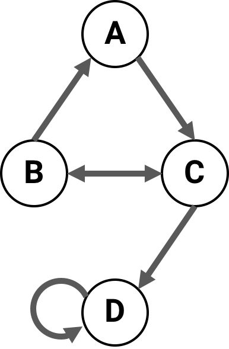

.. _tpm-conventions:

Transition probability matrix conventions
=========================================

A |Network| can be created with a transition probability matrix (TPM) in any of
the three forms described below. However, in PyPhi the canonical TPM
representation is **multidimensional state-by-node form**. The TPM will be
converted to this form when the |Network| is built.

.. tip::
    Functions for converting TPMs from one form to another are available in the
    |convert| module.

.. _state-by-node-form:

State-by-node form
~~~~~~~~~~~~~~~~~~

A TPM in **state-by-node form** is a matrix where the entry |(i,j)| gives the
probability that the |jth| node will be ON at time |t+1| if the system is in
the |ith| state at time |t|.

.. _multidimensional-state-by-node-form:

Multidimensional state-by-node form
~~~~~~~~~~~~~~~~~~~~~~~~~~~~~~~~~~~

A TPM in **multidimensional state-by-node** form is a state-by-node form that
has been reshaped so that it has |n+1| dimensions instead of two. The first |n|
dimensions correspond to each of the |n| nodes at time |t|, while the last
dimension corresponds to the probabilities of each node being ON at |t+1|.

With this form, we can take advantage of `NumPy array indexing
<https://docs.scipy.org/doc/numpy/reference/arrays.indexing.html>`_ and use a
network state as an index directly:

    >>> from pyphi.examples import basic_noisy_selfloop_network
    >>> tpm = basic_noisy_selfloop_network().tpm
    >>> state = (0, 0, 1)  # A network state is a binary tuple
    >>> tpm[state]
    array([0.919, 0.91 , 0.756])

This tells us that if the current state is |N_0 = 0, N_1 = 0, N_2 = 1|, then
the for the next state, :math:`\Pr(N_0 = 1) = 0.919`, :math:`\Pr(N_1 = 1) =
0.91` and :math:`\Pr(N_2 = 1) = 0.756`.

.. important::
    The multidimensional state-by-node form is used throughout PyPhi,
    regardless of the form that was used to create the |Network|.

.. _state-by-state-form:

State-by-state form
~~~~~~~~~~~~~~~~~~~

A TPM in **state-by-state form** is a matrix where the entry |(i,j)| gives the
probability that the state at time |t+1| will be |j| if the state at time |t|
is labeled by |i|.

.. warning::
    **When converting a state-by-state TPM to one of the other forms, information
    may be lost!**

    This is because the space of possible state-by-state TPMs is larger than
    the space of state-by-node TPMs (so the conversion cannot be injective).
    However, if we restrict the state-by-state TPMs to only those that satisfy
    the conditional independence property, then the mapping becomes bijective.

    See :ref:`conditional-independence` for a more detailed discussion.

.. _little-endian-convention:

Little-endian convention
~~~~~~~~~~~~~~~~~~~~~~~~

Even after choosing one of the above representations, there are several ways to
write down the TPM.

With both state-by-state and state-by-node TPMs, one is confronted with a
choice about which rows correspond to which states. In state-by-state TPMs,
this choice must also be made for the columns.

There are two possible choices for the rows. Either the first node changes
state every other row:

    +--------------------+------------------------------------+
    | State at :math:`t` | :math:`\Pr(N = ON)` at :math:`t+1` |
    +--------------------+-----+------------------------------+
    | A, B               |  A  |  B                           |
    +====================+=====+==============================+
    | (0, 0)             | 0.1 | 0.2                          |
    +--------------------+-----+------------------------------+
    | (1, 0)             | 0.3 | 0.4                          |
    +--------------------+-----+------------------------------+
    | (0, 1)             | 0.5 | 0.6                          |
    +--------------------+-----+------------------------------+
    | (1, 1)             | 0.7 | 0.8                          |
    +--------------------+-----+------------------------------+

Or the last node does:

    +--------------------+------------------------------------+
    | State at :math:`t` | :math:`\Pr(N = ON)` at :math:`t+1` |
    +--------------------+-----+------------------------------+
    | A, B               |  A  |  B                           |
    +====================+=====+==============================+
    | (0, 0)             | 0.1 | 0.2                          |
    +--------------------+-----+------------------------------+
    | (0, 1)             | 0.5 | 0.6                          |
    +--------------------+-----+------------------------------+
    | (1, 0)             | 0.3 | 0.4                          |
    +--------------------+-----+------------------------------+
    | (1, 1)             | 0.7 | 0.8                          |
    +--------------------+-----+------------------------------+

Note that the index |i| of a row in a TPM encodes a network state: convert the
index to binary, and each bit gives the state of a node. The question is, which
node?

**Throughout PyPhi, we always choose the first convention---the state of the
first node (the one with the lowest index) varies the fastest.** So, the
least-signficant bit---the one's place---gives the state of the lowest-index
node.

This is analogous to the little-endian convention in organizing computer
memory. The other convention, where the highest-index node varies the fastest,
is analogous to the big-endian convention (see `Endianness
<https://en.wikipedia.org/wiki/Endianness>`_).

The rationale for this choice of convention is that the little-endian mapping
is stable under changes in the number of nodes, in the sense that the same bit
always corresponds to the same node index. The big-endian mapping does not have
this property.

.. tip::
    Functions to convert states to indices and vice versa, according to either
    the little-endian or big-endian convention, are available in the |convert|
    module.

.. note::
    This applies to only situations where decimal indices are encoding states.
    Whenever a network state is represented as a list or tuple, we use the only
    sensible convention: the |ith| element gives the state of the |ith| node.

.. _cm-conventions:

Connectivity matrix conventions
===============================

Throughout PyPhi, if |CM| is a connectivity matrix, then |CM[i][j] = 1| means
that there is a directed edge |(i,j)| from node |i| to node |j|, and 
|CM[i][j] = 0| means there is no edge from |i| to |j|.

For example, this network of four nodes

has the following connectivity matrix:

    >>> cm = [[0, 0, 1, 0],
    ...       [1, 0, 1, 0],
    ...       [0, 1, 0, 1],
    ...       [0, 0, 0, 1]]
